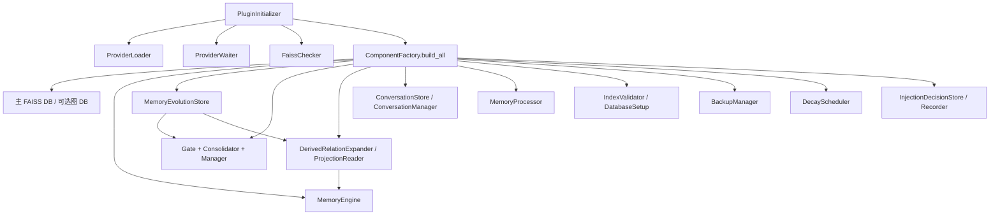

[根级 AGENTS.md](../../AGENTS.md) / core / initializer

# 初始化与组件装配

**最后核对：** 2026-07-19
**公共入口：** `core/initializer/__init__.py`  
**上游编排：** `core/plugin_initializer.py`

## 职责边界

本目录只负责启动期基础组件装配：选择并等待 Embedding/LLM Provider、探测并延迟加载 FAISS、初始化主/图向量库与记忆组件、装配 Memory Evolution 的 Store/Gate/Consolidator/Manager 和可选读取器、修复索引和会话计数，以及启动注入决策持久化。配置的默认值合并、Schema 校验、修订冲突与持久化事务属于 `core/base/config_manager.py`，业务检索、API 和命令不应下沉到这里。



## 公共契约

`__init__.py` 稳定导出：

| 类型 | 关键接口 | 契约 |
|---|---|---|
| `ProviderLoader` | `initialize_providers(embedding_provider, llm_provider, silent=False)` | 返回 `(embedding, llm)`；优先配置 ID，再回退 AstrBot 当前可用 Provider；LLM 必须是 `Provider`，Embedding 必须是 `EmbeddingProvider` |
| `ProviderLoader` | `get_provider_by_id(provider_id, *, silent)` | 正常模式走 Context API；静默轮询只读 `provider_manager.inst_map`，避免尚未完成的框架访问产生噪声 |
| `ProviderWaiter` | `wait_non_blocking(..., max_wait=5.0)` | 每秒检查，返回 `(embedding, llm, ready)`，不在 5 秒窗口内阻塞整个插件生命周期 |
| `ProviderWaiter` | `start_retry_if_needed(...)` / `cancel()` | 单后台任务；2 秒起、1.5 倍退避、30 秒封顶，默认最多 60 次；就绪后调用异步回调 |
| `FaissChecker` | `check_runtime()` / `load_vec_db_class()` | 用固定参数 `[sys.executable, "-c", "import faiss"]`、10 秒超时探测，再动态导入 AstrBot `FaissVecDB` |
| `FaissChecker` | `check_and_fix_dimension_mismatch(path, provider)` | 维度不匹配删除旧索引；不可读索引尽量原子隔离为 `.corrupt_<timestamp>` |
| `DatabaseSetup` | `auto_rebuild_index_if_needed(...)` | 检查 `IndexValidator`，仅在 `needs_rebuild` 时重建；失败记录但不向上抛出 |
| `DatabaseSetup` | `repair_message_counts(store)` | 调用 `sync_message_counts()` 修复会话计数；失败记录但不阻断启动 |
| `ComponentFactory` | `build_all(...) -> dict` | 返回数据库、引擎、处理器、备份/会话/索引/衰减、Memory Evolution 及注入决策组件字典 |

## 启动前备份与恢复

`main.py::_initialize_plugin()` 在调用 `PluginInitializer.initialize()` 前，先由插件级 `BackupManager` 执行 `backup_if_needed_async()`，再应用 `apply_pending_restores()` 中已暂存的恢复事务。恢复应用必须在 provider、`MemoryEngine` 和页面/命令处理器发布前完成；manifest、checksum、SQLite `quick_check` 或原子替换失败时，交由 `BackupManager` 状态机进入失败/回滚路径，不得发布半恢复运行时。

初始化器及 `_ensure_runtime_components()` 全部成功后，主插件才调用 `mark_restore_succeeded()`；初始化失败或运行时组件不完整时调用 `mark_restore_startup_failure_if_needed(...)`，让恢复事务保留可诊断的失败/回滚状态。`ComponentFactory` 仍负责构造并返回 `BackupManager`，并将其传给 `DecayScheduler` 供自动备份使用；调度器不得自行应用恢复或直接替换数据目录。

## 装配顺序与持久化

1. 验证 Embedding 与聊天 Provider；缺失或类型不符抛 `ProviderNotReadyError`。
2. 检查 `memora.index`，图记忆开启时也检查 `memora_graph.index`；主库 `memora.db` 与图文档库 `memora_graph_documents.db` 使用不同文件并可并行初始化。
3. 在主 `memora.db` 上初始化 `MemoryEvolutionStore`。只有 `memory_evolution.enabled=true` 且 mode 为 `readonly` 或 `active` 时，才构造 `DerivedRelationExpander` 和 `ProjectionReader` 并注入引擎配置；`disabled` 与 `shadow` 均传入空读取器。
4. 构造并初始化 `MemoryEngine`；其配置由 `ConfigManager.get()` 逐项投影，覆盖召回、图扩展、重排、成本控制、索引重建、缓存及 Memory Evolution 读取器等，而不是在工厂内再次合并配置。
5. 初始化 `conversations.db` 与 `ConversationManager`，随后修复 `message_count`。
6. 构造 `MemoryProcessor`，再以其带重试 LLM 调用构造 `MemoryConsolidator`；`MemoryEvolutionGate` 会把 `enabled=false` 归一为 disabled，Manager 仅在归一后的 mode 非 disabled 时启动单 worker。
7. 构造 `IndexValidator`，执行一致性检查，并异步加载停用词。
8. 当衰减、自动清理或 `backup_settings.enabled` 启用时启动 `DecayScheduler`；自动备份可以独立于衰减运行。
9. 在 `memora.db` 上初始化 `InjectionDecisionStore` 和有界异步 `InjectionDecisionRecorder`，应用保留天数与最大行数并安排清理。

若第 9 步失败，工厂按 Memory Evolution Manager、Memory Evolution Store、调度器、会话存储、引擎、图 DB、主 DB 的顺序尽力回滚；各关闭失败只记录日志，原异常继续传播。不要把这一局部回滚误写成覆盖前面所有装配阶段的通用事务。

## 配置来源与冲突边界

- `ConfigManager` 以 AstrBot 注入的可变映射为唯一源：先与 `MemoraConfig` 默认值深合并，再做 Pydantic 校验；无效分支回退默认分支，最终才可能全量回退。
- Dashboard 更新使用点号叶子路径、Schema 白名单、SHA-256 revision 和异步锁。revision 过期或保存后源配置被并发改写会产生 `ConfigConflictError`。
- 初始化工厂只消费已经解析后的配置；不得自行写 `_conf_schema.json`、绕过 revision 或把配置 ID 当作已验证 Provider 实例。
- `memory_evolution.enabled=false` 是强制关闭；不能仅凭 `mode` 字符串装配读取器或启动 worker。Projection/relation 只复用 canonical `memora.db` 来源及 ID，不得在初始化层另建第二套权威记忆库。
- Provider ID、模型信息可记录；不得记录凭据、请求正文或 Provider 私有配置。

## 安全与故障约束

- FAISS 子进程参数固定且无用户输入；保持超时和 `check=False` 后显式检查返回码。
- 索引维度变化属于可重建数据失配；数据库文件不是可随意删除的缓存。不要扩展删除范围。
- `ProviderWaiter` 必须保持单任务、可取消；插件卸载时应调用 `cancel()`。
- `ComponentFactory` 要求聊天 Provider 的真实类型，不能用 truthy mock/任意对象绕过生产校验。
- 注入决策存储与主记忆共用 `memora.db`，其生命周期必须随初始化器关闭；详见 [注入模块 AGENTS.md](../injection/AGENTS.md)。
- Memory Evolution Manager 必须先于 Store 关闭；`PluginInitializer.close_memory_evolution_components()` 以独立锁保证幂等，并在初始化失败和插件卸载路径复用。`asyncio.CancelledError`/其他 `BaseException` 不能阻止后续资源执行尽力关闭。

## 依赖方向

`plugin_initializer` → 本模块 → `base`、`managers`、`processors`、`schedulers`、`storage`、`validators`、`injection`。本模块不得反向依赖 Page API、Agent 工具或命令端点。

## 测试定位与精确验证

```powershell
python -m pytest tests/test_plugin_init.py tests/test_memory_evolution_gate.py -q
python -m pytest tests/test_config_contract.py tests/test_api_config.py -q
```

重点保护：Provider 迟到后回调、重复重试抑制/取消、FAISS 探测失败、维度隔离、组件字典完整性、备份管理器与自动备份调度装配、Memory Evolution mode/读取器装配与 manager→store 关闭顺序、注入存储启动/失败回滚、配置 revision 冲突。仅改本模块时先跑第一个命令；涉及配置装配契约时再跑第二个。

## 相关上下文

- [根级 AGENTS.md](../../AGENTS.md)
- [注入模块 AGENTS.md](../injection/AGENTS.md)
- [Memory Evolution 管理器 AGENTS.md](../managers/AGENTS.md)
- [派生检索 AGENTS.md](../retrieval/AGENTS.md)
- `core/plugin_initializer.py`
- `core/base/config_manager.py`
- `core/storage/injection_decision_store.py`
