[根目录](../../CLAUDE.md) > [core](../CLAUDE.md) > **managers**

## 模块职责

`core/managers/` 是 Memora 的核心管理层，共 40 个 Python 文件，围绕 `MemoryEngine` 统一引擎，通过 Mixin 分层组装，提供从记忆 CRUD、检索、衰减、维护、图记忆同步到写可靠性保障、会话管理、自动学习、备份等全部核心业务能力。

## 模块结构图

```mermaid
graph TD
    A["MemoryEngine (主入口)"] --> B["MemoryEngineLifecycleMixin"];
    A --> C["MemoryEngineCRUDMixin"];
    A --> D["MemoryEngineBatchMixin"];
    A --> E["RetrievalOptimizer (检索缓存/增强)"];
    A --> F["WriteOpJournal (写日志/修复)"];
    A --> G["MaintenanceOperations (维护)"];
    A --> H["SchemaManager (建表/迁移)"];
    
    B --> B1["atom_lifecycle_manager"];
    B --> B2["graph_memory_manager"];
    B --> B3["write_coordinator"];
    
    G --> G1["decay_operations"];
    G --> G2["lifecycle_operations"];
    G --> G3["stats_operations"];
    
    F --> F1["write_op_repair"];
    F --> F2["write_op_serialization"];
    
    I["ConversationManager"] --> I1["event_adapter"];
    I --> I2["message_operations"];
    I --> I3["session_lifecycle"];
    I --> I4["session_cache"];
    I --> I5["range_and_metadata"];
    I --> I6["sender_resolver"];

    J["子系统管理器"];
    J --> J1["auto_learning (自主学习)"];
    J --> J2["backup_manager (备份)"];
    J --> J3["knowledge_manager (知识库)"];
    J --> J4["note_manager (笔记)"];
    J --> J5["profile_manager (用户画像)"];
    J --> J6["semantic_compressor (语义压缩)"];
    J --> J7["memory_exporter (导入导出)"];
    J --> J8["metrics_collector (指标)"];
    J --> J9["mood_state (情绪)"];
    J --> J10["index_manager (索引管理)"];
    J --> J11["anomaly_detector (异常检测)"];
    J --> J12["continuity_tracker (连续性)"];
    J --> J13["relationship_tracker (关系)"];
    J --> J14["reconsolidation (再巩固)"];
    J --> J15["trait_evolution (性格演化)"];
    J --> J16["weight_learner (权重学习)"];
```



## 子模块清单

### 1. MemoryEngine (统一记忆引擎) -- 5 文件

**主文件**: `memory_engine.py`
- **类**: `MemoryEngine(MemoryEngineLifecycleMixin, MemoryEngineCRUDMixin, MemoryEngineBatchMixin)`
- **职责**: 整合多存储后端 (FAISS + GraphDB + SQLite)，提供完整的记忆生命周期管理
- **构造函数**:
  ```python
  def __init__(self, db_path, faiss_db, graph_vector_db=None, llm_provider=None, config=None)
  ```
- **委托封装** (所有公开方法通过回调/委托模式分发):
  - `update_importance()` -- 更新重要性评分
  - `update_access_time()` -- 更新访问时间
  - `update_access_times_batch()` -- 批量更新访问时间（消除 SQLite 写锁串行化瓶颈）
  - `get_session_memories()` -- 获取会话记忆
  - `apply_daily_decay()` -- 每日衰减
  - `cleanup_old_memories()` -- 清理旧记忆
  - `consolidate_memories()` -- 梦境整合
  - `get_statistics()` -- 统计信息
  - `maintain_storage()` -- 存储维护（含 VACUUM）
  - `rebuild_graph_index()` -- 重建图索引
  - `register_trigger()` -- 注册触发词
- **内部子对象**: `_retrieval` (RetrievalOptimizer), `_write_journal` (WriteOpJournal), `_schema` (SchemaManager), `_maintenance` (MaintenanceOperations)

---

**`memory_engine_crud.py`** -- MemoryEngineCRUDMixin
- **核心 API**:
  - `add_memory(content, session_id, persona_id, importance, metadata, atoms) -> int` -- 完整写入流程：文档索引 -> 原子写入 -> 图索引。通过 WriteOpJournal 实现多阶段事务日志，任何阶段失败都能修复。写入后触发检索缓存失效 + 干扰衰减 + 触发词提取
  - `search_memories(query, k, session_id, persona_id, emotion_context, recall_type, chain_depth, ...) -> list[HybridResult]` -- 多阶段检索：缓存检查 -> 会话缓存 -> DualRouteRetriever/HybridRetriever -> 触发词提升 -> 情绪/季节增强 -> 多跳扩展(R2) -> 截断
  - `get_memory(memory_id) -> dict | None` -- 从 FAISS 文档存储读取
  - `update_memory(memory_id, updates, skip_graph_reindex) -> bool` -- 内容更新走"创建新记忆 + 删除旧记忆"的 append-only 模式；元数据更新直接修改
  - `delete_memory(memory_id) -> bool` -- 通过 WriteOpJournal 的事务日志确保所有关联子资源（图、原子）被正确清理
  - `_delete_sub_resources(memory_id, op_id) -> bool` -- 清理图记忆和原子

---

**`memory_engine_batch.py`** -- MemoryEngineBatchMixin
- `batch_delete_memories(memory_ids) -> int` -- 批量删除，每 200 条一批
- `batch_delete_memories_detailed(memory_ids) -> dict` -- 返回详细计数（deleted/not_found/failed/errors）
- `_delete_document_indexes_for_batch(memory_ids) -> int` -- 清理文档 + FAISS 向量 + FTS 索引
- `_delete_graph_and_atoms_for_batch(memory_ids) -> None` -- 批量清理子资源

---

**`memory_engine_lifecycle.py`** -- MemoryEngineLifecycleMixin
- `initialize()` -- 完整初始化流程：
  1. 创建 aiosqlite 连接 + 应用性能 PRAGMA
  2. 注册到 ConnectionRegistry (L5 自动重连)
  3. 创建 TextProcessor / BM25Retriever / VectorRetriever / HybridRetriever
  4. 图记忆启用时创建 GraphStore / AtomStore / GraphExtractor / GraphRetriever / GraphMemoryManager 等完整图套件
  5. 条件性初始化所有子系统: ProfileManager, AutoLearning, KnowledgeManager, NoteManager, TraitEvolutionTracker, ContinuityTracker, RelationshipTracker, ReconsolidationManager, AnomalyDetector, MABWeightLearner, MemoryExporter
  6. 创建 DualRouteRetriever (注入 PersonalizedRanker + ProfileManager + Reranker)
  7. 创建 RealtimeSSE 流
  8. 如果启用写入修复，执行 `repair_incomplete()`
- `close()` -- 停止原子生命周期、持久化状态、取消待完成任务、关闭数据库连接
- `_create_tracked_task(coro)` -- 创建异步任务并追踪（自动 cleanup）

---

### 2. 检索优化器 -- 1 文件 (核心增强引擎)

**`retrieval_optimizer.py`** -- RetrievalOptimizer
- **搜索缓存**: 双层缓存（全局 TTL 45s + 会话级 TTL 10s），写入后自动失效
- **检索后增强** (`apply_boosts`):
  - 过滤 dormant/archived 状态记忆
  - 记忆驱动情绪回路（加权情感标签聚合 -> valence delta）
  - 测试效应（召回成功强化 TTL，1.05 指数增长，上限 2x）
  - 情绪增强 (emotion_similarity)
  - 季节增强 (seasonal_boost)
  - 调试追踪 (debug_trace)
- **干扰衰减** (`apply_interference`): Jaccard >= 0.6 的相似记忆重要性 * 0.9
- **多跳扩展** (`chain_expand_multi_hop`): R2 沿图边 + 话题关联做多层扩展，逐跳衰减 (decay^n)
- **梦境整合** (`consolidate`): 夜间批量关联共享话题的高重要性记忆对
- **触发词系统**: `register_trigger` / `extract_triggers` / `apply_trigger_boost` (1.5x)
- **R5 叙事连贯性** (`arrange_narrative`): 时间线排序 + topic 聚类 + 过渡短语 (introduction / same_topic / topic_switch / time_jump)
- **情感传染**: `get_mood_contagion()` 返回结构化情绪反馈供人设系统使用

---

### 3. 写可靠性 -- 4 文件

**`write_coordinator.py`** -- 写协调器
- **L3**: 指数退避重试 (base_delay * 2^attempt + 随机抖动)
- **L4**: `asyncio.Lock` 全局写序列化
- **L5**: `ConnectionRegistry` 自动重连 + 坏死检测
- **API**:
  - `write_with_retry(fn, max_retries=5, base_delay=0.05)` -- 带锁 + 重试
  - `write_transaction(fn)` -- 事务性写入
  - `coordinated_transaction(db)` -- 上下文管理器 (BEGIN IMMEDIATE/commit/rollback)
  - `check_db_alive(db)` -- 同步检查连接存活
  - `is_connection_fatal(exc)` -- 区分锁冲突 vs 连接坏死

**`write_op_journal.py`** -- WriteOpJournal(WriteOpRepairMixin)
- 创建 `memory_write_ops` 表记录多存储写操作状态
- `start_op(op_type, payload, memory_id)` -- 记录起始
- `advance_op(op_id, step, status, memory_id, error, payload_patch)` -- 推进步骤

**`write_op_repair.py`** -- WriteOpRepairMixin
- `repair_incomplete()` -- 崩溃恢复，对 `pending`/`needs_repair` 状态的 add/delete 操作尽力重放修复

**`write_op_serialization.py`** -- 序列化工具
- `serialize_atom_for_repair(atom) -> dict` -- MemoryAtom 转 JSON 安全载荷
- `_deserialize_atom_from_repair(data) -> MemoryAtom` -- 反序列化
- `safe_json_dict(value) -> dict` -- 安全 JSON 解析

---

### 4. 维护操作 -- 3 文件

**`maintenance_operations.py`** -- MaintenanceOperations(DecayOperationsMixin, LifecycleOperationsMixin, StatsOperationsMixin)
- 组合衰减、生命周期、统计三类操作

**`decay_operations.py`** -- DecayOperationsMixin
- `apply_daily_decay(decay_rate, days) -> int` -- 批量重要性衰减
- `update_access_time(memory_id, recall_type) -> bool` -- 单条访问时间更新
- `update_access_times_batch(memory_ids, recall_type) -> int` -- 批量访问时间更新（消除串行化瓶颈）
- 类型感知衰减乘数: EPISODIC=1.5, FACTUAL=0.5, PREFERENCE=0.7, RELATIONAL=0.6

**`lifecycle_operations.py`** -- LifecycleOperationsMixin
- `cleanup_old_memories(days_threshold, importance_threshold) -> int` -- 三阶段分层遗忘:
  - Stage 1 (days): ACTIVE -> DORMANT
  - Stage 2 (days*2): DORMANT -> ARCHIVED
  - Stage 3 (days*3): 物理删除 ARCHIVED
- `migrate_session_if_needed(session_id)` -- 会话迁移

**`stats_operations.py`** -- StatsOperationsMixin
- `get_statistics() -> dict` -- 获取统计摘要 (记忆总数、图节点数、平均重要性等)
- `maintain_storage(vacuum=False) -> dict` -- 存储维护（索引重建、VACUUM）
- `rebuild_graph_index() -> dict` -- 图索引重建
- `get_session_memories(session_id, limit) -> list` -- 分页查询会话记忆

---

### 5. 数据库模式管理 -- 1 文件

**`schema_manager.py`** -- SchemaManager
- `create_tables()` -- 创建/迁移所有系统表:
  - `documents` (id, doc_id, text, metadata, created_at, updated_at)
  - `entity_hierarchy` (G3 实体层级)
  - `db_version` / `migration_status` (迁移追踪)
  - 5 个元数据索引 (session_id, persona_id, importance, last_access_time, doc_id)
  - 自动补齐旧版本缺失字段
- `_drop_legacy_fts_triggers()` -- 清理旧 FTS 触发器
- 白名单校验表名/列名（防 SQL 注入）

---

### 6. 会话管理 -- 7 文件

**`conversation_manager.py`** -- ConversationManager
- 组合 EventAdapterMixin + MessageOperationsMixin + SessionLifecycleMixin + RangeAndMetadataMixin + SessionCacheMixin
- **构造函数**: `__init__(store, max_cache_size=100, context_window_size=50, session_ttl=3600)`
- LRU 缓存热点会话，上下文窗口管理

**`event_adapter.py`** -- EventAdapterMixin
- `add_message_from_event(event, role, content) -> Message` -- 从 AstrBot MessageEvent 自动提取发送者信息

**`message_operations.py`** -- MessageOperationsMixin
- `add_message(session_id, role, content, sender_id, sender_name, group_id, platform, is_bot_message) -> Message`
- `get_context_window(session_id, window_size) -> list[Message]`
- `get_last_n_messages(session_id, n) -> list[Message]`

**`session_lifecycle.py`** -- SessionLifecycleMixin
- `create_or_get_session(session_id, platform) -> Session`
- `get_session_info(session_id) -> Session | None`
- `expire_old_sessions(ttl) -> int`

**`session_cache.py`** -- SessionCacheMixin
- LRU 缓存管理：`_update_cache` / `_get_from_cache` / `_invalidate_cache`

**`range_and_metadata.py`** -- RangeAndMetadataMixin
- `get_messages_range(session_id, start_index, end_index) -> list[Message]` -- 滑动窗口查询
- `get_session_metadata(session_id)` / `set_session_metadata(session_id, key, value)`

**`sender_resolver.py`** -- 发送者名称解析
- 从 AstrBot 事件中提取并规范化发送者名称（过滤占位昵称: unknown, n/a, 未知等）

---

### 7. 图记忆管理 -- 1 文件

**`graph_memory_manager.py`** -- GraphMemoryManager
- `index_memory(source_memory_id, content, metadata, atoms)` -- 重建图产物: extract -> upsert_nodes -> add_edges -> add_entries -> 向量化
- `delete_memory(source_memory_id)` -- 删除关联图产物（级联清理向量索引）
- `batch_delete_memories(source_memory_ids)` -- 批量删除

---

### 8. 原子生命周期 -- 1 文件

**`atom_lifecycle_manager.py`** -- AtomLifecycleManager
- 周期性管理记忆原子的生命周期（过期检测、状态转换）
- `dedup_atoms_batch()` -- 同批次原子 Jaccard 去重
- `migrate_to_cold()` -- 冷存储迁移

---

### 9. 自主学习 -- 1 文件

**`auto_learning.py`** -- AutoLearningManager
- **FeedbackCollector**: 收集隐式/显式反馈 (recall relevance + quality score + correction)
- **ParamOptimizer**: 在线参数优化器，基于 feedback 调整 importance_threshold / recall_top_k / ttl_modifier / document_route_weight / graph_route_weight
- **AutoLearningManager**: 协调反馈收集与参数优化，支持持久化到 `auto_learning.json`
- **API**: `record_recall()`, `record_quality()`, `record_correction()`, `optimize()`, `get_params()`, `get_stats()`, `reset()`

---

### 10. 备份管理 -- 1 文件

**`backup_manager.py`** -- BackupManager
- 版本变更检测 + 自动备份: `backup_if_needed()` 在版本号变化时复制关键文件（memora.db, memora.index, conversations.db, WAL/SHM 日志等）
- 按需备份: `create_backup()` 手动触发
- 备份恢复: `stage_restore(name)` -> `.restore` 暂存文件 -> 下次启动 `apply_pending_restores()` 自动应用
- 备份管理: `list_backups()`, `delete_backup()`, `validate_backup_name()` (防路径遍历)

---

### 11. 其他子系统管理器

| 文件 | 类 | 职责 |
|------|-----|------|
| `knowledge_manager.py` | KnowledgeManager | 知识库生命周期：去重 (Jaccard 0.85)、合并、过期清理 |
| `note_manager.py` | NoteManager | 笔记 CRUD + 版本管理 (max 20) |
| `profile_manager.py` | ProfileManager | 用户画像: ensure/get/update/delete + 标签积累 + 衰减 |
| `semantic_compressor.py` | SemanticCompressor | 60 天+旧记忆按 topic 相似度合并为抽象摘要 |
| `memory_exporter.py` | MemoryExporter | 导入导出: JSONL + Markdown 格式，去重合并导入 |
| `metrics_collector.py` | MetricsCollector | 单例指标收集器：P50/P95/P99 延迟 + 缓存命中率 |
| `mood_state.py` | MoodState | 人设情绪状态 dataclass: valence/arousal/dominant_emotion |
| `index_manager.py` | IndexManager | 增量索引 + FAISS IVF 自动切换 (阈值 10000) |
| `anomaly_detector.py` | AnomalyDetector | 7 日滚动窗口 + 3-sigma 阈值检测记忆创建速率异常 |
| `continuity_tracker.py` | ContinuityTracker | 追踪未完话题，下次对话优先注入 |
| `relationship_tracker.py` | RelationshipTracker | 基于 warmth score 量化关系阶段: STRANGER -> ACQUAINTANCE -> FRIEND -> CLOSE_FRIEND -> CONFIDANT |
| `reconsolidation.py` | ReconsolidationManager | LLM 微调记忆内容再巩固 |
| `trait_evolution.py` | TraitEvolutionTracker | Big Five 性格特质演化，检测 trait_drift 事件 |
| `weight_learner.py` | MABWeightLearner | Epsilon-Greedy 多臂老虎机学习文档/图检索融合权重 |

## 数据流与调用关系

### 写入流程
```
add_memory(content, metadata, atoms)
  -> WriteOpJournal.start_op("add")       // 记录事务开始
  -> hybrid_retriever.add_memory()        // 写入文档+向量索引
  -> WriteOpJournal.advance_op("document_indexed")
  -> atom_store.insert_many(atoms)        // 写入记忆原子
  -> WriteOpJournal.advance_op("atoms_indexed")
  -> graph_memory_manager.index_memory()  // 提取图实体+关系+向量
  -> WriteOpJournal.advance_op("completed"|"needs_repair")
  -> RetrievalOptimizer.invalidate_cache()
  -> _create_tracked_task(apply_interference)  // 干扰衰减
  -> _create_tracked_task(extract_triggers)    // 触发词提取
  -> SSE publish("memory_created")
```

### 检索流程
```
search_memories(query, k, ...)
  -> RetrievalOptimizer.get_cached()      // L1: 全局缓存
  -> RetrievalOptimizer.get_session_cached() // L1: 会话缓存
  -> migrate_session_if_needed()          // 会话格式迁移
  -> dual_route_retriever.search()        // L2: BM25+向量+图 三路检索
      -> hybrid_retriever.search()        //   文档路: BM25 + Vector -> RRF
      -> graph_retriever.search()         //   图路: Keyword + Vector -> MMR
      -> personalized_ranker              //   个性化排序
      -> reranker.rerank()                //   重排序
  -> RetrievalOptimizer.apply_trigger_boost()  // 触发词提升
  -> RetrievalOptimizer.apply_boosts()    // 情绪+季节+测试效应增强
  -> chain_expand_multi_hop()             // R2 多跳扩展
  -> RetrievalOptimizer.set_cached()      // 缓存结果
  -> update_access_times_batch()          // 批量更新访问时间
```

### 衰减流程 (由 schedulers 触发)
```
DecayScheduler.tick()
  -> MemoryEngine.apply_daily_decay(rate, days)
  -> DecayOperationsMixin.apply_daily_decay()
  -> 类型感知衰减乘数: EPISODIC * 1.5, FACTUAL * 0.5...
  -> invalidate_cache()

LifecycleOperationsMixin.cleanup_old_memories()
  -> 三阶段: ACTIVE -> DORMANT -> ARCHIVED -> 物理删除
```

## 测试与质量

- 测试覆盖: `tests/test_managers_*.py` (对应各管理器)
- `tests/test_write_op_repair.py` -- 写入修复测试
- `tests/test_auto_learning.py` -- 自主学习测试
- `tests/test_semantic_compressor.py` -- 语义压缩测试
- `tests/test_index_manager.py` -- 索引管理测试
- 写操作可靠性由 `write_coordinator.py` 多层防御保障

## 常见问题 (FAQ)

**Q: MemoryEngine 初始化顺序如何？**
A: 先初始化 DB + 检索器，然后图记忆套件，再条件性初始化各子系统，最后创建 DualRouteRetriever 和 SSE。子系统间通过回调解耦。

**Q: 写操作失败后如何恢复？**
A: WriteOpJournal 记录每次多阶段写入的每个步骤状态。启动时 `repair_incomplete()` 读取 `pending`/`needs_repair` 状态的记录，尽力重放修复。

**Q: 同时大量写入会不会锁库？**
A: 使用 L3-L5 多层防护：重试+指数退避 -> asyncio.Lock 序列化 -> ConnectionRegistry 坏死检测+自动重连。

**Q: 如何启用/禁用子系统？**
A: 通过配置文件控制开关，如 `graph_memory.enabled`、`auto_learning.enabled`、`trait_evolution.enabled` 等，所有子系统在 `initialize()` 中条件性启用。

## 相关文件清单

完整文件列表 (40 个文件):

| 文件 | 主要类/Mixin | 行数估计 |
|------|-------------|---------|
| `__init__.py` | 模块导出 | ~15 |
| `memory_engine.py` | MemoryEngine | ~170 |
| `memory_engine_crud.py` | MemoryEngineCRUDMixin | ~620 |
| `memory_engine_batch.py` | MemoryEngineBatchMixin | ~140 |
| `memory_engine_lifecycle.py` | MemoryEngineLifecycleMixin | ~330 |
| `retrieval_optimizer.py` | RetrievalOptimizer | ~1050 |
| `write_coordinator.py` | write 工具函数, ConnectionRegistry | ~340 |
| `write_op_journal.py` | WriteOpJournal | ~170 |
| `write_op_repair.py` | WriteOpRepairMixin | ~200+ |
| `write_op_serialization.py` | 序列化工具函数 | ~80+ |
| `maintenance_operations.py` | MaintenanceOperations | ~50 |
| `decay_operations.py` | DecayOperationsMixin | ~200+ |
| `lifecycle_operations.py` | LifecycleOperationsMixin | ~200+ |
| `stats_operations.py` | StatsOperationsMixin | ~200+ |
| `schema_manager.py` | SchemaManager | ~175 |
| `conversation_manager.py` | ConversationManager | ~100 |
| `event_adapter.py` | EventAdapterMixin | ~100+ |
| `message_operations.py` | MessageOperationsMixin | ~150+ |
| `session_lifecycle.py` | SessionLifecycleMixin | ~100+ |
| `session_cache.py` | SessionCacheMixin | ~60+ |
| `range_and_metadata.py` | RangeAndMetadataMixin | ~100+ |
| `sender_resolver.py` | 工具函数 | ~80+ |
| `graph_memory_manager.py` | GraphMemoryManager | ~90 |
| `atom_lifecycle_manager.py` | AtomLifecycleManager | ~200+ |
| `auto_learning.py` | AutoLearningManager 等 | ~230 |
| `backup_manager.py` | BackupManager | ~325 |
| `knowledge_manager.py` | KnowledgeManager | ~100+ |
| `note_manager.py` | NoteManager | ~120+ |
| `profile_manager.py` | ProfileManager | ~100+ |
| `semantic_compressor.py` | SemanticCompressor | ~150+ |
| `memory_exporter.py` | MemoryExporter | ~200+ |
| `metrics_collector.py` | MetricsCollector | ~200+ |
| `mood_state.py` | MoodState | ~80+ |
| `index_manager.py` | IndexManager | ~100+ |
| `anomaly_detector.py` | AnomalyDetector | ~150+ |
| `continuity_tracker.py` | ContinuityTracker | ~100+ |
| `relationship_tracker.py` | RelationshipTracker | ~200+ |
| `reconsolidation.py` | ReconsolidationManager | ~100+ |
| `trait_evolution.py` | TraitEvolutionTracker | ~120+ |
| `weight_learner.py` | MABWeightLearner | ~150+ |

## 变更记录 (Changelog)

| 日期 | 变更 | 描述 |
|------|------|------|
| 2026-07-07 | 深度扫描 | 完整读取 40 文件，生成 managers 模块级 CLAUDE.md |
