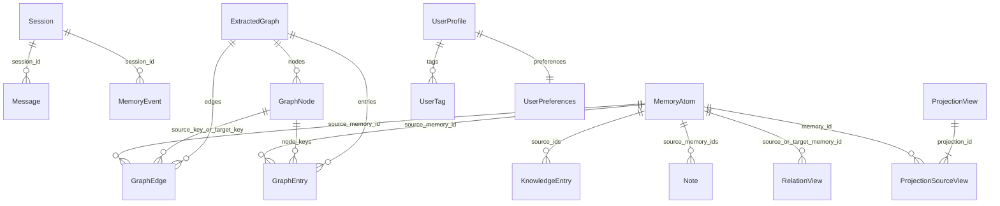
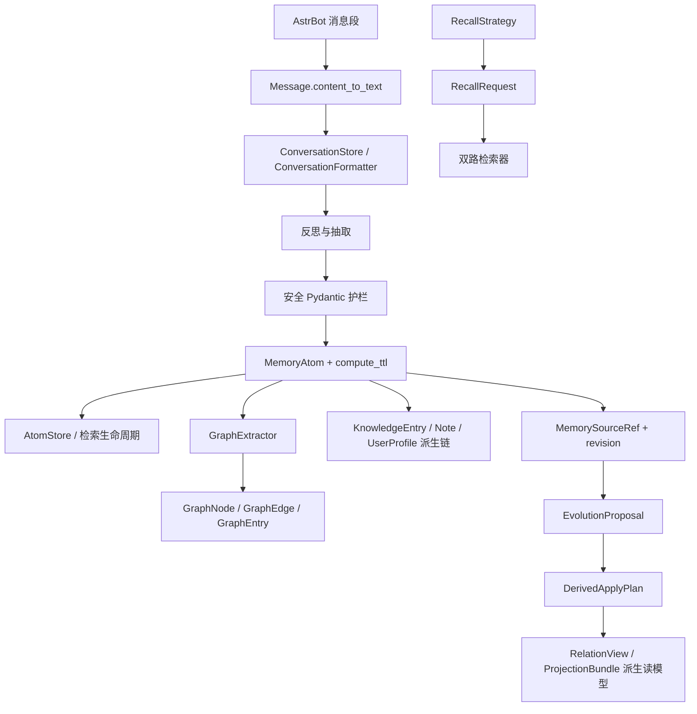

[根级 AGENTS.md](../../AGENTS.md) > [core](../AGENTS.md) > **models**

# `core/models` 模块上下文

**最后更新：** 2026-07-21
**模块入口：** `core/models/__init__.py`；各领域模型通常从其子模块直接导入

## 职责与边界

`core/models/` 定义 Memora 在处理器、管理器、检索器和存储层之间传递的领域对象：对话、记忆原子及生命周期、知识图谱、知识条目、笔记、用户画像、召回请求、默认停用词，以及证据锚定的 Memory Evolution job、relation 和 projection 契约。

这些对象主要是轻量 `dataclass`/`Enum` 契约，而不是 ORM 或输入验证层。除显式计算方法和 `from_dict()` 转换外，大多数构造函数不会自动钳制范围、检查外键或持久化。LLM 原始输出必须先经过 [`../security/AGENTS.md`](../security/AGENTS.md) 的 Pydantic 护栏；数据库一致性属于 [`../storage/AGENTS.md`](../storage/AGENTS.md)。

## 领域关系



这些关系是字段级领域关系，不代表 dataclass 会自动加载、级联保存或验证所指向的记录。

## 模型清单与不变量

### `conversation_models.py`

- `Message`：必填 `id/session_id/role/content/sender_id`。`content_to_text()` 规范化 AstrBot 风格的字符串、标量、嵌套列表/字典消息段；仅媒体内容回退为 `[图片消息]`。`to_dict()` 总是输出文本内容。
- `Message.format_for_llm()`：私聊保留原角色和文本；群聊根据 `metadata["is_bot_message"]` 或 `role == "assistant"` 生成带发送者 ID 和本地时间的前缀。
- `Session`：跟踪平台、活动时间、消息数、参与者和元数据；`add_participant()` 去重，`update_activity()` 使用当前时间。
- `MemoryEvent`：反思链的较旧结构化事件契约；`is_important()` 使用 `>= threshold`。它不包含 `MemoryAtom` 的 TTL/衰减/状态机。
- `from_dict()` 对 JSON 字符串元数据/参与者容错，非法 JSON 回退为空结构；缺失必填键仍会抛 `KeyError`。
- `serialize_to_json()` 只对 `list/dict` 做 JSON 编码；`deserialize_from_json()` 对空值或解析失败返回调用方默认值（未给时为 `{}`）。

### `core/features/memory/domain/memory_atom.py`

该模块是 MemoryAtom 领域模型的唯一导入路径，`core/models/` 不再转发这些类型与计算函数。

- `MemoryAtom` 是当前细粒度持久化/检索核心：`parent_memory_id` 必填；新写入链还保存 `parent_revision`、`parent_scope_key` 与 `parent_privacy_level`，旧行缺失时保持 `None`，不得伪造为当前 source。
- 枚举：`AtomType`（episodic/factual/relational/preference/planned/unknown）、`DecayType`（linear/exponential/step）、`AtomStatus`（active/dormant/superseded/expired/forgotten/cold）、`PrivacyLevel`（public/shared/confidential）。Atom 的隐私快照保存在 `parent_privacy_level`，它只描述父 canonical 创建时边界，不形成独立召回身份。
- `compute_decay_score()` 将 TTL 最小视为 1 天、负 `days_since` 视为 0；线性最低 0，阶跃过期后为 0.05，默认走指数半衰期。
- `compute_ttl()`：基础 TTL 为 episodic 7、planned 2、factual 180、relational 90、preference 60、unknown 30 天；planned 可加到事件发生的剩余天数。
- 情绪强度 `>= 0.85` 触发至少 365 天的 LINEAR 闪光灯路径；低重要性、未强化的 UNKNOWN/EPISODIC 默认进入 3 天基准的试用期路径；人格衰减倍率钳制到 `[0.1, 10.0]`；最终 TTL 至少 1 天。
- `is_expired()` 只比较 `reference_time >= expires_at`。默认 `expires_at=0.0` 会立即判定过期，因此创建/落库链必须计算并写入真实过期时间，不能把 dataclass 默认值当完整生命周期初始化。

### `core/features/memory/graph/domain/models.py`

该模块是 graph 领域模型的唯一导入路径，`core/models/` 不再转发这些类型。

- `GraphNode.node_key = "{node_type}:{canonical_value}"`，规范值由实体解析链负责生成。
- `GraphEdge.edge_key` 包含 `source_memory_id`，用于来源级唯一性；`semantic_edge_key` 忽略记忆 ID，用于跨来源语义合并。
- `GraphEntry` 是可搜索且可回指记忆的图产物；`ExtractedGraph` 是一次抽取的 nodes/edges/entries 容器。
- 模型不验证端点是否存在、置信度范围或 key 格式；这些由图提取器/存储层保证。

### `core/features/knowledge/domain/models.py` 与 `core/features/notes/domain/models.py`

- `KnowledgeEntry` 使用 `KnowledgeType`（fact/concept/rule/event/procedure），支持来源 ID、标签、过期时间与访问计数；显式 `derived` 条目必须携带 `DomainProvenance`，人工条目保持旧序列化形状。
- `Note` 使用 `NoteStatus`（active/archived/deleted），保存当前版本号、用户和来源记忆 ID；显式 `derived` 笔记必须携带 `DomainProvenance`，`NoteVersion` 仍是独立快照类型。
- `from_dict()` 会执行 Enum 和数值转换；非法枚举/数字会抛出，不是无条件容错解析。

### `domain_provenance.py`

- `DomainObjectOrigin` 只允许 `manual` 与 `derived`。人工对象不得伪造 canonical source；派生对象必须有唯一 primary、可选 supporting、同一 scope 和不重复的正整数 source ID。
- `DomainProvenance.to_dict()` 故意排除 canonical 正文，只保存 revision、scope、privacy、role 与时间窗口；Profile、Knowledge 和 Note 复用该契约，不创建第二套 source 类型。

### `core/features/profiles/domain/models.py`

- `UserProfile` 聚合 `UserTag` 与 `UserPreferences`。自动标签/偏好可携带 `DomainProvenance`，人工值使用 manual authority；派生同名标签不能替换人工来源。
- `get_tag_values()` 采用 `confidence >= 0.3`；权重向量忽略 `< 0.2` 的标签，并以出现次数最多 10 次封顶。
- `decay_tags()` 使用 30 天半衰期；`remove_stale_tags()` 返回删除数量。
- dataclass 构造不会自动把置信度钳制到 `[0,1]`；可信范围应由抽取/管理链维护。

### `recall_strategy.py` 与 `default_stopwords.py`

- `RecallRequest` 是 `frozen=True, slots=True` 的请求值对象，默认 `k=5`；它不自行验证 `k`、查询文本或过滤器。
- `RecallStrategy` 固定四类调用意图，检索器据此调整文档/图路权重。
- `DEFAULT_STOPWORDS` 是不可变 `frozenset[str]`，仅作为无外部词表时的共享后备；运行时加载与持久化属于 [`../utils/AGENTS.md`](../utils/AGENTS.md) 的 `StopwordsManager`。

### `core/features/evolution/domain/models.py` 与 `core/shared/contracts/canonical_source.py`

- `MemorySourceRef` 的唯一 owner 是 `core/shared/contracts/canonical_source.py`，Evolution domain 只复用该共享 canonical 来源契约；`EvolutionSignal` 是演化触发的带 revision 证据视图。`memory_id` 必须是非负整数，`scope_key` 与 `revision_token` 必须非空，privacy 只能是 `public/shared/confidential`，证据正文受本地长度上限约束。`topic_keys` 是去重限长的只读主题证据，`subject_key` 是从可信参与者字段生成的不可逆匿名主体键；二者都不创建新的 canonical ID 或模型可见身份。
- `MemoryRelationProposal`、`MemoryProjectionProposal` 与 `EvolutionProposal` 表达 LLM 的结构化提案；alias 在 manager 边界解析，提案本身不能直接写入 canonical memory 或派生表。
- `RelationType`、`ProjectionType`、`JobState` 和 `DerivedState` 是稳定持久化枚举。关系类型包括 supports/updates/contradicts/same_episode/preference_change/causes/supersedes/related；projection 类型固定为 episode_summary/semantic_summary/preference_state/relationship_state/conflict_set。
- `JobSpec`、`MemoryEvolutionJob`、`JobClaim`、`RetrySpec` 描述去重键、创建时 source revision、租约、尝试次数和重试时间；`source_revisions` 只能引用同一 job 的 `source_ids`。模型只做结构约束，lease 所有权和状态迁移由 Store 保证。
- `RelationView` 与 `ProjectionView` 是派生解释平面的读写契约。它们必须保留 scope/privacy、有效期、confidence 与状态；episode/conflict relation 的 `valid_from/valid_to` 保存候选实际时间窗口。`ProjectionView.source_memory_ids` 只是来源回指，不能作为第二套记忆身份。
- `RelationView`、`ProjectionView` 的 `reference_at`、`discovered_at`、`invalid_at`、`time_source` 和 `time_precision` 只描述派生证据时间；`created_at/updated_at` 仍是行生命周期时间，source revision 才是陈旧判断依据。
- `ProjectionSourceView` 固定允许 `primary/supporting/conflict_left/conflict_right` 四种 role，并携带每个 canonical source 的 revision token、ordinal 和可选的 source-level 时间窗口。旧 mapping 缺少时间字段时保持未知，不从 projection 生命周期时间推断。`ProjectionBundle` 将一个 projection 和非空、同 projection ID 的 source mapping 组合起来，供读取侧批量校验。
- `DerivedApplyPlan` 聚合 relation、projection、source mapping 与 `source_revisions`，用于一次原子应用；任一来源 revision 变化时应由管理/存储层拒绝或失效派生结果。

### `derived_metadata.py` 与 `core/features/learning/domain/models.py`

- `DerivedMetadataSourceRef`、`DerivedMetadataProposal` 和 `DerivedMetadataAnnotation` 只描述 process-local 的 source-backed 派生注解；validator 固定执行 NFKC、去重、内容安全和字段/总预算校验，不写 canonical metadata。
- `TrustedFeedbackEvent` 只能由受控 builder 从固定 outcome 枚举派生 reward/window/dedupe；`FeedbackSignalPolicy` 与 `FeedbackSignalAggregate` 只表达有界候选权重，不是生产配置或 canonical 身份。
- 反馈领域模型的唯一入口是 `core/features/learning/domain/models.py`；`core/models/` 不再转发这些类型。

## 导出契约

`core/models/__init__.py` 仅公开：

- `Message`、`Session`、`MemoryEvent`、`serialize_to_json`、`deserialize_from_json`。

Graph 模型必须从 `core.features.memory.graph.domain.models` 导入；`MemoryAtom`、画像、知识、笔记、召回策略和停用词必须从对应 owner 子模块导入。不要假设文件内 `__all__` 会自动汇总到包入口；若扩展包级 API，需显式编辑 `__init__.py` 并增加导出契约测试。

Memory Evolution 类型从 `core.features.evolution.domain` 导入，canonical `MemorySourceRef` 从 `core.shared.contracts` 导入；`core/models/` 不再转发这些类型。新增 evolution 类型时要同步 feature 导出、直接调用方和模型测试，不要无意扩大包入口。

## 典型数据流



## 依赖方向

- **向下依赖：** 标准库；`conversation_models.py` 仅额外依赖 `astrbot.api.logger`。
- **被依赖：** processors 构造/解析模型，storage 序列化并恢复模型，retrieval 消费召回/图/知识契约，managers 维护画像和笔记。
- **禁止方向：** 模型不得导入 storage、processors、retrieval、handlers 或 API；否则会把领域契约绑到执行层并制造循环依赖。

## 安全与兼容约束

- `metadata`、LLM 字典和数据库行都可能是不可信/旧版数据；先通过安全护栏或明确的转换边界，不要直接 `Model(**raw_llm_dict)`。
- `to_dict()` 的键名、Enum `.value`、`node_key/edge_key` 拼接格式是存储与 API 兼容契约。
- 列表/字典字段必须继续使用 `default_factory`，禁止共享可变默认值。
- 新字段要同步存储 schema、行映射、API 序列化和相关集成测试；仅修改 dataclass 不代表持久化完成。
- canonical metadata 中既有 Unix 秒字段仍按原契约读取；Memory Evolution 新增时间统一使用 UTC ISO 8601，并由 `core.shared.temporal` 兼容解析 naive/Unix/ISO 输入。不要把 `documents.updated_at` 当事实发生时间。
- Projection 必须始终能回指 canonical source 及其 revision；不得把 projection ID、摘要或 source mapping 提升为 canonical `doc_id`，也不得在模型层放宽 scope/privacy/role 约束。

## 测试定位与精确验证

| 领域 | 直接测试 | 关键调用链测试 |
|---|---|---|
| 对话模型与格式化 | `tests/test_models_extra.py` | `tests/test_conversation_store.py tests/test_conversation_formatter.py` |
| TTL、衰减、试用期、闪光灯 | `tests/test_memory_atom.py` | `tests/test_atom_store.py tests/integration/test_pipeline_lifecycle.py` |
| 图 key 与容器 | `tests/test_models_extra.py` | `tests/test_graph_store.py tests/test_graph_crud.py tests/test_graph_extractor.py` |
| 知识/笔记 | `tests/test_models_extra.py` | `tests/test_knowledge_manager.py tests/test_note_store.py` |
| 用户画像 | `tests/test_profile_store.py` | `tests/test_managers_profile.py` |
| 召回策略 | `tests/test_dual_route_retriever.py` | `tests/test_api_recall_trace.py` |
| Memory Evolution 模型、枚举与 source role | `tests/test_memory_evolution_models.py` | `tests/test_memory_evolution_store.py tests/test_memory_evolution_manager.py tests/test_projection_reader.py` |

最小模块验证：

```bash
python -m pytest -q tests/test_models_extra.py tests/test_memory_atom.py tests/test_profile_store.py tests/test_memory_evolution_models.py
```

涉及持久化字段或 key 语义时：

```bash
python -m pytest -q tests/test_conversation_store.py tests/test_atom_store.py tests/test_graph_store.py tests/test_note_store.py tests/integration/test_pipeline_lifecycle.py
```

## 变更检查清单

1. 新字段是否有正确的 `default_factory`、序列化和反序列化映射？
2. Enum 值、稳定 key 或状态名称是否会破坏已有数据库/API 数据？
3. 新不变量应由模型纯函数、Pydantic 护栏还是管理/存储层负责？不要重复验证体系。
4. 是否保持模型层单向依赖和无 I/O 边界？
5. 包级导出与子模块导入路径是否和实际调用方一致？
6. Projection/relation 是否仍只作为带 source revision、scope、privacy 和 role 证据的派生解释，不会形成第二套 canonical memory？
