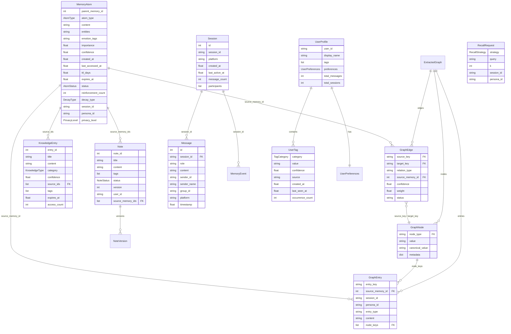

[根目录](../../CLAUDE.md) > [core](../CLAUDE.md) > **models**

## 模块职责

`core/models/` 定义了 Memora 插件的全部核心数据模型，涵盖记忆原子、知识图谱、会话/消息、知识库、笔记、用户画像和召回策略。所有模型使用 Python `dataclass` (大部分带 `slots=True`) 实现，面向存储层和检索层提供一致的数据契约。

## 数据模型 ER 图

## 模型详解

### 1. MemoryAtom (`memory_atom.py`) -- 记忆原子

核心存储单元，从对话中提取的细粒度、时间感知型记忆。

| 字段 | 类型 | 默认值 | 描述 |
|------|------|--------|------|
| `parent_memory_id` | `int` | 必填 | 所属记忆文档 ID |
| `atom_type` | `AtomType` | `UNKNOWN` | 原子类型 (episodic/factual/relational/preference/planned) |
| `content` | `str` | `""` | 记忆内容文本 |
| `entities` | `list[str]` | `[]` | 关联实体列表 |
| `emotion_tags` | `list[str]` | `[]` | 情感标签 |
| `importance` | `float` | `0.5` | 重要性 (0-1) |
| `confidence` | `float` | `0.7` | 置信度 (0-1) |
| `created_at` | `float` | `time.time()` | 创建时间戳 |
| `last_accessed_at` | `float` | `time.time()` | 最后访问时间 |
| `last_reinforced_at` | `float\|None` | `None` | 最后强化时间 |
| `event_time` | `float\|None` | `None` | 事件发生时间 |
| `ttl_days` | `float` | `30.0` | 生存天数 |
| `expires_at` | `float` | `0.0` | 过期时间戳 |
| `status` | `AtomStatus` | `ACTIVE` | 生命周期状态 |
| `reinforcement_count` | `int` | `0` | 强化次数 |
| `decay_type` | `DecayType` | `EXPONENTIAL` | 衰减类型 |
| `session_id` | `str\|None` | `None` | 关联会话 |
| `persona_id` | `str\|None` | `None` | 关联人格 |
| `metadata` | `dict` | `{}` | 扩展元数据 |
| `atom_id` | `int` | `0` | 内部 ID |

**关键方法**:
- `compute_temporal_score(reference_time)` -- 计算当前衰减系数 (0-1)
- `is_expired(reference_time)` -- 判断是否过期

**枚举值**:
- `AtomType`: `EPISODIC`, `FACTUAL`, `RELATIONAL`, `PREFERENCE`, `PLANNED`, `UNKNOWN`
- `DecayType`: `LINEAR`, `EXPONENTIAL`, `STEP`
- `AtomStatus`: `ACTIVE`, `DORMANT`, `SUPERSEDED`, `EXPIRED`, `FORGOTTEN`, `COLD`
- `PrivacyLevel`: `PUBLIC`, `SHARED`, `CONFIDENTIAL`

**关键函数**:
- `compute_ttl(atom_type, importance, reinforcement_count, event_time, emotional_intensity, persona_decay_modifier)` -- 计算 TTL 和衰减类型，包含闪光灯记忆机制 (emotional_intensity >= 0.85 时永久存储) 和 v2.6 试用期机制
- `compute_decay_score(decay_type, ttl_days, days_since)` -- 纯衰减系数计算

**TTL 基础配置**:

| AtomType | Base TTL | DecayType |
|----------|----------|-----------|
| EPISODIC | 7 天 | EXPONENTIAL |
| PLANNED | 2 天 + 事件时间 | STEP |
| FACTUAL | 180 天 | EXPONENTIAL |
| RELATIONAL | 90 天 | LINEAR |
| PREFERENCE | 60 天 | EXPONENTIAL |
| UNKNOWN | 30 天 | EXPONENTIAL |

### 2. GraphNode, GraphEdge, GraphEntry, ExtractedGraph (`graph_models.py`) -- 知识图谱

**GraphNode** -- 图中的规范节点:
| 字段 | 类型 | 描述 |
|------|------|------|
| `node_type` | `str` | 节点类型 (person/entity/concept/...) |
| `value` | `str` | 显示值 |
| `canonical_value` | `str` | 规范化值（去重 key） |
| `metadata` | `dict` | 扩展元数据 |
| `node_key` | `str` (property) | `{node_type}:{canonical_value}` |

**GraphEdge** -- 图边:
| 字段 | 类型 | 默认值 | 描述 |
|------|------|--------|------|
| `source_key` | `str` | 必填 | 源节点 key |
| `target_key` | `str` | 必填 | 目标节点 key |
| `relation_type` | `str` | 必填 | 关系类型 |
| `source_memory_id` | `int` | 必填 | 来源记忆 ID |
| `confidence` | `float` | `0.8` | 置信度 |
| `weight` | `float` | `1.0` | 边权重 |
| `status` | `str` | `"active"` | 边状态 |
| `edge_key` | `str` (property) | | 含 memory_id 的唯一标识 |
| `semantic_edge_key` | `str` (property) | | 跨记忆的语义边标识 |

**GraphEntry** -- 可搜索的图产物:
| 字段 | 类型 | 描述 |
|------|------|------|
| `entry_key` | `str` | 条目 key |
| `source_memory_id` | `int` | 来源记忆 ID |
| `session_id` | `str\|None` | 来源会话 |
| `persona_id` | `str\|None` | 来源人格 |
| `entry_type` | `str` | 条目类型 |
| `content` | `str` | 条目内容 |
| `node_keys` | `list[str]` | 关联节点 keys |
| `relation_type` | `str\|None` | 关系类型 |

**ExtractedGraph** -- LLM 提取的图快照，包含 `nodes`, `edges`, `entries` 三个列表。

### 3. Message, Session, MemoryEvent (`conversation_models.py`) -- 会话模型

**Message** -- 单条消息:
| 字段 | 类型 | 默认值 | 描述 |
|------|------|--------|------|
| `id` | `int` | 必填 | 数据库自增主键 |
| `session_id` | `str` | 必填 | 会话 ID |
| `role` | `str` | 必填 | user/assistant/system |
| `content` | `str` | 必填 | 消息文本 |
| `sender_id` | `str` | 必填 | 发送者唯一 ID |
| `sender_name` | `str\|None` | `None` | 发送者昵称 |
| `group_id` | `str\|None` | `None` | 群组 ID |
| `platform` | `str\|None` | `None` | 平台标识 |
| `timestamp` | `float` | `time.time()` | 消息时间 |
| `metadata` | `dict` | `{}` | 扩展元数据 |

**关键方法**:
- `content_to_text(content)` -- 将各类消息内容规范化为纯文本
- `format_for_llm(include_sender_name)` -- 格式化为 LLM 所需格式，群聊场景添加 `[昵称 | ID | 时间]` 前缀
- `from_dict(data)` -- 从字典反序列化

**Session** -- 会话对象:
| 字段 | 类型 | 描述 |
|------|------|------|
| `id` | `int` | 自增主键 |
| `session_id` | `str` | 会话唯一标识 |
| `platform` | `str` | 平台类型 |
| `created_at` | `float` | 创建时间 |
| `last_active_at` | `float` | 最后活跃时间 |
| `message_count` | `int` | 消息总数 |
| `participants` | `list[str]` | 参与者 ID 列表 |
| `metadata` | `dict` | 扩展元数据 |

**MemoryEvent** -- LLM 提取的结构化记忆:
| 字段 | 类型 | 描述 |
|------|------|------|
| `memory_content` | `str` | 记忆内容 |
| `importance_score` | `float` | 重要性分数 |
| `session_id` | `str` | 关联会话 |
| `timestamp` | `float` | 创建时间 |
| `metadata` | `dict` | 扩展元数据 |

**辅助函数**: `serialize_to_json(obj)`, `deserialize_from_json(json_str, default)`

### 4. KnowledgeEntry (`knowledge_models.py`) -- 知识条目

| 字段 | 类型 | 默认值 | 描述 |
|------|------|--------|------|
| `title` | `str` | `""` | 标题 |
| `content` | `str` | `""` | 内容 |
| `category` | `KnowledgeType` | `FACT` | 分类 |
| `confidence` | `float` | `0.5` | 置信度 |
| `source_ids` | `list[int]` | `[]` | 来源记忆 ID 列表 |
| `tags` | `list[str]` | `[]` | 标签 |
| `created_at` | `float` | `time.time()` | 创建时间 |
| `updated_at` | `float` | `time.time()` | 更新时间 |
| `expires_at` | `float` | `0.0` | 过期时间 (0=永不过期) |
| `access_count` | `int` | `0` | 访问计数 |
| `entry_id` | `int` | `0` | 内部 ID |

**枚举**: `KnowledgeType`: `FACT`, `CONCEPT`, `RULE`, `EVENT`, `PROCEDURE`

### 5. Note + NoteVersion (`note_models.py`) -- 笔记模型

**Note**:
| 字段 | 类型 | 默认值 | 描述 |
|------|------|--------|------|
| `title` | `str` | `""` | 标题 |
| `content` | `str` | `""` | 内容 |
| `tags` | `list[str]` | `[]` | 标签 |
| `status` | `NoteStatus` | `ACTIVE` | 状态 |
| `version` | `int` | `1` | 当前版本号 |
| `created_at` | `float` | `time.time()` | 创建时间 |
| `updated_at` | `float` | `time.time()` | 更新时间 |
| `note_id` | `int` | `0` | 内部 ID |
| `user_id` | `str` | `""` | 所属用户 |
| `source_memory_ids` | `list[int]` | `[]` | 来源记忆 |

**NoteVersion**: 版本快照 (`version`, `content`, `created_at`)

**枚举**: `NoteStatus`: `ACTIVE`, `ARCHIVED`, `DELETED`

### 6. UserProfile + UserTag + UserPreferences (`user_profile.py`) -- 用户画像

**UserProfile**:
| 字段 | 类型 | 描述 |
|------|------|------|
| `user_id` | `str` | 用户 ID |
| `display_name` | `str` | 显示名 |
| `tags` | `list[UserTag]` | 标签列表 |
| `preferences` | `UserPreferences` | 偏好设置 |
| `total_messages` | `int` | 总消息数 |
| `total_sessions` | `int` | 总会话数 |
| `first_seen_at` | `float` | 首次出现时间 |
| `last_seen_at` | `float` | 最后出现时间 |

**关键方法**:
- `get_tags_by_category(category)` -- 按分类筛选标签
- `get_top_tags(limit)` -- 获取置信度最高的标签
- `get_tag_values()` -- 置信度 >= 0.3 的标签值
- `get_weight_vector()` -- 标签权重向量 (用于检索增权)
- `upsert_tag(new_tag)` -- 插入或更新标签（去重+合并置信度）
- `decay_tags(reference_time)` -- 指数衰减标签置信度（半衰期 30 天）
- `remove_stale_tags(min_confidence)` -- 清除低置信度标签

**UserTag**:
| 字段 | 类型 | 默认值 | 描述 |
|------|------|--------|------|
| `category` | `TagCategory` | `CUSTOM` | 标签分类 |
| `value` | `str` | `""` | 标签值 |
| `confidence` | `float` | `0.5` | 置信度 |
| `source` | `str` | `"auto"` | 来源 |
| `created_at` | `float` | `time.time()` | 创建时间 |
| `last_seen_at` | `float` | `time.time()` | 最后出现 |
| `occurrence_count` | `int` | `1` | 出现次数 |

**UserPreferences**:
| 字段 | 类型 | 默认值 | 描述 |
|------|------|--------|------|
| `reply_style` | `str` | `"casual"` | 回复风格偏好 |
| `preferred_topics` | `list[str]` | `[]` | 偏好话题 |
| `avoided_topics` | `list[str]` | `[]` | 回避话题 |
| `active_hours` | `list[int]` | `[]` | 活跃时段 |
| `avg_reply_length` | `int` | `0` | 平均回复长度 |
| `interaction_frequency` | `float` | `0.0` | 互动频率 |

**枚举**: `TagCategory`: `INTEREST`, `PERSONALITY`, `HABIT`, `RELATION`, `KNOWLEDGE`, `PREFERENCE`, `CUSTOM`

### 7. RecallRequest + RecallStrategy (`recall_strategy.py`) -- 召回请求

**RecallRequest** (frozen dataclass):
| 字段 | 类型 | 默认值 | 描述 |
|------|------|--------|------|
| `strategy` | `RecallStrategy` | 必填 | 召回策略 |
| `query` | `str` | 必填 | 查询文本 |
| `k` | `int` | `5` | 返回数量 |
| `session_id` | `str\|None` | `None` | 会话上下文 |
| `persona_id` | `str\|None` | `None` | 人格上下文 |
| `emotion_context` | `list[str]\|None` | `None` | 情感上下文 |
| `memory_types` | `list[str]\|None` | `None` | 记忆类型过滤 |

**枚举**: `RecallStrategy`: `CONTEXTUAL_SIMILARITY`, `TOPIC_ASSOCIATION`, `PREFERENCE_QUERY`, `RELATIONSHIP_REVIEW`

### 8. DEFAULT_STOPWORDS (`default_stopwords.py`) -- 缺省停用词

`DEFAULT_STOPWORDS` 是一个 `frozenset[str]`，包含约 200 个中文常用停用词，按类别组织：代词、助词、连词、介词、副词、量词、叹词，以及常见低信息量动词、名词和标点符号。

## 关键依赖

- `dataclasses` (stdlib)
- `enum` (stdlib)
- `math`, `time` (stdlib)

## 常见问题 (FAQ)

**Q: MemoryAtom 和 MemoryEvent 的区别是什么？**
A: `MemoryEvent` 是 LLM 反思引擎从对话中提取的原始结构化记忆（旧版格式），`MemoryAtom` 是当前核心存储单元，携带完整的生命周期状态 (TTL、衰减、强化、状态机)。

**Q: 闪光灯记忆 (Flashbulb Memory) 是什么？**
A: 当 `emotional_intensity >= 0.85` 时触发，使用 `LINEAR` 衰减且至少保留 365 天，模拟高度情感事件的近似永久记忆。

**Q: 试用期机制 (v2.6) 是如何工作的？**
A: 新建且未被访问、低重要性的 UNKNOWN/EPISODIC 原子默认只给 3 天 TTL。如果被检索访问过（reinforcement_count > 0），则恢复标准 TTL。

**Q: UserTag 如何自动衰减？**
A: 调用 `UserProfile.decay_tags()` 使用指数衰减算法，半衰期 30 天。此后 `remove_stale_tags()` 可清除置信度 < 0.1 的标签。

## 相关文件清单

| 文件 | 行数 | 描述 |
|------|------|------|
| `__init__.py` | 26 | 模块公共导出 |
| `memory_atom.py` | 203 | MemoryAtom + TTL/衰减算法 + 枚举 |
| `graph_models.py` | 72 | GraphNode/Edge/Entry/ExtractedGraph |
| `conversation_models.py` | 346 | Message/Session/MemoryEvent + 序列化 |
| `knowledge_models.py` | 68 | KnowledgeEntry + KnowledgeType |
| `note_models.py` | 67 | Note + NoteVersion + NoteStatus |
| `user_profile.py` | 193 | UserProfile/UserTag/UserPreferences |
| `recall_strategy.py` | 29 | RecallRequest + RecallStrategy |
| `default_stopwords.py` | 247 | 中文停用词 frozenset |

## 变更记录 (Changelog)

| 日期 | 变更 | 描述 |
|------|------|------|
| 2026-07-07 | 初始文档 | 完整扫描 9 文件，生成 Mermaid ER 图 + 全部模型字段详解 |
