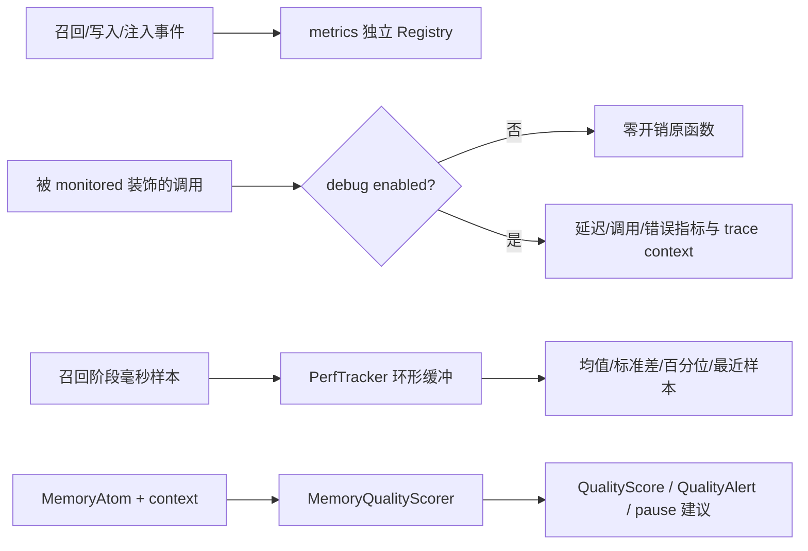

[根目录](../../AGENTS.md) > [core](../AGENTS.md) > **monitoring**

# 指标、插桩、性能与质量监控模块

**Last Updated:** 2026-07-17

## 职责与边界

`core/monitoring/` 包含四类相互独立但同属可观测性的能力：Prometheus 指标定义、可选函数插桩、召回耗时环形统计、记忆原子五维质量评分与告警。它不保存诊断事件、不计算系统总健康分，也不执行记忆审查动作；前者属于 [诊断模块](../diagnostics/AGENTS.md)，人工分诊属于 [审查模块](../review/AGENTS.md)。

## 架构与数据流



## 包入口与组件

### 轻量门面

`core.monitoring.__init__` 默认导出 no-op `monitored` 和 `reset_trace_context`；`set_debug_mode(True)` 首次加载真实 instrumentation 并替换包属性，关闭时恢复 stub。`PerfTracker` 与质量模型通过 `__getattr__` 懒加载并缓存。注意：已经在装饰时绑定的 stub 不会因随后替换包属性而追溯包装旧函数。

### `metrics.py`

使用独立 `CollectorRegistry`，避免污染进程默认注册表。`prometheus_client` 导入失败时 Counter/Gauge/Histogram 退化为支持 `labels/inc/observe/set` 的 no-op stub。指标覆盖召回、缓存、记忆写入、写协调器、注入预算、LLM 调用、注入决策/队列/丢弃、预设迁移、混合钳制、阶段耗时与 payload 比率。`is_prometheus_available()` 只报告真实库是否可用。

### `instrumentation.py`

真实 `@monitored` 同时支持同步和异步函数。debug 开启时按全限定函数名记录延迟、调用和错误；trace 开启时通过 `contextvars` 维护单消息调用树。`reset_trace_context()` 必须在消息边界清理深度和树。动态指标对象按名称缓存并注册到模块独立 Registry。

### `PerfTracker`

默认保留最近 200 条样本，固定键为 `total_ms`、`bm25_ms`、`vector_ms`、`graph_ms`、`rerank_ms`。使用 Welford 统计；环形缓冲溢出后从保留样本重建，确保均值/标准差不包含已淘汰值。`get_percentile` 线性插值，`get_perf_data` 返回汇总和最近样本。

### `MemoryQualityScorer`

`score_atom(atom, context)` 计算 consistency `0.25`、coherence `0.25`、relevance `0.20`、freshness `0.15`、accuracy `0.15`。它是纯统计启发式：双字 token/Jaccard 或余弦、文本结构、来源先验与近期上下文、TTL、来源可靠性/URL/verified。低于 `0.60/0.45/0.30` 产生 medium/high/critical 告警；连续 5 个 overall 低于 `0.30`，或一小时内至少 2 个 critical 告警时 `should_pause()` 建议暂停。历史仅在内存 deque 中。

## 依赖方向

- 上游：`main.py`、`core/event_handler.py`、召回/写入/注入组件和 API 指标汇总。
- 本模块：`instrumentation.py -> metrics.py`；`quality_scorer.py -> core/utils/text_utils.py`；`perf_tracker.py` 仅标准库。
- 下游：可选 `prometheus_client`；没有直接的 LLM、NumPy 或 FAISS 依赖。
- 相关上下文：[诊断模块](../diagnostics/AGENTS.md)、[审查模块](../review/AGENTS.md)、[工具函数](../utils/AGENTS.md)。

## 隐私、安全与修改约束

- Prometheus label 必须是低基数枚举或函数名；不得加入 `user_id`、`group_id`、query、Prompt、异常文本或任意 payload，避免隐私泄漏和时间序列爆炸。
- trace 调用树可能暴露函数结构；消息结束必须 reset，不得把参数/返回值加入 trace 节点。
- `PerfTracker.recent` 是进程内运维数据；新增样本字段要保持有限键集合和有界缓冲，不能保存查询正文。
- 质量 scorer 读取原子内容和上下文，但当前只保留分数与 `atom_id`；不要把完整内容加入历史、告警或 `get_stats()`。
- `should_pause()` 是建议状态，不是事务控制器；调用方决定是否暂停。统计分数不能替代人工审查或安全扫描。
- 保持缺少 Prometheus 时可导入、no-op API 兼容、独立 Registry、懒加载缓存和同步/异步装饰器行为。

## 测试定位与验证

- `tests/test_monitoring_package.py`：包级懒加载、缓存和 debug stub 切换。
- `tests/test_monitoring_metrics.py`：真实/降级 Registry、已知 collector 与 bucket 契约。
- `tests/test_monitoring_instrumentation.py`：同步/异步插桩、动态指标、错误和 trace。
- `tests/test_perf_tracker.py`：环形溢出后的滚动统计、部分键、百分位和边界。
- `tests/test_quality_scorer.py`：五维启发式、告警、自动暂停、统计与边界输入。
- `tests/test_api_metrics.py`：控制台汇总对 PerfTracker 和写指标的集成。

精确验证命令：

```bash
python -m pytest -q tests/test_monitoring_package.py tests/test_monitoring_metrics.py tests/test_monitoring_instrumentation.py tests/test_perf_tracker.py tests/test_quality_scorer.py tests/test_api_metrics.py
```
