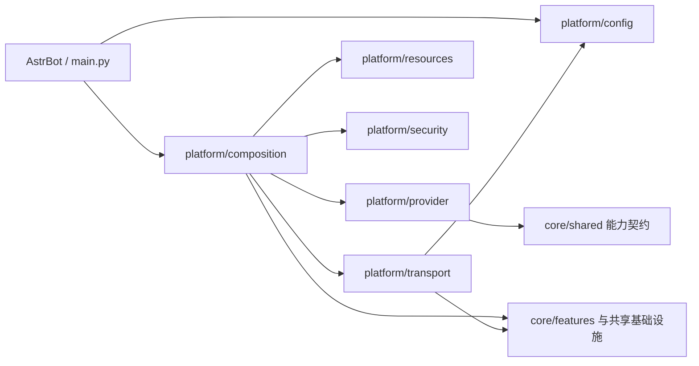

# `core/platform` 宿主边界与运行时平台适配

**最后核对：** 2026-08-14  
**上级上下文：** [项目根级 AGENTS.md](../../AGENTS.md) / [core AGENTS.md](../AGENTS.md)

## 职责边界

`core/platform/` 是 Memora 与 AstrBot 宿主之间的适配层，也是运行时组合根的落点。它负责配置来源与事务、共享组件装配、Provider 能力冻结、插件资源读取，以及 Web/命令/Agent/实时传输边界；不拥有记忆领域规则、SQLite schema、检索算法或 Dashboard 业务状态。

依赖方向保持单向：



- `main.py`/插件入口把宿主 Context、配置源、数据目录和 Provider 交给组合根；平台子模块不得反向导入 `main.py`。
- 组合根可以装配 feature、manager、store 和 processor；领域层不得为了调用业务能力反向依赖页面、命令或宿主适配器。
- 资源、配置快照、Provider adapter 和传输 DTO 都必须隔离可变外部对象；不要在平台层复制领域状态。

## 子模块导航

本轮只补齐以下六个缺失入口：

- [`config/AGENTS.md`](config/AGENTS.md)：Pydantic 配置模型、Schema、迁移、版本化原子更新。
- [`composition/AGENTS.md`](composition/AGENTS.md)：Provider 等待、组件构造、就绪、重建、重载与关闭顺序。
- [`provider/AGENTS.md`](provider/AGENTS.md)：LLM/Embedding 调用入口探测、结果校验和能力快照。
- [`resources/AGENTS.md`](resources/AGENTS.md)：source/bundle 资源定位、Schema 读取、版本和 i18n。
- [`transport/AGENTS.md`](transport/AGENTS.md)：页面、命令、Agent 工具、路由生命周期和实时 Hub 的宿主边界。

下列入口已经存在，本轮保持原文不动：

- [`security/AGENTS.md`](security/AGENTS.md)：Prompt 作用域保护、回复清洗和结构化输出护栏；不要在 platform 父文档复制其规则。
- [`transport/page_api/AGENTS.md`](transport/page_api/AGENTS.md)：Page API mixin、路由与响应契约。
- [`transport/tools/AGENTS.md`](transport/tools/AGENTS.md)：Agent 工具清单、注册开关和 scope 规则。
- [`transport/commands/AGENTS.md`](transport/commands/AGENTS.md)：`/memora` 管理命令、权限、写保护和清理语义。

## 关键运行时链

1. `ConfigManager` 从 AstrBot 注入映射建立深拷贝快照：旧键迁移 → 默认值深合并 → Pydantic 校验/分支降级 → SHA-256 revision；Page API 的配置更新在锁内做 Schema、CAS、原子保存和保存后重读。
2. `PluginInitializer` 通过 `ProviderLoader` 选择候选，`ProviderWaiter` 以有界重试等待两类 Provider；就绪后由 `ComponentFactory` 统一构造数据库、引擎、处理器、身份、索引、调度与演化组件，再发布完整运行时。
3. `DerivedRebuildCoordinator` 只处理可丢弃派生面，顺序为 canonical 可访问性确认 → FTS/BM25/FAISS → graph → relation/projection/evolution（可选 notes/compression 阶段由当前装配决定）；阶段失败不得删除 canonical。
4. 关停先停止 scheduler、回填和引擎后台生产者，再清理 Prompt protection、RealtimeHub、演化/注入组件，最后关闭 manager/store/数据库；路由清理由 transport 的内部生命周期适配器完成。

## 跨模块不变量

- **就绪与共享实例：** 事件、命令、页面和工具只能使用初始化器发布的同一 provider、store、manager、engine；未就绪不得临时创建替代实例或绕过 readiness。
- **取消传播：** 所有等待、Provider 调用、保存和关闭路径必须继续传播 `asyncio.CancelledError`；普通可恢复异常可转为稳定降级，但不能伪造成功。
- **不可信边界：** 宿主配置、Schema、Provider 返回值、资源名、页面输入、命令参数和模型输出都要在各自 owner 处校验；日志和传输结果不得泄露凭据、原始 prompt、绝对路径、异常堆栈或内部 ID 列表。
- **写保护：** 备份恢复、维护和关停期间的写入口必须复用现有 guard；配置保存与领域 canonical 写入均需先验证、再原子发布。派生索引永远不是第二套权威数据。
- **能力声明：** Provider 只有显式 adapter/capability contract 才能进入运行时；未知能力不能通过“尝试调用后再降级”冒充支持。
- **宿主契约：** AstrBot 未公开的反注册等能力只能放在窄的兼容探针中，不能扩展为 feature 可依赖的稳定 API。

## 修改联动

| 修改范围 | 必须同步核对 |
|---|---|
| `config/` | `_conf_schema.json`、`ConfigManager`、Page API 配置端点、Dashboard 类型/默认值和配置契约测试 |
| `composition/` | `main.py` 发布字段、初始化/关闭调用方、Provider 能力、组件失败回滚和重建顺序 |
| `provider/` | `shared/adapter_capabilities.py`、Provider loader、LLM/Embedding/检索调用方及 adapter 契约 |
| `resources/` | `metadata.yaml`、`_conf_schema.json`、`core/i18n`/prompt 资源、bundle 打包入口和版本检查调用方 |
| `transport/` | `platform/transport/page_api/page_api.py`、`platform/transport/commands/command_handler.py`/`command_endpoints.py`、Agent 工具注册、Dashboard API 契约和深层 AGENTS |
| `security/` | 只改安全 owner；同步 [`security/AGENTS.md`](security/AGENTS.md) 指向的安全链与测试，不在其他平台模块复制实现 |

## 最窄验证入口

本次仅生成 Markdown，按任务要求跳过 formatter、lint、测试和项目级验证。源码变更时按 owner 选择最窄入口：

```bash
python -m pytest tests/test_platform_config_contracts.py tests/test_config_persistence_concurrency.py tests/test_config_migrations.py -q
python -m pytest tests/test_platform_composition_contracts.py tests/test_plugin_init.py -q
python -m pytest tests/test_platform_provider_contracts.py tests/test_adapter_capabilities.py -q
python -m pytest tests/test_platform_resources_and_realtime.py -q
python -m pytest tests/test_platform_transport_contracts.py tests/test_page_api_contract.py -q
```

平台文档只维护边界、生命周期和联动；字段、路由、工具参数与安全规则以下沉模块文档和当前源码为准。
