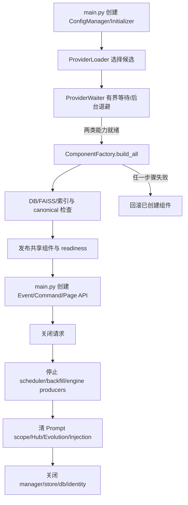

# `core/platform/composition` 运行时组合根

**最后核对：** 2026-08-14  
**上级：** [platform AGENTS.md](../AGENTS.md) / [core AGENTS.md](../../AGENTS.md)

## 职责边界

本目录负责把 AstrBot Context、配置、Provider、数据目录和 feature/domain 组件组合成一个可发布、可观察、可关闭的 Memora 运行时。`PluginInitializer` 是生命周期编排入口，`ComponentFactory` 是共享实例构造入口；其余文件提供 Provider 等待、就绪快照、数据库准备、FAISS 检查、派生重建、延迟重载和失败清理。

组合根可以依赖 [`../config/AGENTS.md`](../config/AGENTS.md)、[`../provider/AGENTS.md`](../provider/AGENTS.md)、[`../resources/AGENTS.md`](../resources/AGENTS.md)、security 与 `core/features`；feature、store、processor 不得反向导入组合根来取得全局实例。旧的 `core.plugin_initializer`、`core.initializer.*` 路径已移除，不要恢复兼容双轨。

## 入口与文件分工

- `plugin_initializer.py`：初始化、发布、失败回滚、维护任务、停止任务和关闭总协调器。
- `component_factory.py`：集中构造数据库、图存储、`MemoryEngine`、`MemoryProcessor`、会话/身份、索引验证器、注入记录、质量/隔离和 Memory Evolution 组件；不得在请求处理器中重复构造。
- `provider_loader.py`：按配置 ID 和宿主默认顺序选择 Embedding/LLM 候选，并用公开 Provider 类型和 adapter 能力过滤。
- `provider_waiter.py`：非阻塞 Provider 检查、指数退避后台重试、终态回调和取消。
- `readiness.py`：只读初始化状态、缺失 Provider/组件快照和有界等待。
- `db_setup.py`：启动期索引一致性检查、统一派生重建调用和会话消息计数修复。
- `derived_rebuild_coordinator.py`：串行、固定顺序重建可丢弃派生面。
- `engine_runtime_config.py`：从配置叶白名单投影出 `MemoryEngine` 运行时快照，并标注 restart/rebuild effect。
- `faiss_checker.py`：隔离子进程导入检查、延迟加载向量 DB 类和 embedding 维度失配隔离。
- `reload_lifecycle.py`：配置/自主学习 operation 的延迟插件重载状态回调；重载失败必须保留真实的 staged/manual 状态。
- `shutdown_lifecycle.py`：先收敛生产者，再关闭共享消费者和安全/传输边界。
- `identity_lifecycle.py`：组件发布失败后的身份运行时清理，取消必须继续传播。

## 初始化生命周期



必须保持以下顺序和状态语义：

1. Provider 未就绪时不开始依赖其能力的 DB/index/engine 初始化，也不发布半初始化运行时；等待有上限，后台重试可取消。
2. `ComponentFactory` 完成所有共享依赖后才让 `_initialization_complete=True`；任何失败都记录稳定失败状态并关闭已经移交组合根的组件。
3. 身份目录普通初始化失败可按当前实现降级为解析模式，但不得把缺失的可选认知组件伪装成 ready；主消息链的必需组件缺失必须失败闭合。
4. 启动期重建只确认 canonical 后处理派生数据。`DerivedRebuildCoordinator` 以锁串行运行；FTS/FAISS、graph、relation/projection 任一阶段失败只报告降级，不删除 canonical。
5. `DatabaseSetup` 未注入 coordinator 时仅保留旧的 FTS/FAISS 独立测试/延迟装配路径；生产组合根应注入统一 coordinator。
6. 配置保存或自主学习变更触发重载时，`reload_lifecycle` 只安排真实宿主能力；无法热重载时保留 staged/manual restart，不得写成 succeeded。

## 关停与取消不变量

- 先停止衰减、回填和引擎后台任务等生产者，再关闭 Evolution、Injection、PromptProtection、RealtimeHub，最后关闭下游 stores/DB/identity；不能让已关闭的 consumer 接收新 job。
- 每个步骤使用 initializer 的统一超时/普通异常处理；原始初始化失败不能被清理异常覆盖。
- `asyncio.CancelledError` 在 Provider 等待、重建、重载和关闭中必须传播；只捕获普通异常并转换稳定 reason code。
- Page 路由反注册由 `transport/route_lifecycle.py` 的内部宿主探针处理；`RealtimeHub` 只管理订阅、发布与关闭，两者都不是 feature 的公开能力。
- 组件实例必须由唯一 owner 关闭一次；关闭函数可幂等，但不得重复创建或重复注册路由。

## 安全边界与修改联动

组合根处理不可信 Provider 返回、配置和路径时只传递已验证 adapter/locator；不得把完整配置、Provider 凭据、异常正文或用户内容写入普通日志。新增组件需：

- 在 `ComponentFactory` 集中构造并注入，而不是在 handler/API 内懒建全局对象；
- 更新 `PluginInitializer` 的发布字段、失败回滚、readiness snapshot、close 顺序和 `core/AGENTS.md` 真实入口；
- 明确是否为 canonical owner 或可重建派生物，并接入统一重建顺序；
- 对可选能力采用真实缺失状态和稳定降级，不能用空壳对象假装可用；
- 核对 `main.py` 的 EventHandler/CommandHandler/Page API/工具注册调用方和相应 contract tests。

## 最窄验证入口

本轮仅生成 Markdown，按任务要求跳过 formatter、lint、测试和项目级验证。组合代码变更时优先：

```bash
python -m pytest tests/test_platform_composition_contracts.py tests/test_plugin_init.py -q
python -m pytest tests/test_derived_rebuild_coordinator.py -q
python -m pytest tests/test_adapter_capabilities.py tests/test_platform_provider_contracts.py -q
```

不存在的历史测试文件不应凭文档创建；提交前以 `tests/` 当前清单选择最窄入口。
