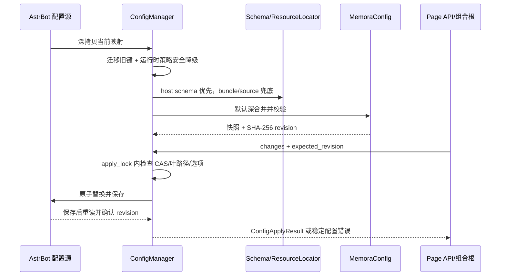

# `core/platform/config` 配置控制面

**最后核对：** 2026-08-14  
**上级：** [platform AGENTS.md](../AGENTS.md) / [core AGENTS.md](../../AGENTS.md)

## 职责边界

本目录是 AstrBot 注入配置的唯一平台 owner：把外部可变映射转换成隔离、已校验、可追踪 revision 的运行时配置，并为 Page API/组合根提供读取和原子更新接口。它负责配置模型聚合、默认值深合并、旧键迁移、Schema 叶路径约束、所有权登记、运行时影响分类和成本策略投影；不直接启动 Provider、修改领域 Store、注册 Web 路由或保存 Dashboard 自己的第二份配置。

`config_validator.py::MemoraConfig` 聚合来自 feature domain 的模型；`feature_contributions.py` 只做模型导入/公开集合，不应在此复制 feature 规则。安全字段的模型 owner 是本目录，安全执行链仍在 [`../security/AGENTS.md`](../security/AGENTS.md)。

## 公开入口与文件分工

- `__init__.py`：惰性导出 `ConfigManager`、验证/默认值函数、所有权和影响分类；保持包导入轻量，未知属性必须失败。
- `manager.py`：唯一可变配置控制面。读取外部源、建立快照、计算 SHA-256 revision，并实现锁内 CAS、持久化、回滚、取消和配置错误映射。
- `config_validator.py`：`MemoraConfig` 根模型及旧兼容导出；不要把验证编排移回 `core/base`。
- `validation.py`：根模型的延迟加载、默认值生成、递归合并和完整候选验证。
- `migrations.py`：只迁移明确支持的旧键；迁移在隔离副本上执行，返回稳定 migration id，不改写源映射。
- `ownership.py`：顶层配置分支到责任模块的不可变登记表；未登记点路径必须拒绝解析。
- `runtime_effects.py`：把变更分类为重启/派生重建影响；当前任一变更要求重启，图 temporal/causal 叶还要求重建。
- `runtime_feature_config.py`、`feature_config.py`、`feature_contributions.py`：聚合正式运行时功能模型和轻量开关。
- `provider_config.py`、`transport_config.py`、`security_config.py`、`rebuild_config.py`：Provider、Agent/Dashboard、Prompt 安全、索引重建模型。
- `cost_control.py`：只接受 `CostControlConfig` 或叶映射，构造 shared 的不可变成本门。

## 配置读取与更新生命周期



不变量：

1. `ConfigManager` 的 `_config`、返回的 section、snapshot 和 `get_all()` 都是隔离副本；调用方不得原地修改内部状态或外部源以绕过 `apply_config_changes()`。
2. 有可持久化能力但 Schema 不可用时，持久化更新 fail-closed；不能用 Pydantic `extra=allow` 替代宿主 Schema 叶约束。
3. `expected_revision` 非空时必须精确匹配当前 revision；并发同 revision 只能有一个写入成功。保存失败要回滚候选源和快照，但不能覆盖已发生的外部并发变更。
4. 保存期间收到取消时，先等待已开始的保存完成：若保存成功，发布新快照后再传播取消；若失败，恢复旧状态并传播取消。
5. 运行时策略叶（注入 preset、retention、max rows 等）只在隔离读取副本上做安全 fallback，不把降级值偷偷写回 AstrBot 源。
6. `migrate_legacy_config()` 只执行白名单迁移；旧 `cross_encoder` 相关键迁移后不得再次出现在当前候选。
7. 配置变更成功并不等于运行时已重载；调用方必须根据 `classify_config_effects()` 安排重载/重建并保留真实状态。

## 安全边界与依赖方向

- 外部 Schema 只允许非空对象、字符串字段名、合法 type、递归 object items 和 JSON 标量 options；非有限浮点、畸形 host/bundle Schema 必须回退或拒绝。
- 配置错误对外使用 `ConfigConflictError`、`ConfigValidationError`、`ConfigPersistenceError` 等稳定类别；日志不得输出密钥、完整配置、绝对路径或异常正文到用户响应。
- `security` 叶只描述开关/阈值，Prompt scope 生命周期由 security owner 管理；不要在配置层实现清洗或以关闭开关绕过 fail-closed 策略。
- `transport` 配置中的 Agent 写工具默认关闭，Dashboard runtime build 默认关闭；不要在配置模型里授予管理员权限。
- 依赖方向为 `resource locator → ConfigManager`、`ConfigManager → Pydantic/shared`、`composition/Page API → ConfigManager`。配置包不得导入 `main.py`、Page API、SQLite 或 feature application 以执行副作用。

## 修改联动

新增/改名配置叶时必须同时检查：

- `_conf_schema.json` 与 `ConfigManager._parse_schema_contract()` 的点路径和 options；
- `config_validator.py`、对应 feature domain 模型、`CONFIG_SECTION_OWNERSHIP`；
- `REBUILD_REQUIRED_PATHS`、组合根的 engine runtime projection 和 reload 调度；
- Page API `/config/schema|state|apply`、Dashboard 类型/默认值、旧配置迁移和契约测试；
- `platform/config/__init__.py` 的惰性公开导出及所有旧 owner 的恒等导出测试；
- quality 门禁分支：`quality.gate` 的 `bindings`/`profiles` 复合数组由 Pydantic 兜底校验（schema 只表达 `enabled`/`default_profile` 两片标量叶）；变更必须同步 `core/features/quality/domain/gate_config.py`、`GateRuntime` 快照构建、门禁页/规则引擎/召回过滤与 `tests/test_gate_config.py`；热重载由 `gate_hot_reload_required()`（`GATE_HOT_RELOAD_PATHS = ("quality.gate",)`）判定并保持窗口内快照一致。

## 最窄验证入口

本轮只新增文档，按共享任务要求不运行验证。配置源码变更时优先：

```bash
python -m pytest tests/test_platform_config_contracts.py tests/test_config_contract.py -q
python -m pytest tests/test_config_persistence_concurrency.py tests/test_config_migrations.py -q
python -m pytest tests/test_api_config.py tests/test_page_api_contract.py -q
```

字段默认值、约束和所有权以当前 `MemoraConfig`、Schema 与测试为准；文档不得成为第二份配置事实来源。
