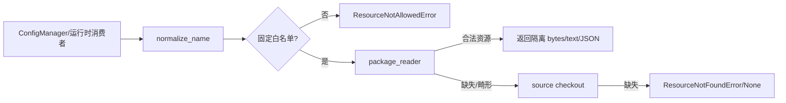

# `core/platform/resources` 插件资源边界

**最后核对：** 2026-08-14  
**上级：** [platform AGENTS.md](../AGENTS.md) / [core AGENTS.md](../../AGENTS.md)

## 职责边界

本目录统一定位 source checkout 与 runtime bundle 中的插件资源，提供配置 Schema、metadata、提示词、翻译和静态词表的安全读取入口。资源名来自插件固定清单，不是用户可自由指定的文件路径；本目录不解释 feature 配置语义、不执行外部命令、不写资源文件，也不承担 Web 下载或 Dashboard 构建。

- `locator.py::PluginResourceLocator`：唯一资源定位器；规范化名称、白名单、source/bundle fallback、JSON/Schema 结构校验。
- `package_reader.py`：用 `importlib.resources` 构造 bundle reader；包不存在或读取异常返回 `None`，让 locator 继续 source fallback。
- `version.py`：从插件根 `metadata.yaml` 读取唯一 `PLUGIN_VERSION`；其他模块不得硬编码版本。
- `i18n_backend.py`：命令/运行时翻译加载，始终以中文包作 fallback，提供 `init`、`t` 和 `t_list`。
- `__init__.py`：公开 locator、资源错误、package reader；保持轻量，不在导入时加载全部文本资源。

## 资源查找顺序



允许的精确名称为 `_conf_schema.json`、`metadata.yaml`；允许的目录前缀为 `static/stopwords/`、`core/prompts/`、`core/i18n/`、`.astrbot-plugin/i18n/`。`normalize_name()` 必须拒绝空名、绝对路径、Windows/Posix 父目录穿越、空段和白名单外路径，并将反斜杠统一为 `/`。

`read_bytes/read_text` 优先使用 bundle，失败后读取 source；`read_json` 遇到畸形 bundle JSON 时继续尝试 source。`load_schema(host_schema)` 的顺序固定为：合法 host 注入 Schema → 合法 bundle Schema → 合法 source Schema；畸形 host 不得遮蔽合法 source。Schema 只验证结构边界（对象、字段名、type、递归 items、有限标量 options），不在资源层解释具体配置叶。

## 安全不变量

- 所有路径先规范化再 `resolve()`，并再次确认 candidate 位于插件根目录；不能把异常消息中的绝对路径透传给用户。
- package reader 的 bytes/text/Path 结果必须转换为隔离 bytes；bundle 读取的异常只能触发安全 fallback，不得任意读取包外路径。
- JSON 只接受非空对象并返回深拷贝；调用方不得修改缓存或 package reader 返回的可变结构。
- Schema options 只接受 `None/bool/int/str/有限 float`；布尔不能被当作整数，NaN/Inf 必须拒绝。
- `metadata.yaml` 是版本唯一事实来源；读取失败应暴露真实初始化问题，不能用硬编码版本静默兜底。
- i18n 语言只接受当前支持集合（`zh/en/ru`），未知语言回退中文；缺键返回 key 或空列表并记录低敏告警，不能把用户输入当作资源路径。
- 资源内容可能进入 Prompt、配置或用户消息；调用方仍需按自身边界做安全清洗、Schema/Pydantic 验证和隐私过滤。

## 依赖方向与修改联动

依赖方向为 `composition/config/消费者 → resources → pathlib/importlib.resources`。resources 不得导入 Page API、Provider、SQLite 或 feature application。变更白名单、bundle 结构、版本路径或翻译语言时，联动检查：

- `_conf_schema.json`、`metadata.yaml`、`core/i18n/*.json`、`core/prompts/` 和打包 manifest；
- `ConfigManager` 的 Schema 优先级、`version_check.py`、i18n 调用方和 runtime bundle reader；
- 资源错误码、路径穿越/畸形 JSON/非法 Schema 的测试；
- 任何新增资源都必须先进入固定白名单，不能由调用方自行拼接路径。

## 最窄验证入口

本轮仅新增 Markdown，按任务要求跳过 formatter、lint、测试和项目级验证。资源源码变更时优先：

```bash
python -m pytest tests/test_platform_resources_and_realtime.py tests/test_version_check.py -q
python -m pytest tests/test_i18n.py tests/test_page_i18n_contract.py tests/test_package_plugin_i18n.py -q
```

资源文档不替代实际白名单和打包配置；冲突时以 `locator.py`、manifest 和测试为准。
