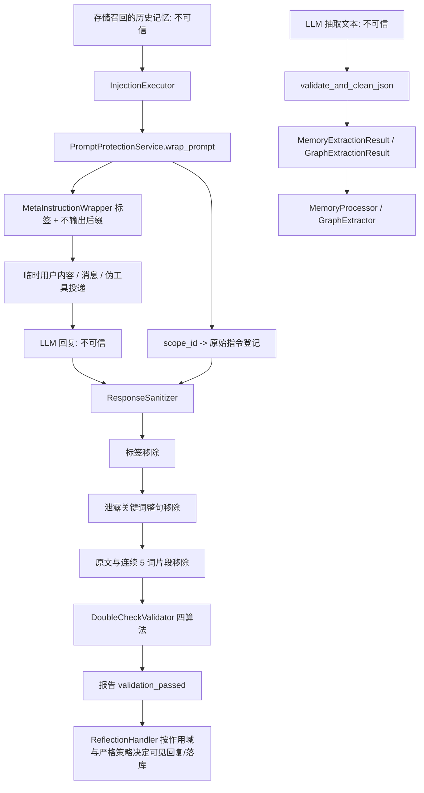

[根级 AGENTS.md](../../AGENTS.md) > [core](../AGENTS.md) > **security**

# `core/security` 模块上下文

**最后更新：** 2026-07-17  
**模块入口：** `core/security/__init__.py`、`prompt_sanitizer.py`、`guardrails.py`

## 职责与威胁边界

`core/security/` 保护两条 LLM 边界：

1. **Prompt/回复链**：包装注入的历史记忆，按请求作用域登记敏感原文，清理模型回复中的标签、泄露关键词和原文片段，再以四种相似度算法复查。
2. **结构化输出链**：从不可信 LLM 文本提取/修复 JSON，并用 Pydantic 模型验证记忆和图抽取结果后才交给处理/存储逻辑。

本模块不实现用户认证、授权、传输加密、宿主沙箱、SQL 执行或 Dashboard XSS 防护。动态注入格式由 [`../utils/AGENTS.md`](../utils/AGENTS.md) 生成，严格模式由 [`../base/AGENTS.md`](../base/AGENTS.md) 定义并由 handlers/injection 调用链执行。

## 端到端安全链



## Prompt 防护组件

### `MetaInstructionWrapper`

- 三种静态模板：`system_internal`、`HIDDEN_INSTRUCTION`、`actor_direction`；构造时模板索引只钳制上界，配置模型负责保证非负。
- `wrap_instruction()` 对空白输入返回空字符串，以 `random.choice()` 添加三种非安全随机后缀，并记录原始指令 SHA-256 的 16 字符前缀供诊断。
- 包装只是给合作模型的边界提示，绝不能作为唯一泄露防线；标签内容仍会发给 Provider。

### `ResponseSanitizer`

顺序固定：

1. 用大小写不敏感、跨行正则移除 5 类内部标签块；
2. 按中英文句末/换行拆句，整句移除包含泄露关键词的内容；
3. 移除已登记指令的完整匹配和连续 5 个空格分词片段；
4. 合并过量空行并返回 `(sanitized, leaks_found)`。

显式传入 `instructions` 时不会污染旧的全局登记列表。清洗是确定性最佳努力：可能过度过滤，也可能漏掉改写后的语义泄露。

### `DoubleCheckValidator`

任一算法分数**严格大于**阈值即判为泄露：

| 算法 | 默认阈值 | 规模限制 |
|---|---:|---|
| token Jaccard | 0.4 | 中英文混合分词 |
| `SequenceMatcher` | 0.6 | 回复 2000 字符、指令 500 字符 |
| 窗口化 LCS | 0.5 | 1.5 倍窗口；2-row DP；单文本截到 500 |
| 3-gram 覆盖 | 0.3 | 分母为指令 n-gram 数 |

`validate_no_leak()` 只返回布尔值和明细，不自动删除文本或抛错。

### `PromptProtectionService` 与请求作用域

- 默认 scope TTL 为 300 秒、最多 1024 个；登记前清理过期 scope，容量满时淘汰最早登记项。
- `wrap_prompt(..., scope_id=...)` 将原始内容与本次请求关联；并发请求必须使用不同 scope，禁止依赖兼容用的全局 instruction 列表。
- `sanitize_response(..., scope_id=..., consume_scope=True)` 使用相同 scope 清理并在 `finally` 中消费，保证异常路径也释放登记。
- `has_scope()` 是上层 fail-closed 判断所需契约。缺失/过期/被淘汰的 scope 在服务内部只表现为空指令集；真正“清空可见回复还是降级放行”由 handler 根据 required 标记和 strict 策略决定。
- `PROMPT_PROTECTION_SCOPE_*` 与 `PROMPT_PROTECTION_REQUIRED_*` 四个键/属性用于 event 上跨 recall/reflection 关联请求；处理结束、非 assistant 回复、错误和 event 复用时必须清理。
- `sanitize_response()` 即使 `validation_passed=False` 仍返回清洗文本；调用方不可忽略报告。统计项只用于观测，不是安全判据。
- `process_interaction()` 是旧式便捷入口；新并发链应显式登记 scope、传递 scope 并消费，而不是共享全局登记。

## 结构化输出护栏

### Pydantic 模型

- `MemoryAtomSchema`
  - `content` 长度 5–2000，先去首尾空白且不可全空；
  - `atom_type` 仅允许 `fact/event/preference/knowledge/reflection`；
  - `importance` 与可选 `confidence` 在 `[0,1]`；实体和情绪标签默认空列表。
- `MemoryExtractionResult`
  - `memories` 默认空；整体 `confidence` 在 `[0,1]`；`extraction_quality` 仅 `low/medium/high`。
- `GraphExtractionResult`
  - 每个 entity 至少有 `name/type`；每个 relation 至少有 `source/target/relation`。

这些是 LLM 交换 Schema，不等同于 [`../models/AGENTS.md`](../models/AGENTS.md) 的持久化 `MemoryAtom`/图 dataclass。处理器负责显式转换，尤其注意两套 atom type 词汇不同。

### JSON 清洗与验证

`validate_and_clean_json()`：空输入默认抛 `ValueError`；可用 `fallback_return_none=True` 改为 `None`。它移除 Markdown 围栏，寻找最先出现的对象/数组边界，先直接 `json.loads()`，失败后修复单引号、尾逗号及 Python `True/False/None` 再试。

- 边界扫描只计括号深度，不解析字符串语境；含括号字符串是已知最佳努力限制。
- 返回注解是字典契约，边界提取器也能解析数组；Pydantic 顶层模型需要对象，调用方不得因 JSON 可解析就认为 Schema 已通过。
- `validate_llm_response()` 始终先以 `fallback_return_none=True` 解析，再用 `safe_validate()` 构造模型。`add_json_instruction` 只是把说明文字追加到已有响应后重新本地解析，不会再次调用 LLM。
- `safe_validate()` 默认吞验证异常并返回 `None`；安全关键路径若要失败可见，传 `fallback_return_none=False` 或在上层严格处理 `None`。

## 生产调用点与依赖方向

- `PluginInitializer` 从 `SecurityConfig` 建立单个共享 `PromptProtectionService`。
- `InjectionExecutor` 在投递已格式化记忆时包装并登记请求 scope；`RecallHandler` 负责 scope 关联；`ReflectionHandler` 在用户可见 assistant 回复与落库前消费并清洗。
- `MemoryProcessor` 使用 `MemoryExtractionResult`，通过后再转换为旧结构化数据/领域模型。
- `GraphExtractor` 使用 `GraphExtractionResult` 验证显式图元数据或字符串 JSON，再转换为 `ExtractedGraph`。
- 模块仅依赖标准库和 Pydantic；不要反向导入 handlers、processors 或 storage。

## 安全修改约束

- 不得为了减少误报而绕过 scope、关闭清洗或忽略 `validation_passed`；阈值变化必须有攻击样例和正常文本回归。
- Wrapper 模板、标签和泄露关键词是安全规则；任何变化必须同步 sanitizer 和测试。
- 不记录原始敏感 Prompt、完整泄露片段或 scope 内容到普通日志；现有 wrapper 只记录截断 hash。
- request scope 必须在所有成功、异常、取消、非 assistant 和复用路径释放；否则会跨请求污染或驻留敏感内容。
- Prompt 防护仍是最佳努力。若数据本身不应发给 Provider，必须在召回/隐私过滤阶段阻止，而不是依赖回复清洗。
- Pydantic 通过只证明结构/局部范围有效，不证明内容真实、无害或有权限落库。

## 测试定位与精确验证

| 变更 | 直接测试 | 跨链测试 |
|---|---|---|
| 包装、标签/关键词/片段清洗、四算法、TTL/容量 scope | `tests/test_prompt_sanitizer.py` | `tests/test_handlers.py` |
| 记忆/图 Schema、JSON 修复、泛型验证 | `tests/test_guardrails.py` | `tests/test_memory_processor.py tests/test_graph_extractor.py` |
| 注入时登记、失败回滚与真实秘密过滤 | `tests/test_injection_executor.py` | `tests/test_cleaners.py` |
| 配置开关和服务创建 | `tests/test_plugin_init.py` | `tests/test_config_contract.py` |

最小安全验证：

```bash
python -m pytest -q tests/test_prompt_sanitizer.py tests/test_guardrails.py
```

作用域或端到端数据流变化：

```bash
python -m pytest -q tests/test_injection_executor.py tests/test_handlers.py tests/test_memory_processor.py tests/test_graph_extractor.py tests/test_cleaners.py
```

## 变更检查清单

1. 不可信输入在何处进入、在何处被清理/验证、失败时由谁决定关闭？
2. scope 是否唯一、可关联、可消费，并覆盖异常与 event 复用路径？
3. 清洗规则和相似度阈值是否同时覆盖泄露样例与正常内容误报？
4. JSON “解析成功”和 Pydantic “Schema 通过”是否仍是两个独立门？
5. 新接口是否从 `core/security/__init__.py` 显式导出，且没有把执行层依赖引回安全层？
