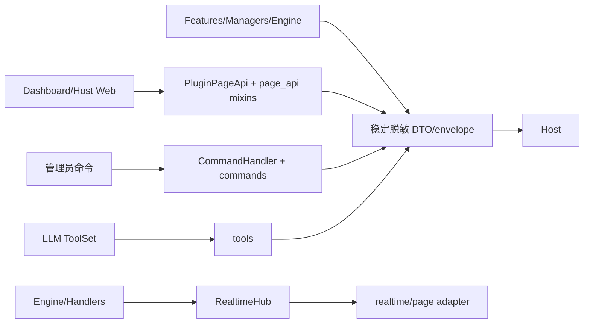

# `core/platform/transport` 宿主传输边界

**最后核对：** 2026-08-14  
**上级：** [platform AGENTS.md](../AGENTS.md) / [core AGENTS.md](../../AGENTS.md)

## 职责边界

本目录承接 Memora 对 AstrBot 的 Web/Page、管理命令、Agent 工具、实时事件和宿主路由生命周期适配。它把已发布的 engine/manager/service 能力转换为宿主可调用的边界，但不复制领域业务、SQLite 操作或第二份运行时状态。

深层模块已有专属上下文，本入口只维护公共边界：

- [`page_api/AGENTS.md`](page_api/AGENTS.md)：Quart/AstrBot Page API mixin、路由、响应 envelope、写保护和审计契约。
- [`tools/AGENTS.md`](tools/AGENTS.md)：Agent FunctionTool、注册开关、scope、结果字段和工具安全边界。
- [`commands/AGENTS.md`](commands/AGENTS.md)：`/memora` 查询/维护/诊断命令、管理员权限和清理语义。

本层文件：

- `realtime_hub.py`：与具体 Web 框架无关的有界订阅发布 Hub。
- `route_lifecycle.py`：AstrBot 未公开反注册能力的窄兼容探针，只清理当前 Page 实例拥有的登记。
- `__init__.py`：公开 `RealtimeHub`、`HubState` 和关闭异常；不聚合深层 mixin。

## 传输方向与调用约束



- Page API、命令和工具必须消费组合根发布的共享实例；不能在请求内重建 engine、DB、Provider 或索引。
- 页面写请求先做 readiness 与 maintenance write guard；命令权限由端点装饰器/宿主承载层保证；Agent 工具不能被描述文本当作管理员鉴权替代。
- query、prompt、记忆正文、用户/群组身份、Provider 配置、凭据、绝对路径、内部 ID 列表和异常堆栈不能进入传输响应、实时事件或普通日志，除非深层模块已有明确 allowlist 契约。
- 动态记忆不得进入 System Prompt；工具和页面只返回完成当前任务所需的稳定字段。详细字段与错误码以下沉文档和源码为准。

## RealtimeHub 生命周期与背压

`RealtimeHub` 是 runtime-owned publisher，不拥有 Web response、不启动 heartbeat。订阅者得到 `(client_id, asyncio.Queue)`；队列有界（默认 256），`publish()` 将事件编码为 JSON `{event,data,ts}`，队列满的客户端被移除，其他客户端继续投递。事件数据必须是 mapping；异常值以稳定 JSON `default=str` 序列化，但不要借此传递敏感对象。

状态严格为 `OPEN → CLOSING → CLOSED`：

1. `OPEN` 才能订阅和发布；closing/closed 拒绝新订阅，关闭后发布返回 `False`。
2. `close()` 在锁内幂等地拒绝新订阅、清空每个队列并放入同一关闭 sentinel，先让等待中的 generator 唤醒，再进入 `CLOSED`。
3. `unsubscribe()`/`drain()` 是幂等语义；SSE/Page adapter 必须在断开、取消和 sentinel 后注销订阅。
4. Hub 不负责 heartbeat、HTTP headers、认证或队列跨进程共享；这些由实时传输适配器/宿主负责。

## Route lifecycle 兼容边界

AstrBot 当前公开路由注册接口但没有公开反注册接口。`unregister_plugin_page_routes(plugin)` 只在 Context 提供已知 `registered_web_apis` 列表且 handler 的绑定 owner 是当前 `page_api` 时原地移除登记，保留其他实例和未知登记；缺能力返回 0。该函数是关停清理的最佳努力探针，不是向 feature 暴露的宿主稳定契约。修改时不得调用未公开宿主 API、按路径粗暴删除其他插件路由或把清理成功伪装为完整卸载。

## 依赖方向与修改联动

依赖方向为 `main.py → transport/page_api|commands|tools → features/config/组合根发布对象`；transport 不得反向导入 Dashboard 实现、`main.py` 全局对象或直接操作 SQLite。改路由、方法、响应字段、工具 Schema、命令行为、SSE 事件或 Hub 队列语义时，必须联动：

- 深层 [`page_api/AGENTS.md`](page_api/AGENTS.md)、[`tools/AGENTS.md`](tools/AGENTS.md)、[`commands/AGENTS.md`](commands/AGENTS.md)；
- `page_api/page_api.py`、`commands/command_handler.py`、`commands/command_endpoints.py` 与 `main.py` 注册/关闭调用方；
- Dashboard bridge/API 类型和页面调用方；
- readiness/write guard、隐私 allowlist、错误 envelope、路由兼容别名；
- 取消传播、订阅注销、队列满淘汰和 shutdown route cleanup 契约。

安全/Prompt 规则统一引用 [`../security/AGENTS.md`](../security/AGENTS.md)，不在 transport 复制 sanitizer 或 scope 实现。

## 最窄验证入口

本轮仅生成 Markdown，按任务要求跳过 formatter、lint、测试和项目级验证。Transport 源码变更时优先：

```bash
python -m pytest tests/test_platform_transport_contracts.py tests/test_platform_resources_and_realtime.py -q
python -m pytest tests/test_page_api_contract.py tests/test_api_realtime.py -q
python -m pytest tests/test_tools_public_contract.py tests/test_tools_memory.py -q
python -m pytest tests/test_command_endpoints.py tests/test_command_handler.py -q
```

路由/响应/工具/命令的详细测试入口以对应深层 AGENTS 和当前 `tests/` 清单为准；不要仅凭本父文档声称端到端验证已完成。
