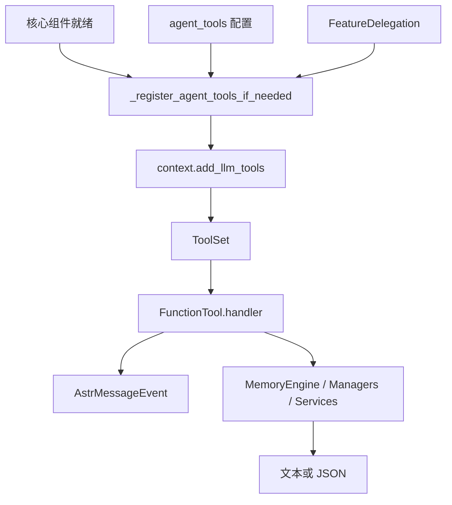

[根级 AGENTS.md](../../../../AGENTS.md) / core / platform / transport / tools

# Agent 工具

**最后核对：** 2026-07-17  
**公共入口：** `core/tools/__init__.py`  
**注册入口：** `main.py::_register_agent_tools_if_needed()`

## 职责边界

本目录把已有 manager/engine 能力封装为 AstrBot 公开 `FunctionTool(handler=...)`。工具定义负责稳定的 `name`、英文 `description`、JSON Schema `parameters`、会话上下文解析和面向模型的结果；真正的检索、写入与领域规则仍在 engine/manager。工具不是 Page API，也不承担插件级权限认证。



## 公共工具清单

`__init__.py` 导出 15 个工具类：

| 工具名 | 类 | 依赖 | 结果形态 |
|---|---|---|---|
| `recall_long_term_memory` | `MemorySearchTool` | `ConfigManager`、`MemoryEngine`、插件 Context | JSON：query、filters、results、formatted recall |
| `memorize_long_term_memory` | `MemoryMemorizeTool` | `MemoryEngine`、`MemoryProcessor`、插件 Context | JSON：memorized、id、content、importance、scope |
| `note_search` / `note_read` / `note_write` | `NoteSearchTool` / `NoteReadTool` / `NoteWriteTool` | `NoteManager` | 人类可读文本 |
| `knowledge_search` / `knowledge_read` | `KnowledgeSearchTool` / `KnowledgeReadTool` | `KnowledgeManager` | JSON |
| `profile_lookup` | `ProfileLookupTool` | `ProfileManager` | JSON |
| `check_affection` / `check_bot_mood` | `AffectionCheckTool` / `BotMoodTool` | `AffectionManager` | JSON |
| `explain_jargon` / `list_group_jargon` | `JargonExplainTool` / `JargonListTool` | `JargonQueryService` | JSON |
| `recall_expressions` | `ExpressionRecallTool` | `ExpressionPatternLearner` | JSON |
| `lookup_relations` / `list_group_relations` | `RelationLookupTool` / `RelationGraphTool` | `RelationManager` | JSON |

类采用 `pydantic.dataclasses.dataclass`，继承 `AgentFunctionTool`，并由共享基类把异步 `_run(event, ...)` 绑定到公开 `FunctionTool.handler`；生产代码不得导入 `astrbot.core.agent` 或 `AstrAgentContext`。

## 注册与启用规则

注册只在 `memory_engine` 和 `memory_processor` 就绪后执行一次，最终一次性调用 `context.add_llm_tools(*tools)`。即使全部关闭，也会把 `_llm_tools_registered` 置为真；运行中修改开关需要重载插件。

- 召回工具默认开启：`agent_tools.enable_recall_tool`。
- 主动记忆写入默认关闭：`agent_tools.enable_memorize_tool`。
- 笔记读默认开启；兼容旧 `enable_note_tools`，但新配置拆为 `enable_note_read_tools` 与默认关闭的 `enable_note_write_tool`。
- 知识、画像、黑话、好感度、社交、表达工具默认开启，但仅在对应依赖存在时注册。
- FeatureDelegation 已把黑话、好感度、表达或 persona/social 交给伴侣插件时，本地对应工具不注册，避免双重能力。

生产路由判断 memory tool 可用时，不只看注册标志，还检查当前请求 ToolSet 中名为 `recall_long_term_memory` 的工具是否存在且 active；详见 [注入模块 AGENTS.md](../../../injection/AGENTS.md)。

## 关键调用契约

### `MemorySearchTool`

- `query` 必填且去空白；`k` 在 1 与 `recall_engine.max_k` 之间钳制，无法解析时回退 `top_k`。
- 按 `filtering_settings` 决定是否传 session/persona；默认两者都过滤。session 来自 `event.unified_msg_origin`，persona 通过 `get_persona_id()` 解析。
- 返回字段只取稳定的记忆 ID、content、score、importance、session/persona 与访问时间，再由 `HumanLikeMemoryFormatter` 可选格式化。
- 工具查询是显式 Agent 调用，不是动态记忆写入 System Prompt。

### `MemoryMemorizeTool`

- `memory` 必填；topics/key_facts 各最多取 5 个非空文本；sentiment 非 positive/neutral/negative 时归一为 neutral。
- `MemoryProcessor.build_memory_from_structured_data()` 负责最终内容、重要性与 atoms；写入携带当前 session/persona。
- metadata 标记 `source_window.triggered_by=agent_tool`、`tool_name` 和 `memory_origin=agent_memorize_tool`；非空 reason 才写 `memorize_reason`。
- 该工具能持久化用户相关信息，因此必须保持默认关闭并仅在用户明确要求持久记忆时由模型调用。

### `NoteWriteTool`

只在用户明确要求记录/修改笔记时使用。title 必填且最多 120 字符，content 必填且最多 20000 字符；tags 最多 10 个，每个 1–40 字符且只允许字母、数字、下划线、连字符或 CJK。传 `note_id` 为更新，否则创建。

## 安全、隐私与故障边界

- 查询工具应从当前事件推断 scope，不得默认跨 session/persona/group 扩大查询。显式关闭过滤是配置层决策，不在工具内偷偷回退。
- `ProfileLookupTool` 的 self lookup 只信任 `event.get_sender_id()`；`unified_msg_origin` 仅是会话身份，不能替代用户身份。显式查询其他用户必须经过注入的 `authorization_checker`，缺少授权时返回稳定 `profile_scope_denied`。
- 工具结果进入模型上下文；只返回完成任务所需字段，禁止加入 Provider 配置、凭据、数据库路径或异常堆栈。
- JSON 工具使用 `ensure_ascii=False, default=str` 的稳定序列化；错误通常返回结构化 `error`，笔记工具沿用文本错误契约。不要擅自统一返回类型而破坏 Agent/测试契约。
- `CancelledError` 在记忆工具中继续传播；普通异常记录后只返回 `internal_error`。其他领域工具不保证全部捕获异常，修改时遵循该文件现有契约而非假设全局吞错。
- `FunctionTool.parameters` 是模型可见公共协议；改名称、required、类型或默认行为必须同步注册调用与测试。
- Agent 工具没有管理员装饰器。写工具的主要生产安全门是“默认关闭 + 依赖就绪 + 描述约束 + 领域校验”；高风险管理写入应继续留在 Page API/管理员命令。

## 依赖方向

`main.py` → 本目录 → `platform/config`、`processors` 与各领域 manager/service。工具不得导入 `main.py`、Page API 或命令。工具的注册开关属于根插件装配，不在各工具内部重复读取（记忆搜索过滤配置除外）。

## 测试定位与精确验证

```powershell
python -m pytest tests/test_tools_memory.py -q
python -m pytest tests/test_tools_note.py tests/test_tools_knowledge.py tests/test_tools_profile.py -q
python -m pytest tests/test_plugin_init.py -q
```

前两条锁定工具名、参数 Schema、scope、输入校验和结果；注册开关、依赖缺失、FeatureDelegation 与只注册一次语义由 `test_plugin_init.py` 覆盖。

## 相关上下文

- [根级 AGENTS.md](../../../../AGENTS.md)
- [注入模块 AGENTS.md](../../../injection/AGENTS.md)
- [初始化模块 AGENTS.md](../../../initializer/AGENTS.md)
- `main.py`
