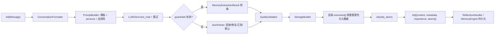

[根级 AGENTS.md](../../AGENTS.md) > [core](../) > **processors**

# 对话到结构化记忆处理管道

**最后更新：** 2026-07-17  
**主入口：** `MemoryProcessor.process_conversation()`  
**包级公开导出：** `MemoryProcessor`、`TextProcessor`、`ChatroomContextParser`、`store_round_with_length_check`、`EntityResolver`、`GraphExtractor`

## 职责边界

`core/processors/` 将已经进入会话存储的 `list[Message]` 格式化、提交给 LLM、校验/修复响应，并构造成持久化层可消费的记忆、元数据与原子。目录还包含话题策略、图结构提取、文本检索预处理，以及画像/知识/笔记等独立派生处理器。

本模块不捕获 AstrBot 事件、不决定何时触发总结、不直接持久化主管道产物，也不执行召回。触发与批次编排见 [`../handlers/AGENTS.md`](../handlers/AGENTS.md)；消息组件标准化见 [`../extractors/AGENTS.md`](../extractors/AGENTS.md)；存储、图 CRUD 与检索属于相应 manager/store/retrieval 模块。

## 真实主管道



重要边界：`MemoryProcessor` 本身不调用 `TopicSegmentationRouter`。反思链对 C/D 策略在调用主管道前预切批次；A/混合提示词策略可通过 LLM 返回的 `memories[]` 让主管道一次产生多条记忆。不要再添加第二套隐藏分割步骤。

## 主管道协议

### `MemoryProcessor`

- `process_conversation(messages, ..., is_group_chat=False, persona_id=None) -> list[dict]`：空输入抛 `ValueError`；成功项固定包含 `content`、`metadata`、`importance`、`atoms`。
- `conversation_formatter` 与 `llm_client_instance` 是给 `TopicBatchPreparer` 使用的只读协作接口。
- Prompt 模板优先级由 `PromptBuilder` 实现：配置自定义模板 > `core/prompts/*.txt` > 最小硬编码回退；系统提示可含当前时间、人格、连续性、兴趣与话题引导。
- 输出解析优先 `MemoryExtractionResult` guardrail；验证失败才进入旧 JSON 解析器，并写入 `_guardrail_fallback`。不要把“回退成功”误标为已通过 guardrail。
- 低质量总结仍返回，但写 `summary_quality=low`；调用方决定是否持久化。
- 每条记忆写 `schema_version=v3`、最多 150 字符 `source_snippet`；`StorageBuilder` 同时维护 `summary_schema_version=v2` 的摘要元数据，这是不同层级的版本字段。
- 重要性可受情感强度、首因/近因和兴趣命中影响，并始终上限钳制到 1.0。
- `build_memory_from_structured_data()` 用于已有结构化数据；`classify_atoms_from_metadata()` 尊重 `atom_enabled`；`generate_persona_interpretations()` 是可选逐 persona LLM 调用，单个失败不影响其他 persona。

### LLM、解析与格式化

- `LLMClient.get_current_llm_provider()`：固定对象优先；字符串 ID 动态查找；之后使用当前默认 Provider，避免持有过期引用。
- `call_llm_with_retry(prompt, system_prompt, max_retries=3)`：调用 `provider.text_chat()`，普通异常按 $2^{attempt}+jitter$ 退避，最后一次原样抛出；无 Provider 是 `RuntimeError`。
- `JsonParser` 顺序：直接 JSON → 补括号/引号与去尾逗号后解析 → 正则提取 → `QualityValidator` 默认结构。
- `QualityValidator` 规范 `summary/topics/key_facts/sentiment/importance`；重要性范围为 `[0,1]`，非法值回退 `0.5`。
- `ConversationFormatter` 的普通格式保留发送者、ID、秒级时间并给 bot 加前缀；compact 格式用于成本敏感路径。
- `StorageBuilder`：群聊 `privacy_level=public`，私聊 `confidential`；内容优先 canonical summary，否则使用对话摘录。

## 话题分割协议

`topic_splitter.py` 提供 `MemorySegment` 和策略：

- A `PromptSegmentationStrategy`：消费结构化响应中的 `memories[]`。
- B `EmbeddingClusteringStrategy`：按 key facts 的余弦相似度聚类。
- `HybridSegmentationStrategy`：先 A，必要时回退 B。
- C `TopicChunkingStrategy`：在抽取前按相邻消息 embedding 边界切块；无 embed 函数时使用确定性伪向量回退。
- D `TwoStageLLMStrategy`：第一阶段识别 1-based `line_range`，第二阶段由上游逐批抽取。
- `TopicSegmentationRouter` 接受 `a`、`b`、`c`、`d`、`a_b_hybrid` 及别名；非法策略稳定回退 `a_b_hybrid`。

策略输出必须保持输入顺序、边界合法和至少可回退为单段；C/D 的运行成本门控由 handlers 中的 `TopicBatchPreparer` 负责。

## 其他处理器地图

| 文件 | 入口/作用 | 失败或回退 |
|---|---|---|
| `atom_classifier.py` | `classify_atoms()`：规则分类 PLANNED/PREFERENCE/RELATIONAL/FACTUAL/EPISODIC | 低信息、低置信度/重要性被过滤；UNKNOWN 兜底 |
| `graph_extractor.py` | `GraphExtractor.extract()`：结构化图、原子或旧 metadata → 节点/边/entry | 非法结构化载荷回退旧提取；实体交给 `EntityResolver` |
| `entity_resolver.py` | 实体规范化、去重、IS-A 上下扩展和层级文件读写 | 层级 I/O 是尽力而为 |
| `contradiction_detector.py` | 写前候选搜索和 Jaccard/否定启发式冲突标记 | 未启用/无候选/异常返回空列表 |
| `episode_clusterer.py` | 24h 时间窗 + topic Jaccard 聚类并分配 episode | 单条更新失败隔离；30 天外不聚类 |
| `text_processor.py` | jieba/回退分词、停用词、BM25/FTS 预处理 | jieba 缺失或禁用时走内置分段 |
| `human_like_formatter.py` | 按 atom 类型生成拟人片段并去重 | 无内容返回空片段 |
| `chatroom_parser.py` | 从 AstrBot 群聊上下文包装中取最新消息 | 不匹配或异常时原样返回 prompt |
| `profile_extractor.py` | LLM 提取用户标签/偏好，最多 5 个标签 | 无 client/调用失败返回空；另有关键词 fallback |
| `knowledge_extractor.py` | 记忆 → `KnowledgeEntry` | 输入过短、无 client 或 JSON 无法恢复时 `None` |
| `note_generator.py` | 重要对话 → note dict | 未达长度、无 client 或 JSON 无法恢复时 `None` |
| `message_utils.py` | 30KB 单消息截断；将一轮对话写成记忆 | 返回 `(success, error)`，不抛普通存储异常 |
| `prompt_builder.py` | 模板与 persona system prompt | persona 不存在时使用基础 prompt |

## 失败、取消与安全边界

- 主管道在 LLM/构建异常时记录并重新抛出，交由反思窗口记录 `pending_summary`；不要在这里伪造成功或返回占位记忆。
- `asyncio.CancelledError` 属于控制流，必须穿透处理器与 LLM 重试。新增异步异常处理时先单独 `except asyncio.CancelledError: raise`，不要把关闭取消转成重试、空结果或 pending 业务失败。
- LLM 文本是不可信输入：优先 guardrail，回退解析后仍需规范字段、长度、枚举与数值范围。Prompt 中只放完成抽取所需的对话片段，避免在日志输出正文或人格秘密。
- 图、画像、知识、笔记属于不同派生模型；不要把它们加入 `MemoryProcessor` 的关键同步路径，除非上游契约明确要求。
- `TextProcessor` 是检索预处理边界；不要在抽取模块另造分词规则。
- 包级 `__init__.py` 只导出已列出的六个符号。内部类需要成为稳定 API 时同步更新导出契约和测试。

## 文件清单

主管道：`memory_processor.py`、`llm_client.py`、`prompt_builder.py`、`conversation_formatter.py`、`json_parser.py`、`quality_validator.py`、`storage_builder.py`。  
话题：`topic_splitter.py`。  
派生与图：`atom_classifier.py`、`graph_extractor.py`、`entity_resolver.py`、`contradiction_detector.py`、`episode_clusterer.py`、`profile_extractor.py`、`knowledge_extractor.py`、`note_generator.py`、`human_like_formatter.py`。  
文本/兼容：`text_processor.py`、`chatroom_parser.py`、`message_utils.py`、`__init__.py`。

## 测试定位与验证

主管道和直接组件分别位于 `tests/test_memory_processor.py`、`test_llm_client.py`、`test_json_parser.py`、`test_prompt_builder.py`、`test_conversation_formatter.py`、`test_atom_classifier.py`、`test_text_processor.py`、`test_message_utils.py`。话题策略在 `test_topic_splitter.py` 与 `test_integration_topic_segmentation.py`。派生处理器有同名测试，包括 graph/entity/contradiction/episode/profile/knowledge/note/human-like/chatroom。

精确模块验证命令：

```bash
python -m pytest tests/test_memory_processor.py tests/test_llm_client.py tests/test_json_parser.py tests/test_prompt_builder.py tests/test_conversation_formatter.py tests/test_atom_classifier.py tests/test_text_processor.py tests/test_message_utils.py tests/test_topic_splitter.py tests/test_integration_topic_segmentation.py tests/test_graph_extractor.py tests/test_entity_resolver.py tests/test_contradiction_detector.py tests/test_episode_clusterer.py tests/test_profile_extractor.py tests/test_knowledge_extractor.py tests/test_note_generator.py tests/test_human_like_formatter.py tests/test_chatroom_parser.py -q
```

若改变主管道与反思之间的批次/失败契约，另跑：

```bash
python -m pytest tests/test_handlers.py -q
```