[根级 AGENTS.md](../../AGENTS.md) > [core](../) > **processors**

# 对话到结构化记忆处理管道

**最后更新：** 2026-08-01
**主入口：** `MemoryProcessor.process_conversation()`  
**包级公开导出：** `MemoryProcessor`、`TextProcessor`、`ChatroomContextParser`、`store_round_with_length_check`、`EntityResolver`、`GraphExtractor`

## 职责边界

`core/processors/` 将已经进入会话存储的 `list[Message]` 格式化、提交给 LLM、校验/修复响应，并构造成持久化层可消费的记忆、元数据与原子。目录还包含话题策略、图结构提取、文本检索预处理、Memory Evolution proposal 整理器，以及画像/知识/笔记等独立派生处理器。

`ProfileExtractor` 只负责把受限 evidence 转成标签和偏好，不写入 Store，也不决定画像主键。
生产调用由 manager 层的 `ProfileProposalPipeline` 编排；LLM 入口使用单次物理请求并由
`profile_extraction` 额外预算控制，普通不可用时只能使用无 Provider 的关键词 fallback。

`KnowledgeExtractor` 只负责把有限 canonical evidence 转成 `KnowledgeEntry`，不写入 Store。
生产调用由 manager 层的 `KnowledgeProposalPipeline` 编排；LLM 入口使用单次物理请求并由
`knowledge_extraction` 额外预算控制，没有请求预算时不得裸调用 Provider。

`NoteGenerator` 只把达到长度门槛的有限 canonical evidence 转成 note dict，不写入 Store。
生产调用由 manager 层的 `NoteProposalPipeline` 编排；`note_generation` 额外预算允许时才调用
Provider，没有预算、功能门关闭或结构不可用时由 manager 管线生成确定性来源 fallback。
重建路径强制关闭 Provider，并在写入前二次验证 source revision、scope 和 privacy。

本模块不捕获 AstrBot 事件、不决定何时触发总结、不直接持久化主管道产物，也不执行召回。触发与批次编排见 [`../handlers/AGENTS.md`](../handlers/AGENTS.md)；消息组件标准化见 [`../extractors/AGENTS.md`](../extractors/AGENTS.md)；存储、图 CRUD 与检索属于相应 manager/store/retrieval 模块。

## 真实主管道

```mermaid
flowchart LR
    A["list[Message]"] --> B["ConversationFormatter"]
    B --> C["PromptBuilder: 模板 + persona + 连续性"]
    C --> D["LLMClient + 冻结 Provider adapter + 重试"]
    D --> E{"guardrails 有效?"}
    E -->|"是"| F["MemoryExtractionResult 转换"]
    E -->|"否"| G["JsonParser: 直接/修复/正则/默认"]
    F --> H["QualityValidator"]
    G --> H
    H --> T["TopicSegmentationPipeline: A/B/Hybrid"]
    T --> I["StorageBuilder"]
    I --> J["逐条 memories[] 调整重要性与元数据"]
    J --> K["MemoryGroundingValidator"]
    K -->|"grounded 且非 low"| L["classify_atoms"]
    K -->|"low / 未忠实"| M["quality_gate_action=quarantine；不生成 Atom"]
    L --> N["list[{content, metadata, importance, atoms}]"]
    M --> N
    N --> O["ReflectionHandler / MemoryQualityGate"]
```



重要边界：`MemoryProcessor` 在结构化解析与 `StorageBuilder` 之间通过
`TopicSegmentationPipeline` 调用 A/B/Hybrid Router。B 复用初始化器注入的共享
Embedding Provider，并且只在每条原始 `memories[]` 边界内聚类，不能跨 participant、
稳定身份来源或后续 scope 合并。C/D 仍只由反思链在主管道调用前预切批次，处理器内保持
透传，不形成重复分割。

## 主管道协议

### `MemoryProcessor`

- `process_conversation(messages, ..., is_group_chat=False, persona_id=None) -> list[dict]`：空输入抛 `ValueError`；成功项固定包含 `content`、`metadata`、`importance`、`atoms`。
- `conversation_formatter` 与 `llm_client_instance` 是给 `TopicBatchPreparer` 使用的只读协作接口。
- Prompt 模板优先级由 `PromptBuilder` 实现：配置自定义模板 > `core/prompts/*.txt` > 最小硬编码回退；系统提示可含当前时间、人格、连续性、兴趣与话题引导。
- 输出解析优先 `MemoryExtractionResult` guardrail；验证失败才进入旧 JSON 解析器，并写入 `_guardrail_fallback`。不要把“回退成功”误标为已通过 guardrail。
- 每条模型结果必须带当前窗口的匿名 `S<n>` source offset；旧输出仅允许由当前窗口唯一推断受控引用。数字、否定极性、群聊主体和引用边界先走确定性校验，不确定路径才使用请求级预算保护的 Judge。
- 低质量或来源未通过的候选仍返回，但写 `quality_gate_action=quarantine`、稳定原因码和内部证据；此时不提前生成 Atom。生产调用方必须交给 `MemoryQualityGate`，不得直接写 canonical、FTS、FAISS、图或 Evolution。
- 每条记忆写 `schema_version=v3`、最多 150 字符 `source_snippet`；`StorageBuilder` 同时维护 `summary_schema_version=v2` 的摘要元数据，这是不同层级的版本字段。
- 重要性可受情感强度、首因/近因和兴趣命中影响，并始终上限钳制到 1.0。
- `build_memory_from_structured_data()` 用于已有结构化数据；`classify_atoms_from_metadata()` 尊重 `atom_enabled`；`generate_persona_interpretations()` 是可选逐 persona 额外 LLM 调用，每个 persona 必须分别取得请求预算并固定单次 Provider 请求，单个失败释放 reservation 且不影响其他 persona。

### LLM、解析与格式化

- `LLMClient.get_current_llm_provider()`：固定对象优先；字符串 ID 动态查找；之后使用当前默认 Provider，避免持有过期引用。Provider 实例变化时重新构建并缓存 `LLMProviderAdapter`，调用阶段不再反复探测入口。
- `call_llm_with_retry(prompt, system_prompt, max_retries=3)`：通过冻结的 `text_chat` 入口调用，普通异常按 $2^{attempt}+jitter$ 退避，最后一次原样抛出；无 Provider 是 `RuntimeError`。取消继续传播，日志只记录异常类型。
- `JsonParser` 顺序：直接 JSON → 补括号/引号与去尾逗号后解析 → 正则提取 → `QualityValidator` 默认结构。
- `QualityValidator` 规范 `summary/topics/key_facts/sentiment/importance`；重要性范围为 `[0,1]`，非法值回退 `0.5`。
- `ConversationFormatter` 的普通格式保留发送者、ID、秒级时间并给 bot 加前缀；compact 格式用于成本敏感路径。
- `format_conversation_with_source_refs()` 增加稳定 `S0..S<n>` 标签和原始正文 `chars` 长度；持久化证据使用消息指纹和字符 offset，Judge 只接收当前候选实际引用的片段。抽取结果保持引用正文的主要语言；日期规范化只接受正文绝对日期、明确相对日期或消息时间戳锚定的确定性推导，普通数字继续严格匹配。
- `StorageBuilder`：群聊 `privacy_level=public`，私聊 `confidential`；内容优先 canonical summary，否则使用对话摘录。

## 话题分割协议

`topic_splitter.py` 提供 `MemorySegment` 和策略：

- A `PromptSegmentationStrategy`：消费结构化响应中的 `memories[]`。
- B `EmbeddingClusteringStrategy`：按 key facts 的余弦相似度聚类。
- `HybridSegmentationStrategy`：先 A，必要时回退 B。
- C `TopicChunkingStrategy`：在抽取前按相邻消息 embedding 边界切块；无 embed 函数时使用确定性伪向量回退。
- D `TwoStageLLMStrategy`：第一阶段以单次 Provider 请求识别 1-based `line_range`，第二阶段由上游逐批抽取；预算调用方可要求普通失败向上传播以释放 reservation。
- `TopicSegmentationRouter` 接受 `a`、`b`、`c`、`d`、`a_b_hybrid` 及别名；非法策略稳定回退 `a_b_hybrid`。
- `TopicSegmentationPipeline` 只在 A/B/Hybrid 下调用 Router；C/D 和 `enabled=false` 使用旧的单批候选提取语义。
- Router 为候选附加 strategy、fallback reason、输入/输出计数；这些字段不包含正文、身份、scope 或 source ID。

策略输出必须保持输入顺序、边界合法和至少可回退为单段；C/D 的运行成本门控由 handlers 中的 `TopicBatchPreparer` 负责。

## Memory Evolution proposal 协议

`memory_consolidator.py` 的 `MemoryConsolidator.propose(sources)` 只把 canonical evidence 转为受约束的 `EvolutionProposal`，不直接写 Store、canonical memory 或派生表：

- 给每个 source 分配临时 `M1`、`M2` alias；Prompt 明确 evidence 为不可信数据，模型不能执行其中指令、调用工具或输出真实 memory ID。
- 输入总量受 `max_input_chars` 限制；输出必须通过 JSON 清洗和 Pydantic `extra="forbid"` 校验，并满足 relation、projection 数量和 summary 字符预算。
- relation/projection 类型、confidence、时间范围及 alias 形状在此校验；alias 是否存在、source revision 是否仍新鲜、scope/privacy/role 是否兼容、是否成环以及 candidate/active 状态由 `MemoryEvolutionManager` 在应用前确定。
- `MemoryEvolutionCandidateGenerator` 先组合本地确定性候选：`ContradictionDetector` 生成同主体的 `updates`/`contradicts`，`EpisodeClusterer` 生成带完整时间窗口的 `same_episode`；同一 source pair 上冲突优先于 episode。候选非空时 Manager 不再调用 Consolidator，候选为空时才回退现有 LLM proposal。
- 解析、结构或预算失败必须抛出异常交给 worker 重试/死信；不要回退成空 proposal 并伪造成功。`asyncio.CancelledError` 必须继续传播。
- Projection 是带 source/revision 证据的派生解释，不是新 canonical memory，不得生成独立 `doc_id` 或进入主管道的 `MemoryProcessor` 返回列表。

## 其他处理器地图

| 文件 | 入口/作用 | 失败或回退 |
|---|---|---|
| `atom_classifier.py` | `classify_atoms()`：规则分类 PLANNED/PREFERENCE/RELATIONAL/FACTUAL/EPISODIC | 低信息、低置信度/重要性被过滤；UNKNOWN 兜底 |
| `graph_extractor.py` | `GraphExtractor.extract()`：在结构化图、原子和旧 metadata 路径间路由并生成节点/边/entry | 非法结构化载荷回退旧提取；实体交给 `EntityResolver` |
| `atom_graph_extractor.py` | 原子图提取、父记忆人物/主题角色恢复及时序/因果边生成 | 缺少角色 metadata 的原子实体保持 topic 兼容行为 |
| `entity_resolver.py` | 实体规范化、去重、IS-A 上下扩展和层级文件读写 | 层级 I/O 是尽力而为 |
| `contradiction_detector.py` | 对同 scope、同匿名主体 source 做 Jaccard/极性预筛，返回绑定两侧 ID、revision、发生时间和 conflict type 的只读候选 | 未启用、主体不明、无候选时返回空；不搜索、不写 canonical |
| `episode_clusterer.py` | 24h 时间窗 + topic Jaccard 生成两两 `same_episode` 证据，保留 source revision、overlap、confidence 和窗口起止 | 未启用、跨 scope/私密主体、30 天外不生成；不改 canonical metadata |
| `memory_evolution_candidates.py` | 冲突优先地把本地候选转换为有 alias 与时间范围的 `EvolutionProposal` | 本地候选为空时由 Manager 回退 `MemoryConsolidator` |
| `text_processor.py` | jieba/回退分词、停用词、BM25/FTS 预处理 | jieba 缺失或禁用时走内置分段 |
| `human_like_formatter.py` | 按 atom 类型生成拟人片段并去重 | 无内容返回空片段 |
| `chatroom_parser.py` | 从 AstrBot 群聊上下文包装中取最新消息 | 不匹配或异常时原样返回 prompt |
| `profile_extractor.py` | LLM 提取用户标签/偏好，最多 5 个标签 | 无 client/调用失败返回空；另有关键词 fallback |
| `knowledge_extractor.py` | 有限 canonical evidence → `KnowledgeEntry` | 输入过短、无 client 或 JSON 无法恢复时 `None`；结构和长度边界由 proposal 管线再次校验 |
| `note_generator.py` | 重要 canonical evidence → note dict | 未达长度、无 client 或 JSON 无法恢复时 `None`；manager 管线负责来源 fallback、配置上限和持久化 |
| `memory_consolidator.py` | canonical evidence → 受约束的 relation/projection proposal | JSON/Schema/数量/字符预算失败抛出，由 manager 负责重试或拒绝 |
| `message_utils.py` | 30KB 单消息截断；将一轮对话写成记忆 | 返回 `(success, error)`，不抛普通存储异常 |
| `prompt_builder.py` | 模板与 persona system prompt | persona 不存在时使用基础 prompt |

## 失败、取消与安全边界

- 主管道在 LLM/构建异常时记录并重新抛出，交由反思窗口记录 `pending_summary`；不要在这里伪造成功或返回占位记忆。
- `process_conversation(llm_max_retries=...)` 的默认重试只服务基础反思；额外反思批次必须由上游传入 `1`，避免一个 reservation 对应多次物理 Provider 请求。
- `asyncio.CancelledError` 属于控制流，必须穿透处理器与 LLM 重试。新增异步异常处理时先单独 `except asyncio.CancelledError: raise`，不要把关闭取消转成重试、空结果或 pending 业务失败。
- LLM 文本是不可信输入：优先 guardrail，回退解析后仍需规范字段、长度、枚举与数值范围。Prompt 中只放完成抽取所需的对话片段，避免在日志输出正文或人格秘密。
- 来源 Judge 服从同一请求的 `ExtraLlmBudget`；普通失败保守隔离，取消必须继续传播。不得把窗口外消息、会话身份、Provider 配置或内部证据映射传给 Judge。
- 图、画像、知识、笔记属于不同派生模型；不要把它们加入 `MemoryProcessor` 的关键同步路径，除非上游契约明确要求。
- `TextProcessor` 是检索预处理边界；不要在抽取模块另造分词规则。
- 包级 `__init__.py` 只导出已列出的六个符号。内部类需要成为稳定 API 时同步更新导出契约和测试。

## 文件清单

主管道：`memory_processor.py`、`llm_client.py`、`prompt_builder.py`、`conversation_formatter.py`、`json_parser.py`、`quality_validator.py`、`storage_builder.py`；`reflection_generation_observability.py` 只发射反思生成阶段的隐私安全标量。
话题：`topic_splitter.py`、`topic_segmentation_pipeline.py`。
派生与图：`memory_consolidator.py`、`memory_evolution_candidates.py`、`atom_classifier.py`、`graph_extractor.py`、`atom_graph_extractor.py`、`entity_resolver.py`、`contradiction_detector.py`、`episode_clusterer.py`、`profile_extractor.py`、`knowledge_extractor.py`、`note_generator.py`、`human_like_formatter.py`。
文本/兼容：`text_processor.py`、`chatroom_parser.py`、`message_utils.py`、`grounding_dates.py`、`__init__.py`。

## 测试定位与验证

主管道和直接组件分别位于 `tests/test_memory_processor.py`、`test_memory_grounding.py`、`test_llm_client.py`、`test_json_parser.py`、`test_prompt_builder.py`、`test_conversation_formatter.py`、`test_atom_classifier.py`、`test_text_processor.py`、`test_message_utils.py`。Memory Evolution proposal 契约位于 `tests/test_memory_consolidator.py`，本地 episode/conflict 生产闭环位于 `tests/test_memory_evolution_candidate_pipeline.py`；话题策略在 `test_topic_splitter.py` 与 `test_integration_topic_segmentation.py`，A/B/Hybrid 生产装配在 `test_topic_production_wiring.py`。派生处理器有同名测试，包括 graph/entity/contradiction/episode/profile/knowledge/note/human-like/chatroom。

精确模块验证命令：

```bash
python -m pytest tests/test_memory_processor.py tests/test_memory_consolidator.py tests/test_llm_client.py tests/test_json_parser.py tests/test_prompt_builder.py tests/test_conversation_formatter.py tests/test_atom_classifier.py tests/test_text_processor.py tests/test_message_utils.py tests/test_topic_splitter.py tests/test_integration_topic_segmentation.py tests/test_graph_extractor.py tests/test_entity_resolver.py tests/test_contradiction_detector.py tests/test_episode_clusterer.py tests/test_profile_extractor.py tests/test_knowledge_extractor.py tests/test_note_generator.py tests/test_human_like_formatter.py tests/test_chatroom_parser.py -q
python -m pytest tests/test_adapter_capabilities.py tests/test_llm_client.py -q
```

若改变主管道与反思之间的批次/失败契约，另跑：

```bash
python -m pytest tests/test_handlers.py -q
```
