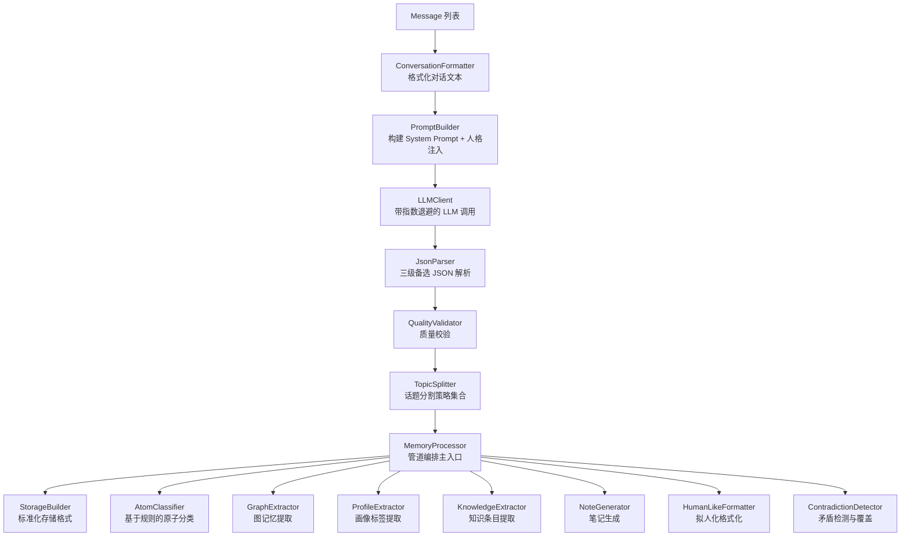

[根目录](../../CLAUDE.md) > [core](../CLAUDE.md) > **processors**

## 模块职责

`core/processors/` 是记忆处理管道，将原始对话历史通过 LLM 转换为结构化记忆。包含 21 个文件，覆盖从文本预处理、LLM 调用、JSON 解析、话题分割、原子分类、图谱提取到存储格式化的完整流水线。

## 处理管道架构



## 入口与启动

- **主入口**: `MemoryProcessor` (memory_processor.py) -- 管道编排器，组合所有子组件
- **公开 API**: `conversation_formatter`, `llm_client_instance` (属性)，供话题分割策略使用
- **核心方法**: `process_conversation()` -- 处理对话批次并生成结构化记忆

### 初始化流程

```
MemoryProcessor.__init__()
  -> LLMClient(context, llm_provider)
  -> PromptBuilder(prompt_dir, config)
  -> QualityValidator()
  -> JsonParser(quality)
  -> ConversationFormatter()
  -> StorageBuilder()
  -> _load_topic_guidance() -- 加载话题分割引导文本
```

记忆处理器在 `PluginInitializer` 中通过 `ComponentFactory` 构建，注入 Context、LLM Provider 和配置。

## 数据流（输入->处理->输出）

```
输入: list[Message] + 配置参数
  |
  v
1. ConversationFormatter.format_conversation()
   -> 对话文本 (含发送者/时间戳格式化)
  |
  v
2. PromptBuilder.build_system_prompt_with_persona()
   -> system_prompt (含人格设定、连续性上下文、兴趣画像、话题分割引导)
  |
  v
3. LLMClient.call_llm_with_retry()
   -> LLM 响应文本 (带 3 次指数退避重试)
  |
  v
4. JsonParser.parse_llm_response() + guardrails
   -> 结构化 dict (summary/topics/key_facts/sentiment/importance/memories[])
  |
  v
5. QualityValidator.validate_summary_quality()
   -> quality 标志 (low/normal)
  |
  v
6. (可选) TopicSplitter.segment()
   -> list[MemorySegment] (多话题独立记忆)
  |
  v
7. StorageBuilder.build_storage_format()
   -> (content, metadata) tuple (含 canonical_summary、隐私级别、人格解读)
  |
  v
8. MemoryProcessor.classify_atoms_from_metadata()
   -> list[MemoryAtom] (含 TTL、衰减类型、置信度、事件时间)
  |
  v
输出: list[{"content", "metadata", "importance", "atoms"}]
```

## 各处理器详解

### MemoryProcessor (`memory_processor.py`)
**职责**: 管道编排器，串联所有子处理器。
**核心类**: `MemoryProcessor`
**公共 API**:
- `async process_conversation(messages, is_group_chat, persona_id, ...) -> list[dict]` -- 处理对话批次
- `build_memory_from_structured_data(data, is_group_chat, fallback_excerpt) -> dict` -- 从已有结构化数据构建记忆
- `classify_atoms_from_metadata(metadata, parent_importance, ...) -> list[MemoryAtom]` -- 原子分类入口
- `async generate_persona_interpretations(content, ...) -> dict[str, str]` -- 多角色解读
**特性**:
- 支持 guardrails 安全验证（优先使用 `MemoryExtractionResult` 模式验证）
- 序列位置效应（首因/近因加权 +0.10~0.15）
- 兴趣画像匹配加权（+0.35 上限）
- 情感标签优先级：LLM 输出 > 外部传入
- 记忆溯源 `source_snippet` 字段
- schema_version="v3"

### LLMClient (`llm_client.py`)
**职责**: 动态解析 LLM Provider + 带指数退避的重试调用。
**核心类**: `LLMClient`
**公共 API**:
- `get_current_llm_provider() -> Provider | None` -- 动态解析（按 ID 查找 > 默认 Provider）
- `async call_llm_with_retry(prompt, system_prompt, max_retries=3) -> str` -- 退避重试调用

### TopicSplitter (`topic_splitter.py`)
**职责**: 话题分割策略集合，将混合话题的 LLM 输出拆分为独立记忆。
**核心类**:
- `TopicSegmentationStrategy` (ABC) -- 策略基类
- `PromptSegmentationStrategy` -- 策略 A: 解析 LLM 输出中的 `memories[]` 数组
- `EmbeddingClusteringStrategy` -- 策略 B: 按向量余弦相似度对 key_facts 聚类
- `HybridSegmentationStrategy` -- A+B 混合: 先走 Prompt，必要时回退向量聚类
- `TopicChunkingStrategy` -- 策略 C: 在 LLM 调用前通过相邻消息向量相似度检测话题边界
- `TwoStageLLMStrategy` -- 策略 D: 两阶段 LLM (先识别话题范围，再逐段抽取)
- `TopicSegmentationRouter` -- 策略路由器，从配置选择并实例化策略
**公共 API**:
- `router.strategy -> TopicSegmentationStrategy` -- 当前活跃策略
- `async router.segment(structured_data, messages, is_group_chat) -> list[MemorySegment]`
**数据类型**: `MemorySegment(content, importance, metadata, key_facts, topics, atoms)`

### GraphExtractor (`graph_extractor.py`)
**职责**: 将记忆摘要转换为节点、边与可检索的图条目。
**核心类**: `GraphExtractor`
**公共 API**:
- `extract(source_memory_id, content, metadata, atoms) -> ExtractedGraph` -- 主提取方法
**图边类型**:
- G1 (时序): `before`, `after`, `during` -- 基于 atom event_time 的事件先后关系
- G2 (因果): `caused_by`, `results_in`, `prevents` -- 基于 26 组中英文因果关键词匹配
- G3 (层级): IS-A 树 (通过 `EntityResolver` 管理)
- 旧版边类型: `describes`, `mentioned_in`, `co_occurs_with`
**节点类型**: `entity`, `topic`, `person`, `fact`, `summary`
**提取策略**: 结构化图元数据 (guardrails 验证) > 原子的原子级别提取 > 旧版 metadata 提取

### AtomClassifier (`atom_classifier.py`)
**职责**: 基于规则的原子分类器，无需额外 LLM 调用。
**核心函数**: `classify_atoms(key_facts, topics, participants, ...) -> list[MemoryAtom]`
**分类规则**:
- PLANNED: 时间指示词 + 动作动词 (置信度 0.85)
- PREFERENCE: 偏好关键词 (置信度 0.82)
- RELATIONAL: 人物模式 + 关系关键词 (置信度 0.80)
- FACTUAL: 状态/定义类模式 (置信度 0.78)
- EPISODIC: 有动作但无时间 (置信度 0.75)
- UNKNOWN: 兜底 (置信度 0.60)
**质量过滤 (v2.6)**:
- 信息量预检: 过滤寒暄/纯表情/纯数字/单字重复
- 最小内容长度: 默认 5 字符
- 最小置信度: 0.65
- 最小重要性: 0.3
- 支持时间解析: 周/月/日表达的绝对时间戳转换

### HumanLikeFormatter (`human_like_formatter.py`)
**职责**: 将检索结果按记忆类型格式化为拟人化表达。
**核心类**: `HumanLikeMemoryFormatter`
**公共 API**: `format(memories: list[dict]) -> list[str]`
**格式化规则**:
- EPISODIC: "记得{时间提示} {内容}" (时间衰减分层: 刚才/前几天/几周前/半年前/去年/N年前)
- FACTUAL: "ta{内容}"
- PREFERENCE: "ta喜欢{内容}" 或 "ta{内容}" (如有内置偏好关键词)
- RELATIONAL: 直接输出内容
- 支持去重 (前缀重叠率 >50% 视为重复)

### KnowledgeExtractor (`knowledge_extractor.py`)
**职责**: 基于 LLM 从记忆原子中提取知识条目。
**核心类**: `KnowledgeExtractor`
**公共 API**: `async extract(memory_content, memory_type) -> KnowledgeEntry | None`
**提取类型**: fact / concept / rule / event / procedure

### ProfileExtractor (`profile_extractor.py`)
**职责**: 基于 LLM 从对话内容中提取用户标签和偏好。
**核心类**: `ProfileExtractor`
**公共 API**: `async extract(user_message, bot_response, context) -> tuple[list[UserTag], dict]`
**提取维度**: interest / personality / habit / relation / knowledge / preference
**兜底策略**: `extract_keywords_fallback()` -- 基于关键词的规则匹配

### PromptBuilder (`prompt_builder.py`)
**职责**: 加载提示词模板 + 构建带人格的 system_prompt。
**核心类**: `PromptBuilder`
**公共 API**:
- `build_system_prompt_with_persona(context, persona_id, ...) -> str` -- 构建完整 system prompt
**模板优先级**: WebUI 自定义模板 > 文件模板 > 硬编码最小回退
**注入内容**: 日期时间、话题分割引导、连续性上下文、兴趣画像、人格设定

### JsonParser (`json_parser.py`)
**职责**: 多级备选 JSON 解析。
**核心类**: `JsonParser`
**公共 API**: `parse_llm_response(response_text, is_group_chat) -> dict`
**解析策略**: 直接 JSON 解析 -> 修复后解析 (补齐括号/引号) -> 正则提取 -> 默认值

### QualityValidator (`quality_validator.py`)
**职责**: 总结质量校验 + 数据规范化。
**核心类**: `QualityValidator`
**公共 API**:
- `validate_summary_quality(data) -> str` -- 返回 "low" 或 "normal"
- `normalize_parsed_data(data, is_group_chat) -> dict` -- 字段补全与规范化
- `validate_importance(value) -> float` -- 限制到 [0, 1]
- `validate_sentiment(value) -> str` -- 三值校验

### StorageBuilder (`storage_builder.py`)
**职责**: 构建标准化的 (content, metadata) 存储格式。
**核心类**: `StorageBuilder`
**公共 API**: `build_storage_format(fallback_excerpt, structured_data, is_group_chat, persona_interpretations) -> tuple[str, dict]`
**输出字段**: canonical_summary, privacy_level (public/confidential), schema_version, persona_interpretations

### ConversationFormatter (`conversation_formatter.py`)
**职责**: 将 Message 列表格式化为对话文本。
**核心类**: `ConversationFormatter`
**公共 API**: `format_conversation(messages: list[Message]) -> str`
**格式**: `[发送者 | ID: xxx | 时间戳] 消息内容` (Bot 消息加 [Bot:] 前缀)

### 其他处理器

| 文件 | 类/函数 | 职责 |
|------|---------|------|
| `entity_resolver.py` | `EntityResolver` | 实体规范化 + 去重 + G3 IS-A 层级管理 (异步加载/保存 entity_hierarchy.json) |
| `chatroom_parser.py` | `ChatroomContextParser` | 从 AstrBot 群聊上下文感知格式中提取真实用户消息 |
| `contradiction_detector.py` | `ContradictionDetector` | R4: 写入时检测冲突记忆并标记 SUPERSEDED (Jaccard 重叠阈值 0.40) |
| `episode_clusterer.py` | `EpisodeClusterer` | 时间窗口 (24h) + 主题 Jaccard (0.50) 的情景聚类，分配 episode_id |
| `message_utils.py` | `truncate_message_if_needed`, `store_round_with_length_check` | 消息截断 (30KB 上限) 与对话轮次存储 |
| `note_generator.py` | `NoteGenerator` | 基于 LLM 从重要对话中生成笔记 (最小长度 100 字符) |
| `text_processor.py` | `TextProcessor` | 中文分词 (jieba) + 停用词过滤 + BM25 预处理 (FTS5 token) |

## 关键依赖与配置

- **LLM Provider**: AstrBot `Provider.text_chat()` -- 所有 LLM 提取器的基础依赖
- **Embedding Provider**: 用于向量聚类和话题切块策略 (可选)
- **Guardrails**: `core/security/guardrails.py` -- Pydantic 模式校验
- **提示词文件**: `core/prompts/private_chat_prompt.txt`, `group_chat_prompt.txt`, `topic_segmentation_guidance.txt`
- **配置**: `topic_segmentation.*`, `security.guardrails_enabled`, `atom_enabled`, `persona_interpretation.*`

## 测试与质量

- 核心测试: `tests/processors/` 下的单元测试
- 过滤统计: `atom_classifier.py` 维护全局 `_FILTERED_STATS` 字典，支持周期性日志输出

## 常见问题 (FAQ)

**Q: LLM 调用失败怎么办？**
A: `LLMClient` 内置 3 次指数退避重试 (`2^attempt + random(0,1)` 秒)。完全失败会抛出异常，由 `MemoryProcessor.process_conversation()` 捕获并记录日志。

**Q: 如何切换话题分割策略？**
A: 通过配置 `topic_segmentation.strategy` 设置为 `a`/`b`/`c`/`d`/`a_b_hybrid`。`TopicSegmentationRouter` 自动路由到对应策略。

**Q: 如何添加新的记忆类型（原子分类）？**
A: 编辑 `atom_classifier.py` 中的正则模式 (`_TIME_INDICATORS`, `_ACTION_VERBS`, `_STATIVE_PATTERNS` 等) 和 `_classify_single()` 函数中的决策逻辑。

**Q: 图记忆的边类型如何扩展？**
A: 在 `graph_extractor.py` 中新增候选关键词列表（如 `_CAUSAL_PATTERNS`），并在 `_extract_causal_edges()` 或新增专用提取函数中实现匹配逻辑。

## 相关文件清单

- `memory_processor.py` -- 主管道编排器 (502 行)
- `topic_splitter.py` -- 话题分割策略集合 (695 行)
- `graph_extractor.py` -- 图记忆结构提取 (858 行)
- `atom_classifier.py` -- 原子分类器 (355 行)
- `text_processor.py` -- 文本分词与预处理 (479 行)
- `human_like_formatter.py` -- 拟人化格式化 (194 行)
- `prompt_builder.py` -- 提示词构建 (178 行)
- `json_parser.py` -- JSON 解析与修复 (175 行)
- `llm_client.py` -- LLM 调用客户端 (72 行)
- `quality_validator.py` -- 质量校验 (103 行)
- `storage_builder.py` -- 存储格式构建 (61 行)
- `conversation_formatter.py` -- 对话格式化 (53 行)
- `knowledge_extractor.py` -- 知识提取 (54 行)
- `profile_extractor.py` -- 画像提取 (134 行)
- `note_generator.py` -- 笔记生成 (61 行)
- `contradiction_detector.py` -- 矛盾检测
- `episode_clusterer.py` -- 情景聚类
- `entity_resolver.py` -- 实体规范化 (152 行)
- `chatroom_parser.py` -- 群聊上下文解析
- `message_utils.py` -- 消息工具函数 (102 行)
- `__init__.py` -- 模块导出

## 变更记录 (Changelog)

| 日期 | 变更 | 描述 |
|------|------|------|
| 2026-07-07 | 初始文档 | 生成 processors 模块级 CLAUDE.md，覆盖全部 21 个文件 |
