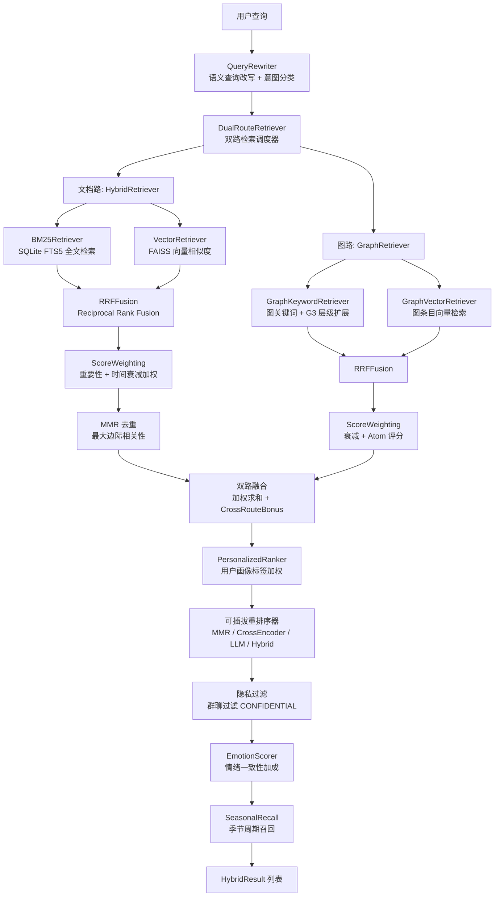

[根目录](../../CLAUDE.md) > [core](../CLAUDE.md) > **retrieval**

## 模块职责

`core/retrieval/` 实现了完整的多路记忆检索流水线，包含 25 个文件。系统通过 **文档路 (BM25 + 向量)** 和 **图路 (关键词 + 向量)** 双路并行检索，经过 RRF 融合、评分加权、重排序和个性化排序，最终返回高质量的记忆结果。

## 检索架构图



## 入口与启动

- **主入口**: `DualRouteRetriever` (dual_route_retriever.py) -- 文档路 + 图路协调器
- **文档路入口**: `HybridRetriever` (hybrid_retriever.py) -- BM25 + 向量 + RRF + 加权
- **图路入口**: `GraphRetriever` (graph_retriever.py) -- 图关键词 + 图向量融合
- **检索主流程**: `MemoryEngine` (core/managers/memory_engine.py) 调用 `DualRouteRetriever.search()`

### 组件初始化顺序

```
ComponentFactory.build_all()
  -> TextProcessor (jieba 分词)
  -> BM25Retriever(db_path, text_processor)
  -> VectorRetriever(faiss_db)
  -> RRFFusion(k=60)
  -> HybridRetriever(bm25, vector, rrf)
  -> GraphKeywordRetriever(graph_store, text_processor)
  -> GraphVectorRetriever(faiss_db)
  -> GraphRetriever(keyword, vector, rrf)
  -> QueryRewriter(llm_caller)
  -> create_reranker(strategy, config)
  -> DualRouteRetriever(hybrid, graph, memory_loader, ...)
```

## 检索数据流详解

### 阶段 1: 查询预处理

```
QueryRewriter.rewrite(query, recent_context)
  -> LLM few-shot 查询展开 (R1)
  -> 意图分类: factual | relational | temporal | preference | contextual
  -> 实体提取 + 时间参考解析
  -> fallback: intent_keywords 硬编码规则

DualRouteRetriever._route_weights_for_query(query, query_intent)
  -> 动态路由权重: 关系查询偏向图路，事实查询偏向文档路
  -> default: doc_weight=0.65, graph_weight=0.35
```

### 阶段 2: 双路并行检索

**文档路:**
```
HybridRetriever.search(query, k, session_id, persona_id)
  -> asyncio.gather(
      BM25Retriever.search() -- FTS5 + jieba 分词
      VectorRetriever.search() -- FAISS cosine similarity
    )
  -> RRFFusion.fuse(bm25_results, vector_results, top_k)
    RRF 公式: score(d) = 1/(60 + rank_bm25(d)) + 1/(60 + rank_vector(d))
  -> ScoreWeighting.apply_weighting()
    加权求和: final = alpha*rrf_normalized + beta*importance + gamma*recency
    (alpha=0.5, beta=0.25, gamma=0.25)
  -> apply_mmr(results, k, lambda=0.7) -- 词袋 Jaccard 去重
```

**图路:**
```
GraphRetriever.search(query, k, session_id, persona_id)
  -> asyncio.gather(
      GraphKeywordRetriever.search() -- FTS5 图条目搜索 + G3 层级扩展
      GraphVectorRetriever.search() -- 图条目 FAISS 检索
    )
  -> RRFFusion.fuse()
  -> 四维加权: alpha*rrf + beta*importance + gamma*recency + delta*decay
    其中 decay 使用 compute_decay_score(atom) 计算记忆原子的衰减
```

### 阶段 3: 双路融合

```
DualRouteRetriever._merge_dual_results(doc_results, graph_results)
  -> 归一化各路最高分 -> doc_signal, graph_signal
  -> final_score = doc_weight*doc_signal + graph_weight*graph_signal + cross_route_bonus
  -> cross_route_bonus: 同一记忆同时出现在两路时 +0.08
  -> 缺失记忆回填: 并行 memory_loader 批量加载
  -> 构建 score_breakdown (含各路分信号)
```

### 阶段 4: 后处理管道

```
1. Persona Boost: 当前 persona 匹配的记忆 *1.2
2. PersonalizedRanker: 用户画像标签加权 (最多 +0.3)
3. 可插拔 Reranker:
   - MMR (默认): lambda=0.7 的边际相关性去重
   - CrossEncoder: query-doc 向量余弦相似度
   - LLM: LLM 直接评分 0-10
   - Hybrid: CrossEncoder 窄化 -> LLM 精排
4. 隐私过滤: 群聊场景过滤 privacy_level="confidential"
5. EmotionScorer: 情绪标签 Jaccard 相似度加成
6. SeasonalRecall: 周年/季节周期召回加成
```

## 各检索器详解

### DualRouteRetriever (`dual_route_retriever.py`)
**职责**: 文档路 + 图路协调器，双路并行检索并融合结果。
**核心类**: `DualRouteRetriever`
**公共 API**: `async search(query, k, session_id, persona_id, strategy, memory_types, chat_type, query_intent, user_id) -> list[HybridResult]`
**核心参数**:
- `document_route_weight` (0.65): 文档路默认权重
- `graph_route_weight` (0.35): 图路默认权重
- `cross_route_bonus` (0.08): 双路同时命中奖励
- `dynamic_route_weighting` (True): 启用动态路由权重 (基于查询意图)

### HybridRetriever (`hybrid_retriever.py`)
**职责**: 文档路 BM25 + 向量检索 + RRF + 加权 + MMR 的完整流水线。
**核心类**: `HybridRetriever`
**公共 API**:
- `async search(query, k, session_id, persona_id, memory_types) -> list[HybridResult]`
- `async add_memory(content, metadata) -> int`
- `async delete_memory(doc_id) -> bool`
- `async update_metadata(doc_id, metadata) -> bool`
**退化机制**: 某一路检索失败时自动降级为单路 (BM25-only 或 Vector-only)

### BM25Retriever (`bm25_retriever.py`)
**职责**: 基于 SQLite FTS5 的 BM25 全文检索，使用 jieba 中文分词。
**索引策略**: FTS5 虚拟表 `memora_memories_fts`，`tokenize='unicode61'`，预处理后的 token 串
**查询方法**: FTS5 MATCH with OR 连接多个 token，`bm25()` 排名函数
**分数归一化**: (max - score) / range 线性映射到 [0, 1]
**过滤**: 支持 session_id / persona_id 后过滤，有过滤条件时 fetch_limit *10

### VectorRetriever (`vector_retriever.py`)
**职责**: 封装 AstrBot `FaissVecDB` 的向量密集检索。
**索引策略**: FAISS HNSW 索引，由 AstrBot 管理
**查询方法**: `faiss_db.retrieve(query, k, fetch_k, metadata_filters)`，相似度已归一化 [0, 1]
**内容保护**: 过长内容 (4000 字符+) 截头截尾保留中间标记
**ID 映射缓存**: int_id -> uuid 缓存，加速删除操作

### RRFFusion (`rrf_fusion.py`)
**职责**: Reciprocal Rank Fusion 算法，合并多路检索结果。
**RRF 公式**: `score(d) = SUM(1/(k + rank_i(d)))`，k=60 (论文推荐值)
**数据类型**: `BM25Result`, `VectorResult`, `FusedResult`, `HybridResult`

### ScoreWeighting (`score_weighting.py`)
**职责**: 对 RRF 融合结果应用三阶段后处理。
**加权公式**: `final = 0.5*rrf_norm + 0.25*importance + 0.25*recency`
**时间衰减**: `exp(-decay_rate * days_old) * recency_bump(days_old)`
  - 7天内: 1.5x bump
  - 30天内: 1.2x bump
  - 使用 `max(create_time, last_access_time)` -- 高频访问记忆衰减更慢

### GraphRetriever (`graph_retriever.py`)
**职责**: 融合图关键词检索和图向量检索的结果。
**四维加权**: alpha*RRF + beta*importance + gamma*recency + delta*atom_decay
  - alpha=0.55, beta=0.2, gamma=0.15, delta=0.1
  - delta 使用 `compute_decay_score(atom)` (基于 TTL 的衰减函数)

### GraphKeywordRetriever (`graph_keyword_retriever.py`)
**职责**: 图条目的全文检索 + 邻居扩展 + G3 层级检索。
**特性**:
- FTS5 搜索图条目表
- 邻居节点扩展 (1-2 hop, second_hop_weight=0.4)
- G3 IS-A 层级展开 (`EntityResolver.expand_with_children`)
- 聚合同一源记忆的多个命中候选项

### GraphVectorRetriever (`graph_vector_retriever.py`)
**职责**: 封装专用于图记忆条目的向量存储。
**索引**: 独立的 FAISS 向量库实例
**查询**: `faiss_db.retrieve()` with metadata_filters

### QueryRewriter (`query_rewriter.py`)
**职责**: R1 语义查询改写 -- LLM few-shot 将模糊指代展开为精准检索词。
**核心类**: `QueryRewriter`, `QueryIntent`
**公共 API**: `async rewrite(query, recent_context) -> QueryIntent`
**回退**: LLM 不可用时使用 `intent_keywords.py` 硬编码关键词分类

### PersonalizedRanker (`personalized_ranker.py`)
**职责**: 基于用户画像标签权重对检索结果加权。
**核心类**: `PersonalizedRanker`
**公共 API**: `apply(results, tag_weights, profile) -> list[HybridResult]`
**加成逻辑**: 内容/元数据匹配用户偏好标签时，加分 (最多 +0.3)
**负加成**: avoided_topics 匹配时 -0.1

### 重排序策略 (`reranker_factory.py`)
**策略类型**:
- `mmr` (默认): `MMRReranker` -- lambda=0.7 边际相关性去重
- `cross_encoder`: `CrossEncoderReranker` -- query-doc 向量余弦相似度
- `llm`: `LLMReranker` -- LLM 直接评分 0-10
- `hybrid`: `HybridReranker` -- CrossEncoder 窄化 + LLM 精排
**公共 API**: `create_reranker(strategy, config, **deps) -> RerankerStrategy`

### MMR Reranker (`mmr_reranker.py`)
**算法**: `mmr_score = lambda * final_score - (1-lambda) * max_jaccard_sim`
**实现**: 词袋 Jaccard 相似度 (无需额外向量计算)

### CrossEncoder Reranker (`cross_encoder_reranker.py`)
**策略**: query-doc 向量余弦相似度作为 CE 分数
**融合**: `new_score = lambda * ce_score + (1-lambda) * original_score`
**回退**: FAISS 不可用时回退到 MMR

### LLM Reranker (`llm_reranker.py`)
**策略**: LLM 直接对批量候选评分 0-10
**融合**: `new_score = (original + llm_score/10) / 2`
**批次**: 最多 2*batch_size 候选 (默认 10)

### 辅助模块

| 文件 | 类/函数 | 职责 |
|------|---------|------|
| `emotion_scorer.py` | `emotion_similarity`, `compute_emotion_boost` | 情绪一致性偏差: Jaccard 标签匹配 + 情绪强度加成 |
| `seasonal_recall.py` | `seasonal_similarity`, `seasonal_boost` | 周年/季节周期召回: 一年内同一天的相似度加成 |
| `explainable_recall.py` | `ExplainableRecall` | 可解释召回追踪包装器，记录查询->结果的完整路径 |
| `trace_models.py` | `RecallTrace`, `TraceStage`, `TraceResult` | 召回追踪数据模型，JSON 安全序列化 |
| `trace_store.py` | `RecallTraceStore` | 召回追踪持久化 (SQLite + 内存 LRU) |
| `intent_keywords.py` | `RELATION_TERMS`, `TEMPORAL_TERMS`, `FACTUAL_TERMS` | 查询意图关键词库 (中英文) |
| `knowledge_retriever.py` | `KnowledgeRetriever` | 独立的知识库检索 (全文搜索 + 向量搜索) |
| `atom_retriever.py` | `AtomRetriever` | 时间感知的记忆原子检索 (base_score * temporal_score) |
| `memory_lifecycle.py` | `MemoryLifecycleManager` | 记忆在多个存储层中的统一生命周期管理 |

## 评分融合算法总结

1. **文档路**: `RRF(BM25, Vector)` -> `0.5*rrf + 0.25*imp + 0.25*recency` -> `MMR(lambda=0.7)`
2. **图路**: `RRF(Keyword, Vector)` -> `0.55*rrf + 0.2*imp + 0.15*recency + 0.1*decay`
3. **双路融合**: `doc_weight*doc_signal + graph_weight*graph_signal + 0.08*cross_bonus`
4. **后处理**: persona_boost(1.2) -> tag_weight(+0.3) -> reranker -> privacy_filter

## 关键依赖与配置

- **jieba**: 中文分词 (BM25 检索的关键依赖)
- **FAISS**: `AstrBot FaissVecDB` -- 向量索引与检索
- **SQLite FTS5**: BM25 全文索引
- **GraphStore**: `core/storage/graph_store.py` -- 图条目持久化
- **EntityHierarchyStore**: `core/storage/hierarchy_store.py` -- G3 层级存储
- **配置**: `recall_engine.*`, `graph_memory.*`, `hybrid_scoring.*`, `reranker.*`, `decay_rate`, `document_route_weight`, `graph_route_weight`

## 常见问题 (FAQ)

**Q: 如何提高事实类查询的召回率？**
A: 增大 `document_route_weight` (默认 0.65)。事实类查询会自动增加文档路权重 +0.15~0.2。

**Q: 如何切换重排序策略？**
A: 设置 `reranker.strategy` 为 `mmr`/`cross_encoder`/`llm`/`hybrid`。`reranker_factory.py` 自动创建对应实例。

**Q: BM25 搜索不到中文关键词？**
A: 确保 jieba 已安装 (`pip install jieba`)，且 `TextProcessor` 正常工作。使用同义词可考虑添加自定义词汇。

**Q: 如何追踪某次检索的具体逻辑？**
A: 启用 `explainable_recall` 模块，通过 `RecallTraceStore` 查询最近的召回追踪记录。追踪数据包含各阶段分数和过滤原因。

**Q: 双路融合中的 cross_route_bonus 是什么？**
A: 当同一记忆同时被文档路和图路检索到时，额外 +0.08 奖励。这表示该记忆在多个维度上与查询高度相关。

## 相关文件清单

- `dual_route_retriever.py` -- 双路检索协调器 (437 行)
- `hybrid_retriever.py` -- 文档路混合检索 (251 行)
- `bm25_retriever.py` -- BM25 全文检索 (424 行)
- `vector_retriever.py` -- 向量密集检索 (338 行)
- `rrf_fusion.py` -- RRF 融合算法
- `score_weighting.py` -- 评分加权 (165 行)
- `graph_retriever.py` -- 图路检索融合
- `graph_keyword_retriever.py` -- 图关键词检索
- `graph_vector_retriever.py` -- 图向量检索
- `query_rewriter.py` -- 语义查询改写
- `mmr_reranker.py` -- MMR 去重 (68 行)
- `cross_encoder_reranker.py` -- CrossEncoder 重排
- `llm_reranker.py` -- LLM 重排序 (60 行)
- `reranker_factory.py` -- 重排序工厂 (78 行)
- `personalized_ranker.py` -- 个性化排序 (67 行)
- `emotion_scorer.py` -- 情绪计分 (41 行)
- `seasonal_recall.py` -- 季节性召回 (32 行)
- `intent_keywords.py` -- 意图关键词 (58 行)
- `knowledge_retriever.py` -- 知识库检索
- `atom_retriever.py` -- 原子检索器
- `memory_lifecycle.py` -- 记忆生命周期管理
- `explainable_recall.py` -- 可解释召回
- `trace_models.py` -- 追踪数据模型
- `trace_store.py` -- 追踪存储
- `__init__.py` -- 模块导出

## 变更记录 (Changelog)

| 日期 | 变更 | 描述 |
|------|------|------|
| 2026-07-07 | 初始文档 | 生成 retrieval 模块级 CLAUDE.md，覆盖全部 25 个文件 |
