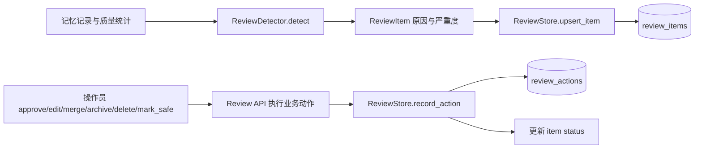

[根目录](../../AGENTS.md) > [core](../AGENTS.md) > **review**

# 记忆人工审查队列模块

**Last Updated:** 2026-07-17

## 职责与边界

`core/review/` 提供确定性的可疑记忆检测、JSON-safe 审查模型、SQLite 队列与动作历史。它负责把候选记忆标为“需要人工处理”，不负责证明内容恶意、不替代提示词防护，也不直接实现对记忆正文的 edit/merge/archive/delete；这些动作由 `core/api/review_api.py` 协调真实存储后再记录审查状态。

## 架构与数据流



## 检测模型

- `ReviewReason`：`low_confidence`、`duplicate`、`stale`、`sensitive`、`noisy`、`provenance_missing`。
- `ReviewSeverity`：`low`、`medium`、`high`；敏感标记优先为高严重度。
- `ReviewStatus`：开放、批准、编辑、合并、归档、删除和安全状态。
- `ReviewItem`：`memory_id`、原因、严重度、状态、内容预览、元数据和时间戳。
- `ReviewAction` / `ReviewActionResult`：动作、操作者、载荷与执行结果。
- `json_safe` / `json_copy`：递归生成 JSON-safe 副本，避免可变内部状态泄漏。

`ReviewDetector.detect(memories, quality_stats=None)` 使用确定性启发式：质量统计中的低置信度 ID、token 重叠的近重复、长期未访问且低重要度、配置的敏感 marker、标点/噪声占比和来源元数据缺失。英文 marker 采用不区分大小写匹配。检测结果是分诊信号，不是内容净化或安全裁决。

## Store 契约与数据流

`ReviewStore` 不依赖 AstrBot，使用独立 `aiosqlite` 连接：

- `initialize()` 创建 `review_items`、`review_actions` 及排序/状态/动作索引。
- `upsert_item()` 在 `BEGIN IMMEDIATE` 中按相同 `memory_id` 且原因有交集去重开放项；保留最新 winner，并把其余重叠开放项标为 `safe`。
- `list_items(status, reason, severity, cursor, limit)` 支持稳定的 `(updated_at DESC, item_id DESC)` 游标分页；limit 必须为整数并裁剪到 `1..200`。
- `record_action()` 追加动作历史并把 item 状态更新为动作状态；找不到 item 时返回明确失败，不伪造记录。
- `list_actions()` 按创建时间与 action ID 升序返回完整历史。

## 依赖方向

- 上游：`core/api/review_api.py` 从实际记忆/质量数据刷新队列并执行操作。
- 本模块：`review_detector.py -> models.py`；`review_store.py -> models.py`。
- 下游：仅 `aiosqlite` 与标准库；包可在没有 AstrBot mock 的环境导入。
- 相关上下文：[存储模块](../storage/AGENTS.md)、[监控模块](../monitoring/AGENTS.md)、[API 模块](../api/AGENTS.md)。

## 隐私、安全与修改约束

- Detector 接收完整记忆内容；Store 保存 `content_preview` 和任意 JSON 元数据。敏感 marker 命中不表示数据已脱敏，写入前和 API 返回前仍需遵循上层隐私策略。
- 不要在日志、错误响应或动作审计中回显完整记忆、敏感 marker 周边文本或任意 payload。
- 动作状态不能替代真实记忆操作结果；API 必须先确认业务动作语义，再写动作历史，失败不得标成成功状态。
- 保持开放项去重的 `memory_id + overlapping reasons` 语义、事务原子性和游标稳定顺序。
- `json_safe` 只保证可序列化，不验证字段可信度；所有外部 action/payload 仍需在 API 边界限制。
- 新增原因、严重度或状态时必须同步枚举规范化、数据库过滤、API 映射和测试。

## 测试定位与验证

- `tests/test_review_detector.py`：重复、陈旧、低置信度、敏感 marker、噪声、来源缺失、JSON-safe 模型、开放项去重、动作历史、筛选、游标、limit 与非法枚举。
- `tests/test_api_review.py`：队列刷新、详情与操作 API、底层记忆动作协调和失败契约。

精确验证命令：

```bash
python -m pytest -q tests/test_review_detector.py tests/test_api_review.py
```
