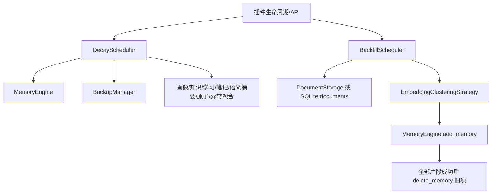
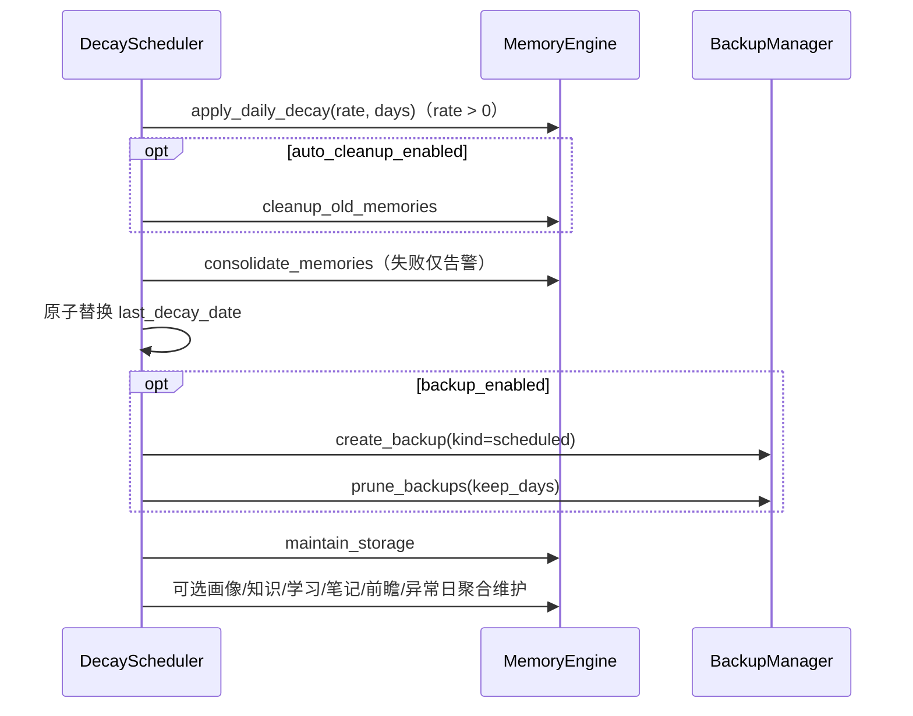

[根级 AGENTS.md](../../AGENTS.md) > **core/schedulers**

# Schedulers 模块上下文

**最后更新：** 2026-07-17  
**源码范围：** `core/schedulers/*.py`（3 个 Python 文件）

## 职责与边界

`core/schedulers/` 只负责后台触发、进度和协程生命周期；具体衰减、清理、备份、写入与索引同步委托给 [`core/managers/AGENTS.md`](../managers/AGENTS.md)。包级当前只导出 `DecayScheduler`；`BackfillScheduler` 由具体模块显式导入。



## `DecayScheduler`

### 生命周期

- `start()` 幂等：设置 `_running`，创建启动补偿 `_startup_task` 和每日循环 `_task`，两者都注册异常回调。
- `stop()` 取消并 await 两个任务，清空引用。
- 主循环按本地时间计算下一次 `check_hour:check_minute`；普通循环异常后等待 1 小时重试。
- 默认触发时间由构造参数决定，源码默认 `00:05`；不要在循环内硬编码另一时间。
- 每日可选维护会调用已装配的 `SemanticCompressor`（只生成 source-backed `semantic_summary` Projection）与 `AnomalyDetector` 日聚合（按 UTC 日幂等投喂 canonical 创建量，告警写脱敏诊断事件）。普通失败只记录安全计数并继续其他维护项，`CancelledError` 必须传播。

### 状态与幂等

`data_dir/decay_state.json` 保存 `last_decay_date`。写入先落同目录 `.tmp` 再 `Path.replace()`，避免半写 JSON；读取损坏或 I/O 失败降级为空状态。启动时：

1. 若日期已是今天则跳过。
2. 否则计算错过天数，以 `missed_days + 1` 调用衰减，完成主衰减/清理/整合后写今天日期。
3. 状态日期写入发生在备份、storage maintenance 和 optional maintenance **之前**；这些后续任务失败不会令当天主衰减重跑。

### 每日链



可选维护各自独立捕获异常：画像标签衰减、知识过期清理、自主学习 shadow 候选重建、笔记版本裁剪、未来 24 小时 PLANNED 原子扫描、异常检测日聚合。单项失败不能阻止其他项。

当 `backup_settings.enabled` 为真，或异常检测已装配（`anomaly_detector` 非空）时，即使衰减率和自动清理都关闭，`DecayScheduler` 也会启动，以保证定时备份与异常日聚合独立运行。调度器不遍历或删除备份目录；创建和保留策略必须委托 `BackupManager.create_backup(kind="scheduled")` 与 `BackupManager.prune_backups(keep_days=...)`。公开状态只保留 succeeded/failed、备份名称和稳定 reason code，不输出路径或异常正文。

## `BackfillScheduler`

后台回填把多 `key_facts` 的旧记忆重新按 embedding 聚类拆分。公开接口：

- `start() -> job_id`：disabled 或已有 running job 时抛 `RuntimeError`。
- `get_status()` / `progress`：返回进度副本。
- `stop()`：取消任务并标记 `cancelled`。
- `is_running`：仅当 status 为 `running`。

### 候选与游标

- 优先调用异步 `DocumentStorage.get_documents_after_id(last_id, limit)`。
- 否则使用可执行的真实 `engine.db_connection` 做 `id > checkpoint ORDER BY id LIMIT ?`；再降级到其他 DocumentStorage 分页接口。
- metadata 字符串 JSON 解析失败视为空；`schema_version` 可解析且 `>= v3` 的项跳过；`key_facts` 不超过 1 的项跳过。
- `_checkpoint` 只存在内存，且每次 `start()` 重置为 0；它只防止**同一次运行**重复扫描，不是跨重启断点续传。

### 单项替换语义

1. `EmbeddingClusteringStrategy.segment()` 返回 0/1 个片段时，仅把旧项 metadata 标为 `schema_version=v3`。
2. 多片段时逐个调用 `MemoryEngine.add_memory()`，新项记录 `schema_version=v3` 与 `backfill_source=旧 doc_id`。
3. 仅当 `len(new_ids) == target_count` 才删除旧项。
4. 部分片段写失败时保留旧项，但已成功的新项也保留；这可能暂时产生重复内容，后续修复/人工核对不可假定回填原子化。
5. 旧项删除抛异常时，尝试在旧项标记 `backfill_delete_failed` 和 `backfill_new_ids`，随后把该项计为 error。
6. `delete_memory()` 若只返回 `False` 而不抛异常，当前代码不会进入 delete-failed 标记路径；修改时应以测试契约为准并关注此风险。

任务最终状态是 `completed`、`completed_with_errors`、`cancelled` 或 `failed`。`processed` 只在 `_backfill_one()` 未抛出时递增；错误项仍推进本次运行 checkpoint。

## 并发、异常与安全边界

- 每个 scheduler 实例通过状态/任务引用防重复，但没有跨进程分布式锁；同一 data dir 不得启动多个实例。
- `CancelledError` 在内部清理状态后必须继续抛出，供 `stop()` 正确 await。
- scheduler 不直接开大事务；耗时 Embedding、FAISS 和 SQLite 写由 managers/processors 控制。回填 `max_per_run` 和 `batch_size` 是资源上限，不能无界。
- `decay_state.json`、备份路径、job status 和 error 可能暴露运行节奏、内部路径与数据规模；API 返回前应最小化并鉴权。
- 回填读取和新建的正文、key facts、session/persona、embedding 都是敏感数据。日志只记录 doc ID/计数，不得记录片段正文或 metadata。
- 每日备份包含数据库、WAL/SHM 和 FAISS 文件，保密级别等同原数据；清理只能在备案备份目录内执行。
- 前瞻原子缓存 `_pending_proactive` 仍受 session/persona 授权约束，不能跨会话注入。

## 测试定位与精确验证

```bash
python -m pytest -q tests/test_decay_scheduler.py
python -m pytest -q tests/test_backfill_scheduler.py
```

本次文档迁移不运行测试。若改每日维护调用顺序，还需运行 managers 的 decay/lifecycle/backup 测试；若改回填替换语义，还需运行 `tests/test_managers_memory_crud.py`。

## 依赖方向与改动守则

- 允许：`schedulers → managers/processors`；不允许 managers 反向导入 scheduler。
- 所有新后台任务都必须有 start/stop、重复启动保护、取消传播、完成状态和资源上限。
- 状态文件更新必须采用同目录临时文件 + 原子替换；不要直接覆盖正式 JSON。
- 不把“部分成功”记录为完全成功；进度字段的含义必须在测试中锁定。
- 任何会删除旧数据的迁移都必须先证明替代数据全部持久化，并保留可诊断的失败标记。
