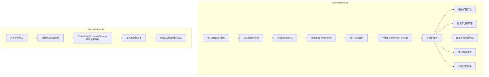

[根目录](../../CLAUDE.md) > [core](../CLAUDE.md) > **schedulers**

## 模块职责

`core/schedulers/` 负责记忆系统的后台调度任务，包括每日重要性衰减、旧记忆清理、自动备份、存储维护以及旧版记忆的回填拆分。两个调度器以 asyncio 协程方式运行，独立管理各自的生命周期。

## 调度架构图



## 调度器清单

### 1. DecayScheduler -- 记忆衰减与每日维护调度器

**文件**: `decay_scheduler.py`
**类**: `DecayScheduler`
**触发条件**: 每日按固定时间点执行（默认 00:05）
**状态持久化**: `data_dir/decay_state.json`

#### 核心功能

| 功能 | 方法 | 描述 |
|------|------|------|
| 每日衰减 | `_execute_decay(days)` | 调用 `MemoryEngine.apply_daily_decay(rate, days)`，支持多天补偿 |
| 自动清理 | 内置 | 三阶段分层遗忘，基于 `cleanup_days_threshold`(30d) + `cleanup_importance_threshold`(0.3) |
| 梦境整合 | 内置 | 衰减后巩固高重要性记忆的关联网络，调用 `MemoryEngine.consolidate_memories()` |
| 自动备份 | `_run_backup()` | 通过 `BackupManager.create_backup()` 每日备份 |
| 存储维护 | 内置 | 调用 `MemoryEngine.maintain_storage()`，释放 FAISS/SQLite 空间 |
| 画像标签衰减 | `_run_optional_maintenance()` | 调用 `ProfileManager.decay_and_clean_all()` |
| 知识库清理 | `_run_optional_maintenance()` | 调用 `KnowledgeManager.cleanup_expired()` |
| 自主学习优化 | `_run_optional_maintenance()` | 调用 `AutoLearning.optimize()` |
| 笔记版本清理 | `_run_optional_maintenance()` | 调用 `NoteManager.prune_versions(max_versions)` |
| 前瞻记忆扫描 | `_run_optional_maintenance()` | 扫描未来 24 小时内的 PLANNED 原子并缓存 |
| 启动补偿 | `_check_and_execute()` | 启动时检查 `last_decay_date`，计算并补偿错过的天数 |

#### 关键参数

| 参数 | 默认值 | 描述 |
|------|--------|------|
| `decay_rate` | 配置值 | 每日衰减率 (0-1)，0 表示不衰减 |
| `check_hour` | 0 | 每日执行小时 |
| `check_minute` | 5 | 每日执行分钟 |
| `backup_enabled` | True | 是否启用每日自动备份 |
| `backup_keep_days` | 7 | 备份保留天数 |

#### 生命周期

```
start() -> 创建 startup_task (_check_and_execute) + scheduler_loop
         -> 启动补偿检查 -> 进入每日定时循环
stop()  -> 取消两个任务
```

**防重复机制**: 通过 `decay_state.json` 记录 `last_decay_date`，同一天不会重复执行。

### 2. BackfillScheduler -- 旧版记忆回填调度器

**文件**: `backfill_scheduler.py`
**类**: `BackfillScheduler`
**触发条件**: API 手动调用 `start()`
**状态**: 内存中的 `_progress` 字典，通过 `progress` 属性和 `get_status()` 查询

#### 核心功能

对 `schema_version < "v3"` 的旧版记忆进行重新拆分：

1. **获取旧版记忆**: 通过 FAISS DocumentStorage 或 SQLite 直接查询，分页获取（默认 50 条/批）
2. **重新话题分割**: 使用 `EmbeddingClusteringStrategy` 基于向量聚类将混合话题记忆拆分为更细粒度的话题片段
3. **写入新记忆**: 对每个片段调用 `MemoryEngine.add_memory()` 写入，标记 `schema_version=v3` 和 `backfill_source`
4. **原子删除**: 仅在所有新片段写入成功后删除旧记忆；部分失败时保留原记忆并标记 `backfill_delete_failed=true`

#### 关键参数

| 参数 | 默认值 | 描述 |
|------|--------|------|
| `enabled` | True | 是否启用回填 |
| `batch_size` | 50 | 每批获取的旧版记忆数 |
| `max_per_run` | 500 | 单次运行最多处理数 |
| `similarity_threshold` | 0.5 | 向量聚类相似度阈值 |
| `min_cluster_size` | 1 | 最小聚类大小 |
| `max_clusters` | 5 | 最大聚类数 |

#### 进度追踪

通过 `progress` 属性暴露:
```python
{
    "job_id": "bf_1234567890",
    "total": 0,
    "processed": 123,
    "status": "running",  # idle | running | completed | completed_with_errors | cancelled | failed
    "errors": 2,
}
```

#### API 接口

- `await start()` -> `str` (job_id): 启动回填任务
- `await get_status()` -> `dict`: 查询当前进度
- `await stop()`: 取消当前任务
- `is_running` -> `bool`: 是否正在运行

## 关键依赖

- `core.managers.memory_engine.MemoryEngine` -- 记忆引擎（衰减、清理、梦境整合、存储维护）
- `core.managers.backup_manager.BackupManager` -- 备份管理
- `core.processors.topic_splitter.EmbeddingClusteringStrategy` -- 向量聚类话题分割
- `core.managers.profile_manager` -- 用户画像管理（可选）
- `core.managers.knowledge_manager` -- 知识库管理（可选）
- `core.managers.note_manager` -- 笔记管理（可选）
- `astrbot.api.logger` -- 日志

## 常见问题 (FAQ)

**Q: 如何调整衰减执行时间？**
A: 修改 `DecayScheduler` 的 `check_hour` 和 `check_minute` 参数。通常在配置中设置。

**Q: 衰减率为 0 会怎样？**
A: 记忆不会自动衰减，但仍会执行自动清理、备份、存储维护和子维护任务。

**Q: 回填任务可以并发运行吗？**
A: 不可以。`BackfillScheduler` 同时只能有一个任务运行，调用 `start()` 时若已有任务运行会抛出 `RuntimeError`。

**Q: 回填失败如何恢复？**
A: 通过 `_checkpoint` (最后处理的 memory_id) 实现断点续传。重新调用 `start()` 会从上次中断处继续。

## 相关文件清单

| 文件 | 行数 | 描述 |
|------|------|------|
| `__init__.py` | 5 | 模块导出 `DecayScheduler` |
| `decay_scheduler.py` | 427 | 衰减调度器完整实现 |
| `backfill_scheduler.py` | 328 | 回填调度器完整实现 |

## 变更记录 (Changelog)

| 日期 | 变更 | 描述 |
|------|------|------|
| 2026-07-07 | 初始文档 | 完整扫描 3 文件，生成调度架构文档 |
