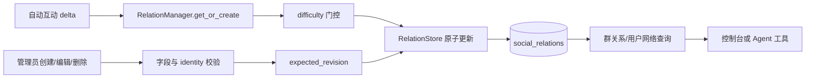

[根目录](../../AGENTS.md) > [core](../AGENTS.md) > **social**

# 类型化社交关系模块

**Last Updated:** 2026-07-17

## 职责与边界

`core/social/` 维护有方向的 `(from_user, to_user, relation_type, group_id)` 关系、关系类型分类、强度、互动次数和标签，并以类型难度系数抑制自动强度变化。它是图记忆/互动关系之上的显式领域层，不负责从消息中推断关系类型，也不自动创建反向边。组件由 `core/plugin_initializer.py` 初始化，控制台编辑在 `core/api/social_api.py`，Agent 查询在 `core/tools/social_tools.py`。

## 架构与数据流



## 模型与规则

- `SocialRelation`：单向关系，字段为双方用户、关系类型、`strength`、`frequency`、`last_interaction`、群和标签。
- `RelationChange`：自动变化请求，包含原始 `delta`、建议新强度和原因。
- `RELATION_CATEGORIES`：`blood`、`geographic`、`career`、`emotional`、`interest`、`intimacy` 六类真实子类型。
- `RELATION_DIFFICULTY`：类型变化阻尼；未知类型的读取辅助函数回退 `0.40`，但管理员创建/编辑必须拒绝未知类型。
- 自动变化公式：`actual_delta = delta * (1 - difficulty)`，最终 `strength` 裁剪到 `[0.0, 1.0]`。
- 默认自动关系为 `stranger`，初始强度 `0.1`；关系始终有方向，双向语义必须显式写两条记录。

## 关键接口与一致性

- `get_or_create`、`apply_delta`：自动路径；Store 在写锁/事务内基于最新记录应用变化，避免陈旧对象覆盖管理员编辑。
- `create_manual_relation`：校验标识、支持的类型、有限且有界强度、标签类型/长度/数量；人工记录的互动次数和时间保持为零。
- `update_manual_relation`、`delete_manual_relation`：以四元组 identity 定位并强制 `expected_revision`。
- `get_relations_by_group`、`get_user_network`、`get_user_relations_in_group`、`list_all`、`list_group_ids`：只读查询。
- `update_tags`、`delete_relation`：已有自动/内部接口；管理 API 应优先使用 revision 保护的严格接口。

`RelationStore` 持久化 `social_relations`，四元组唯一；标签存为 JSON。严格 CRUD 抛出 `EntityAlreadyExistsError`、`EntityNotFoundError` 或 `EditConflictError`。连接池复用前必须结束失败事务，取消也不得留下锁或半提交状态。

## 依赖方向

- 上游：`core/plugin_initializer.py`、`core/api/social_api.py`、`core/tools/social_tools.py`。
- 本模块：`relation_manager.py -> models.py + relation_store.py`。
- 下游：`core/storage/base.py`、`core/base/entity_editing.py`、`aiosqlite`。
- 相关上下文：[存储模块](../storage/AGENTS.md)、[基础领域能力](../base/AGENTS.md)。

## 隐私、安全与修改约束

- 用户 ID、群 ID、关系类型、强度和标签构成敏感社交图数据；任何查询必须保留群/用户过滤，不能以空 `group_id` 意外代表全局。
- 标签是人工输入文本。API 层限制单项 64 字符、去重后最多 32 项；渲染或日志仍须按不可信文本处理。
- 控制台 mutation 通过审计边界记录动作和安全 identity 摘要；不得在错误日志追加完整 tags 或关系网。
- 管理员更新必须以 revision 防止丢失更新；不要把冲突转换为成功，也不要由自动路径回写陈旧的 `SocialRelation`。
- `update_relation(RelationChange)` 当前使用空群作用域，调用者若需要群隔离应使用 `apply_delta(..., group_id, ...)`；修改时要先核对调用契约，避免跨群混合。
- 新增关系类型必须同时更新分类、难度、显示映射和测试。

## 测试定位与验证

`tests/test_social_relation.py` 覆盖六类类型和全部难度、模型序列化、Store CRUD、方向性与群隔离、门控与裁剪、高频更新、标签、管理员 revision、自动/人工并发、连接池事务清理、取消和 locator 校验。

精确验证命令：

```bash
python -m pytest -q tests/test_social_relation.py
```
