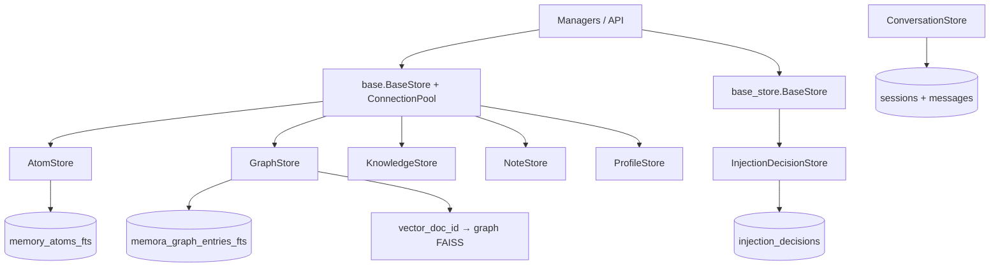
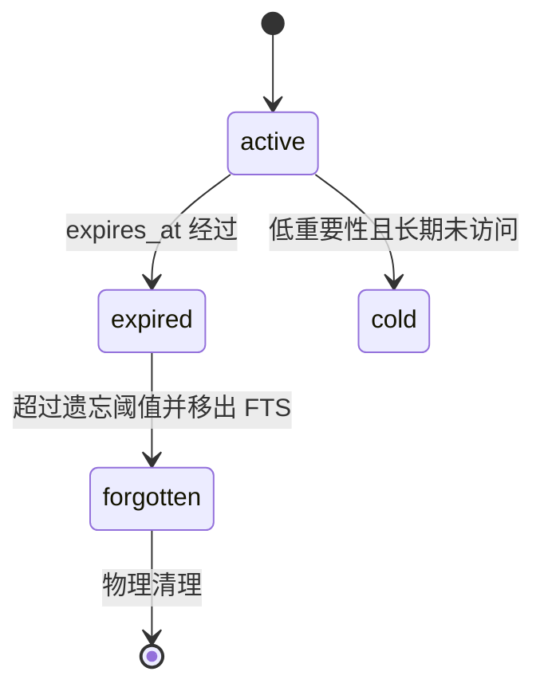
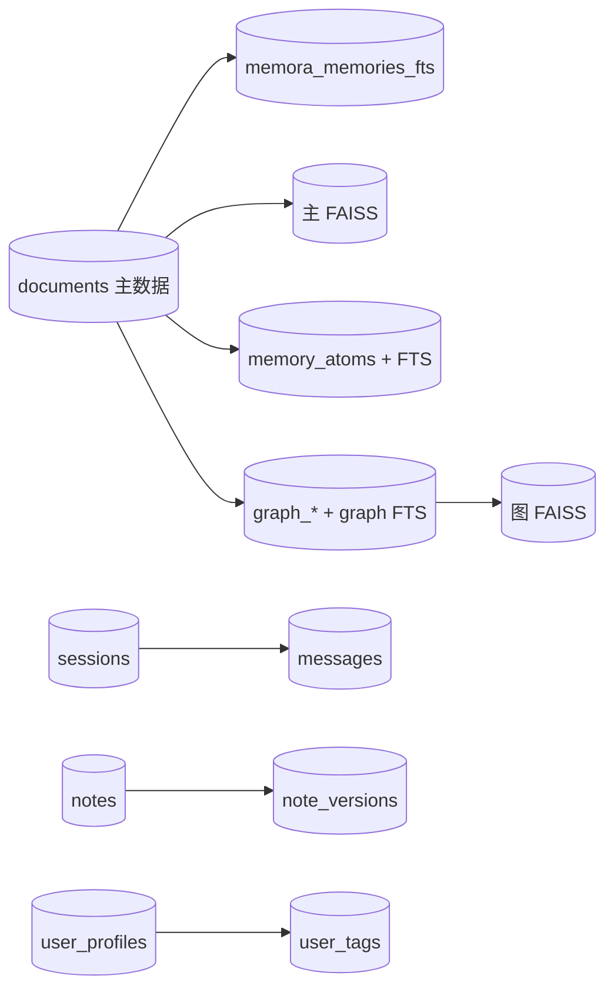

[根级 AGENTS.md](../../AGENTS.md) > **core/storage**

# Storage 模块上下文

**最后更新：** 2026-07-17  
**源码范围：** `core/storage/*.py`（18 个 Python 文件）

## 职责与边界

`core/storage/` 是本地持久化层：以 `aiosqlite`/SQLite WAL 保存原子、图、会话消息、知识、笔记、画像和注入决策遥测，并维护 FTS5 派生索引及与 FAISS 向量 ID 的关联。业务编排位于 [`core/managers/AGENTS.md`](../managers/AGENTS.md)，召回算法位于 [`core/retrieval/AGENTS.md`](../retrieval/AGENTS.md)。



## 连接模型与并发

### `base.py`

- `apply_perf_pragmas()` 是共享 SQLite 设置的单一事实来源：`foreign_keys=ON`、`journal_mode=WAL`、`synchronous=NORMAL`、`busy_timeout=30000`、64 MB page cache、内存临时表、256 MB mmap。
- `ConnectionPool` 用 `asyncio.Queue` 管理固定数量连接；`base.BaseStore._connect()` 优先借池连接，否则创建一次性连接。
- 所有 JSON 解析必须经安全助手并验证容器类型；数据库里的 JSON 字符串不天然可信。

### `base_store.py`

- 这是另一种 per-instance 持久连接基类，供 `InjectionDecisionStore` 使用；`initialize()` 建连接并建表，`close()` 显式释放。
- `_insert_many()`、`_delete_where()` 等会动态拼接表/列名，只能传内部常量。不要把 API 输入直接传给这些助手。
- 两个同名 `BaseStore` 不可互换；导入时必须明确来源。

`ConversationStore` 维护自己的持久连接和 `_write_lock`。其他领域 Store 多数通过短连接上下文执行事务。WAL 提升并发读写，但不消除 SQLite 单写者约束；跨多条相关写入必须在同一连接和一次 commit 内完成。

## Schema 与 Store

### 记忆原子：`AtomStore` + `AtomFTSMixin`

`memory_atoms` 保存 `parent_memory_id`、类型、正文、实体 JSON、重要性/置信度、时间、TTL、状态、强化次数、衰减类型、session/persona 和 metadata；`memory_atoms_fts` 是 `content, atom_id UNINDEXED` 的 FTS5 表。



- 单条 `insert()` 在一个事务内写主表和 FTS；`insert_many()` 每 500 条形成独立事务，单批失败 rollback 并重置已准备对象的 `atom_id`。
- `forget_expired_atoms()`、`cleanup_forgotten()`、按父 ID 删除必须同步主表与 FTS。
- FTS 搜索使用参数绑定；查询 token 中的引号会转义，session/persona/status 作为参数化过滤。普通搜索只返回 active；cold 不参加常规 FTS。

### 图记忆：`GraphStore` 与四个 mixin

| 表 | 作用 |
|---|---|
| `graph_nodes` | 规范化实体节点，`node_key` 唯一 |
| `graph_edges` | 节点关系、源记忆、权重、置信度与状态 |
| `graph_entries` | 可搜索图条目、源记忆、scope、`vector_doc_id` |
| `graph_entry_nodes` | 条目与节点多对多关系 |
| `memora_graph_entries_fts` | 图条目全文索引 |

- `GraphCRUDMixin` 在单连接事务内批量 upsert 节点/边/条目；跨记忆同语义边按实现规则合并。
- `GraphDeleteMixin` 删除 entries、FTS、entry-node、edges，并清孤儿节点；返回 `vector_doc_id` 给上层删除图 FAISS。SQLite commit 与 FAISS 删除不是同一事务，必须由 `GraphMemoryManager`/写日志补偿。
- `GraphQueryMixin` 的 scope 值参数化；节点 token 查询和批量 `IN` 占位符由内部数量生成。
- `GraphSubgraphMixin` 构建前端快照并限制 memories/entries/nodes/edges；其输出仍可能暴露实体关系和正文片段，不是公开匿名数据。

### 会话与消息：`ConversationStore`

- `sessions` 保存 `session_id`、platform、活跃时间、消息计数、participants JSON 和 metadata JSON。
- `messages` 保存 role、content、sender/group/platform、timestamp 和 metadata，并关联 session。
- `add_message()` 在 `_write_lock` 内写消息、upsert session、更新计数和参与者后一次 commit。
- `trim_session_messages()` 只能删除已经总结的最旧消息；`sync_message_counts()` 修复 sessions 计数。任何范围查询都应以实际消息数为准。

### 用户画像：`ProfileStore`

`user_profiles.user_id` 唯一；`user_tags` 对 `(user_id, category, value)` 唯一并以外键关联画像。

- 严格创建、管理员字段替换、带 revision 删除、偏好合并、标签 upsert、消息计数和标签衰减都使用 `BEGIN IMMEDIATE`。
- 管理员编辑以 `compute_entity_revision()` 做乐观并发检查，冲突抛 `EditConflictError`；不要把旧画像快照整行写回。
- `_rollback_safely()` 保证回滚清理错误不覆盖原异常。

### 知识与笔记

- `knowledge_entries`：title/content/category/confidence/source_ids/tags、时间、过期和访问计数；搜索是参数化 `LIKE`，不是 FTS。
- `notes` + `note_versions`：创建时同事务写 v1；更新以 `WHERE id=? AND version=?` 乐观锁，成功后插入下一版本。
- `idx_note_versions_note_version` 对 `(note_id, version)` 唯一；健康检查仍检测旧数据或损坏造成的重复版本。
- `soft_delete()` 仅改状态；`delete()` 同事务删版本和主笔记；`prune_versions()` 按创建时间保留最新 N 个。

### 实体层级：`EntityHierarchyStore`

`entity_hierarchy(child,parent)` 唯一；添加前从 parent 向上搜索，拒绝自环和会形成的环。它复用 `MemoryEngine` 主连接，不自持连接。

### 注入决策遥测：`InjectionDecisionStore`

该 Store 使用显式安全 schema，只保存决策 ID、时间、trace ID、路由/预设/交付结果、reason code、provider 类型/模型、计数、字符预算与耗时；**不保存提示词、候选正文、最终注入正文、session/user/persona ID 或 provider 凭据**。

- `DecisionQuery` 限制 `offset >= 0`、`1 <= limit <= 100` 和时间范围顺序；所有过滤参数绑定。
- `insert_many()` 在全局 `write_transaction` 中原子批量插入，重复 `decision_id` 忽略，异常 rollback。
- 列表故意排除 `reason_codes_json`，详情按 opaque `decision_id` 获取并解码。
- `cleanup()` 先按 retention 删除，再按 `(created_at_ms DESC, decision_id DESC)` 稳定保留 newest `max_rows`，同一事务提交。
- provider 型号和错误码仍可能泄露部署信息，API 层必须授权；“无正文”不代表可公开。

## 数据与依赖方向



`documents` 和主 BM25 表由管理/检索初始化路径拥有，但它们是持久化一致性图的一部分。`core/storage` 不应导入 handler、scheduler 或页面 API；上层可以依赖 Store，Store 不回调领域编排。

## 安全与不可泄露数据边界

1. `content`、message、atom、graph entry、profile、tag、session/persona/user ID、participants 与全部 metadata 都按敏感用户数据处理。
2. SQL 值一律参数绑定；动态表名/列名必须来自封闭白名单。FTS 查询语法不是普通字符串，必须保留 token 转义。
3. 不在日志中记录 SQL 参数、正文、完整 metadata、用户标识或数据库绝对路径。异常对外只给稳定错误码，内部 traceback 也要避免拼接敏感值。
4. SQLite 文件、WAL/SHM、FAISS 文件、备份和 trace DB 具有相同保密级别；文件权限和下载授权由调用层强制。
5. 删除主数据时必须同步 FTS 与向量引用；不能仅删 SQLite 行而留下可召回的 FAISS/FTS 内容。
6. JSON 列读取失败应返回安全空容器或显式错误；禁止反序列化任意 Python 对象。

## 异常与一致性约束

- 未初始化持久连接的写操作应抛 `RuntimeError`；不要把它转换为“写入 0 条”的成功。
- 批量事务失败必须 rollback；`CancelledError` 不得吞掉，否则会留下未知提交状态。
- `NoteStore.update()` 返回 `False` 表示版本冲突或不存在；调用方必须重新读取而不是重试旧对象。
- 图/原子/FTS 是派生索引，发现孤儿或缺失时交给 [`core/validators/AGENTS.md`](../validators/AGENTS.md) 检测与重建，不在查询时静默伪造数据。
- `foreign_keys=ON` 只约束声明了外键的表；`memory_atoms.parent_memory_id`、部分图源引用仍需健康检查维护。

## 测试定位与精确验证

```bash
python -m pytest -q tests/test_storage_base.py tests/test_storage_builder.py
python -m pytest -q tests/test_atom_store.py tests/test_atom_fts.py
python -m pytest -q tests/test_graph_store.py tests/test_graph_crud.py tests/test_graph_query.py tests/test_graph_delete.py tests/test_graph_subgraph.py
python -m pytest -q tests/test_conversation_store.py tests/test_message_store.py tests/test_message_queries.py
python -m pytest -q tests/test_profile_store.py tests/test_knowledge_store.py tests/test_note_store.py tests/test_hierarchy_store.py
python -m pytest -q tests/test_injection_decision_store.py
python -m pytest -q tests/integration/test_pipeline_graph.py tests/stress/test_concurrent_writes.py
```

本次文档迁移不运行测试。Schema、事务或删除语义变化时，除同名 Store 测试外还必须运行 `tests/test_validators.py`，因为健康检查编码了跨表不变量。

## 改动守则

- Schema 新字段必须同步建表、旧库迁移、row mapper、写入参数、测试和健康检查；仅改 dataclass 不算完成。
- 新增派生索引必须同时设计增删改同步、崩溃修复和重建路径。
- 保持批量上限（原子/图常为 500）；不要为减少 commit 次数制造超大锁定事务。
- 包级 `__init__.py` 只暴露稳定公共 Store/DTO；新增导出前检查调用方是否应依赖具体实现。
- 不要把两个 `BaseStore` 合并或互换，除非完整迁移连接生命周期与所有调用方。