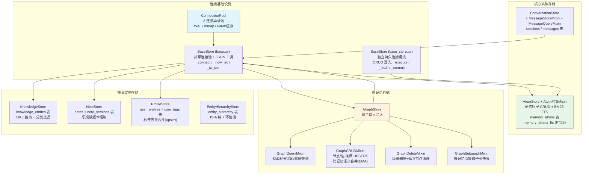

[根目录](../../CLAUDE.md) > [core](../) > **storage**

## 模块职责

`core/storage/` 是 Memora 的数据持久化层，基于 SQLite (aiosqlite + WAL 模式) 实现记忆原子、图记忆、会话消息、知识库、笔记、用户画像等全部实体的本地存储与全文检索。同时作为 FAISS 向量索引的持久化锚点。

## 存储架构图

## 各 Store 详解

### 连接基础设施

| 文件 | 类 | 职责 |
|------|-----|------|
| `base.py` | `ConnectionPool` | 固定大小(默认3)的 aiosqlite 异步连接池。通过 `asyncio.Queue` 管理连接借出/归还 |
| `base.py` | `BaseStore` | 提供 `_connect()` 上下文管理器(优先连接池,回退一次性连接)、`_now_iso()`、`_to_json()`/`_from_json()` |
| `base_store.py` | `BaseStore` | **独立持久连接模式**(不同于 base.py 的连接池模式)。提供 `_execute`/`_fetch_all`/`_fetch_one`/`_insert_many`/`_delete_where` 等 CRUD 助手 |

**性能 PRAGMA** (在 `apply_perf_pragmas` 中统一设置):
- `journal_mode = WAL` (并发读写)
- `synchronous = NORMAL` (安全与性能平衡)
- `busy_timeout = 30000` (30秒等待)
- `cache_size = -65536` (64MB 页面缓存)
- `temp_store = MEMORY`
- `mmap_size = 268435456` (256MB 内存映射)

### AtomStore -- 记忆原子存储

**文件**: `atom_store.py` + `atom_fts.py` (FTS混入)

**Schema -- `memory_atoms` 表**:
| 字段 | 类型 | 说明 |
|------|------|------|
| id | INTEGER PK | 自增主键 |
| parent_memory_id | INTEGER | 父记忆文档 ID |
| atom_type | TEXT | 原子类型 (episodic/semantic/planned/...) |
| content | TEXT | 原子内容 |
| entities | TEXT (JSON) | 关联实体列表 |
| importance | REAL | 重要性 0-1 |
| confidence | REAL | 置信度 0-1 |
| created_at | REAL | 创建时间 (Unix 秒) |
| last_accessed_at | REAL | 最后访问时间 |
| last_reinforced_at | REAL | 最后强化时间 |
| event_time | REAL | 事件发生时间 |
| ttl_days | REAL | 生存天数 |
| expires_at | REAL | 过期时间戳 |
| status | TEXT | 生命周期状态 (active/expired/forgotten/cold) |
| reinforcement_count | INTEGER | 强化次数 |
| decay_type | TEXT | 衰减策略 (exponential/linear) |
| session_id | TEXT | 会话标识 |
| persona_id | TEXT | 人设标识 |
| metadata | TEXT (JSON) | 扩展元数据 |

**FTS5 虚拟表 `memory_atoms_fts`**: 对 `content` 字段建立全文索引, `tokenize='unicode61'`, 使用 `bm25()` 打分。

**核心方法**:
| 方法 | 签名 | 职责 |
|------|------|------|
| `insert` | `(atom: MemoryAtom) -> int` | 插入单个原子,返回 ID |
| `insert_many` | `(atoms: list[MemoryAtom]) -> list[int]` | 批量插入(500条/批次) |
| `get` | `(atom_id: int) -> MemoryAtom \| None` | 按 ID 查询 |
| `get_by_parent` | `(parent_memory_id: int) -> list[MemoryAtom]` | 按父记忆 ID 查全部原子 |
| `update_status` | `(atom_id: int, status: AtomStatus) -> bool` | 更新原子状态 |
| `touch` | `(atom_id: int) -> None` | 更新 last_accessed_at |
| `reinforce` | `(atom_id: int, new_confidence?: float) -> None` | 强化: +1计数,重新计算TTL(EMA),可选置信度更新 |
| `expire_stale_atoms` | `() -> int` | 标记过期原子 (active且expires_at < now) |
| `forget_expired_atoms` | `(older_than_days: float, batch_size: int) -> int` | 软删除: expired -> forgotten, 移除FTS |
| `cleanup_forgotten` | `(older_than_days: float, batch_size: int) -> int` | 物理删除 forgotten > 阈值 的原子 |
| `migrate_to_cold` | `(cold_days_threshold: float, max_importance: float) -> int` | 冷存储迁移: 低重要性+长期未访问 -> COLD |
| `delete_by_parent` / `batch_delete_by_parent` | 级联删除 | 删除父记忆下所有原子(含FTS) |
| `search_fts` | `(query, limit, ...) -> list[MemoryAtom]` | BM25 FTS 搜索, 回退 LIKE, 带 BM25+时间双因子排序 |
| `search_fts_by_type` | `(query, limit, atom_types, ...) -> list[MemoryAtom]` | 按类型过滤的 FTS 搜索 |
| `get_stats` | `() -> dict[str, int]` | 按状态统计原子数量 |
| `query_upcoming_planned` | `(lookahead_sec, session_id, ...) -> list[MemoryAtom]` | 前瞻记忆: 查询即将到来的 PLANNED 原子 |
| `count_by_type` | `() -> dict[str, int]` | 按类型统计 |

**生命周期状态机**: `active -> expired -> forgotten -> (物理删除)` / `active -> cold`

### GraphStore -- 图记忆存储

**文件**: `graph_store.py` (入口), `graph_crud.py`, `graph_query.py`, `graph_delete.py`, `graph_subgraph.py`

**Schema**:
| 表 | 说明 |
|-----|------|
| `graph_nodes` | 图节点: node_key(唯一), node_type, node_value, canonical_value, metadata |
| `graph_edges` | 图边: edge_key(唯一), source_node_id, target_node_id, relation_type, source_memory_id, weight, confidence, status |
| `graph_entries` | 图条目(可搜索项): entry_key, source_memory_id, session_id, persona_id, entry_type, relation_type, content, edge_id, vector_doc_id |
| `graph_entry_nodes` | 条目-节点关联表(多对多) |
| `memora_graph_entries_fts` | 图条目的 FTS5 倒排索引 |

**核心操作** (按混入类分组):

`GraphCRUDMixin`:
- `upsert_node` / `upsert_nodes` -- 节点插入/更新 (ON CONFLICT UPSERT)
- `add_edge` / `add_edges` -- 边插入: 先精确匹配 edge_key, 再跨记忆语义合并(EMA: old*0.7+new*0.3)
- `add_entry` / `add_entries` -- 条目插入: 同时维护 FTS 和 graph_entry_nodes 关联
- `update_entry_vector_doc_id` / `update_entry_vector_doc_ids` -- 持久化 FAISS 向量 ID 回写

`GraphQueryMixin`:
- `search_entries_by_bm25` -- FTS5 + BM25 搜索图条目,带归一化评分
- `search_nodes_by_tokens` -- LIKE 多 token 关键词搜节点
- `get_entries_for_node_ids` -- 从匹配节点一跳展开到关联条目(hit_count 打分)
- `get_neighbor_node_ids` -- 查询活跃边的邻居节点(加权聚合)
- `get_recent_memory_ids` -- 获取最近更新的记忆标识符

`GraphDeleteMixin`:
- `delete_memory` -- 按 source_memory_id 级联删除 entries/edges/orphan-nodes, 返回 vector_doc_ids
- `batch_delete_memories` -- 批量删除多个源记忆的图产物

`GraphSubgraphMixin`:
- `get_subgraph_for_memories` -- 从记忆 ID 列表构建紧凑子图快照(nodes/edges/entries/memories), 支持节点数量截断与权重排序

### ConversationStore -- 会话与消息存储

**文件**: `conversation_store.py` (主), `message_store.py` (MessageStoreMixin), `message_queries.py` (MessageQueryMixin)

**Schema**:
| 表 | 说明 |
|-----|------|
| `sessions` | session_id(唯一), platform, created_at, last_active_at, message_count, participants(JSON), metadata(JSON) |
| `messages` | session_id(FK), role, content, sender_id, sender_name, group_id, platform, timestamp, metadata(JSON) |

**核心方法**:
- `create_session` / `get_session` / `update_session_activity` / `get_recent_sessions`
- `add_message` -- 同时 upsert session, 更新 message_count, 自动添加 participant
- `get_messages` -- 按 session_id/last_n 获取, 时间升序返回
- `trim_session_messages` -- 仅删除已总结消息(based on `last_summarized_index`)
- `delete_session_messages` / `delete_old_sessions`
- `get_session_participants` / `add_session_participant`

### KnowledgeStore -- 知识条目存储

**文件**: `knowledge_store.py`

**Schema -- `knowledge_entries`**: id, title, content, category (fact/concept/rule/event/procedure), confidence, source_ids(JSON), tags(JSON), created_at, updated_at, expires_at, access_count

**核心方法**: `insert` / `get` / `search`(LIKE) / `list_entries`(分页+分类过滤) / `update` / `delete` / `count`

### NoteStore -- 笔记存储

**文件**: `note_store.py`

**Schema**:
| 表 | 说明 |
|-----|------|
| `notes` | title, content, tags(JSON), status(active/archived/deleted), version(乐观锁), user_id, source_memory_ids(JSON) |
| `note_versions` | note_id(FK), version, content, created_at (UNIQUE on note_id+version) |

**核心方法**: `create`(同时创建 v1), `get` / `update`(乐观锁: WHERE version=? 并写入新版本), `soft_delete` / `delete`, `search`(LIKE), `list_notes`(分页+状态过滤), `get_versions`, `prune_versions`(保留最近 N 个版本)

### ProfileStore -- 用户画像存储

**文件**: `profile_store.py`

**Schema**:
| 表 | 说明 |
|-----|------|
| `user_profiles` | user_id(唯一), display_name, preferences_json, total_messages, total_sessions, first_seen_at, last_seen_at |
| `user_tags` | user_id(FK), category(TagCategory), value, confidence, source, occurrence_count (UNIQUE on user_id+category+value) |

**核心方法**: `get_or_create_profile`, `get_profile`, `create_profile`, `update_profile`, `touch`, `list_profiles`(分页), `delete_profile`, `add_tag`(upsert: 存在则更新置信度/计数), `remove_tag`

### EntityHierarchyStore -- 实体层级存储

**文件**: `hierarchy_store.py`

**Schema -- `entity_hierarchy`**: child, parent (UNIQUE on child+parent)

**核心方法**: `add_relation`(环检测), `get_parents`, `get_ancestors`(BFS, max_depth), `detect_cycle`

## 数据迁移策略

1. **Schema 迁移**: 各 Store 的 `initialize()` 使用 `CREATE TABLE IF NOT EXISTS`, 无破坏性变更
2. **图 FTS 迁移**: `GraphStore._migrate_legacy_graph_fts()` -- 自动将旧版 `livingmemory_graph_entries_fts` 数据迁移到 `memora_graph_entries_fts`
3. **原子生命周期迁移**: `migrate_to_cold()` 是 v2.6 新增, 将低重要性+长期未访问原子迁移到 COLD 状态
4. **版本控制**: NoteStore 使用乐观锁(`WHERE version=?`)进行并发安全更新

## 测试与质量

- 数据库文件路径可配置, 测试环境使用独立路径
- 所有 Store 继承 `BaseStore`, 共享连接池和性能 PRAGMA
- 批量操作均为分块执行(500条/批), 避免大事务锁定

## 相关文件清单

- `base.py` -- 连接池 + 共享 BaseStore
- `base_store.py` -- 独立连接模式 CRUD 基类
- `atom_store.py` -- 记忆原子 CRUD
- `atom_fts.py` -- FTS5 BM25 全文检索混入
- `graph_store.py` -- 图存储入口
- `graph_crud.py` -- 图节点/边/条目 CRUD
- `graph_query.py` -- 图查询(BM25/邻居/关键词)
- `graph_delete.py` -- 图删除(级联+孤立清理)
- `graph_subgraph.py` -- 子图快照构建
- `conversation_store.py` -- 会话存储
- `message_store.py` -- 消息 CRUD
- `message_queries.py` -- 消息只读查询
- `knowledge_store.py` -- 知识条目存储
- `note_store.py` -- 笔记+版本存储
- `profile_store.py` -- 用户画像+标签存储
- `hierarchy_store.py` -- 实体层级 IS-A 树

## 变更记录 (Changelog)

| 日期 | 变更 | 描述 |
|------|------|------|
| 2026-07-07 | 初始文档 | 生成 storage 模块级 CLAUDE.md |
