[根目录](../../CLAUDE.md) > [core](../) > **tools**

## 模块职责

`core/tools/` 提供 LLM Agent 可主动调用的工具集, 基于 AstrBot 的 `FunctionTool[AstrAgentContext]` 基类实现。共 15 个工具, 覆盖记忆搜索/写入、笔记管理、知识库查询、用户画像、好感度/情绪、黑话解释、表达模式回忆、社交关系查询等能力域。

## 工具架构图

```mermaid
graph TD
    subgraph "AstrBot Agent 框架"
        FT["FunctionTool[AstrAgentContext]"]
        CW["ContextWrapper"]
        TER["ToolExecResult"]
    end

    subgraph "记忆工具"
        MST["MemorySearchTool<br/>recall_long_term_memory"]
        MMT["MemoryMemorizeTool<br/>memorize_long_term_memory"]
    end

    subgraph "笔记工具"
        NST["NoteSearchTool<br/>note_search"]
        NRT["NoteReadTool<br/>note_read"]
        NWT["NoteWriteTool<br/>note_write"]
    end

    subgraph "知识库工具"
        KST["KnowledgeSearchTool<br/>knowledge_search"]
        KRT["KnowledgeReadTool<br/>knowledge_read"]
    end

    subgraph "画像工具"
        PLT["ProfileLookupTool<br/>profile_lookup"]
    end

    subgraph "好感度/情绪工具"
        ACT["AffectionCheckTool<br/>check_affection"]
        BMT["BotMoodTool<br/>check_bot_mood"]
    end

    subgraph "社交工具"
        RLT["RelationLookupTool<br/>lookup_relations"]
        RGT["RelationGraphTool<br/>list_group_relations"]
    end

    subgraph "黑话工具"
        JET["JargonExplainTool<br/>explain_jargon"]
        JLT["JargonListTool<br/>list_group_jargon"]
    end

    subgraph "表达工具"
        ERT["ExpressionRecallTool<br/>recall_expressions"]
    end

    FT --> MST
    FT --> MMT
    FT --> NST
    FT --> NRT
    FT --> NWT
    FT --> KST
    FT --> KRT
    FT --> PLT
    FT --> ACT
    FT --> BMT
    FT --> RLT
    FT --> RGT
    FT --> JET
    FT --> JLT
    FT --> ERT

    MST --> CW
    MMT --> CW
    ACT --> CW
    TER --> MST
    TER --> MMT
```



## Agent 工具清单

所有工具均继承 `FunctionTool[AstrAgentContext]`, 通过 `call(context, ...) -> ToolExecResult` 执行。

### 1. 记忆搜索工具 (`memory_search_tool.py`)

| 属性 | 值 |
|------|-----|
| 工具名 | `recall_long_term_memory` |
| 依赖 | `ConfigManager`, `MemoryEngine`, `HumanLikeMemoryFormatter` |
| 可配置 | 是 (受 `filtering_settings`, `recall_engine.top_k`/`max_k` 控制) |

**参数签名**:
```
query: str (必填)        -- 简洁的召回关键词(非完整消息)
k: int = 5               -- 返回记忆数量上限
emotion_context: list[str] = [] -- 情感标签,匹配相同情绪编码的记忆
```

**返回**: JSON, 包含 `query`, `count`, `results` (含 id/content/score/importance)、`formatted_recall` (经过 HumanLikeMemoryFormatter 格式化的人类可读文本)、`applied_filters`。

**安全控制**: 受 `k <= max_k` 限制, 可选 session/persona 过滤。

### 2. 记忆写入工具 (`memory_memorize_tool.py`)

| 属性 | 值 |
|------|-----|
| 工具名 | `memorize_long_term_memory` |
| 默认状态 | **关闭** (需在配置中显式启用) |
| 依赖 | `MemoryEngine`, `MemoryProcessor` |

**参数签名**:
```
memory: str (必填)        -- 要记住的简洁事实性内容
topics: list[str] = []    -- 话题标签(最多5个)
key_facts: list[str] = [] -- 关键支撑事实(最多5个)
sentiment: str = "neutral" -- positive/neutral/negative
importance: float = 0.7   -- 重要性 0.0-1.0
reason: str = ""           -- 记住的原因
```

**返回**: JSON, 包含 `memorized` (bool), `id`, `content`, `importance`。

### 3. 笔记搜索工具 (`note_tools.py`)

| 属性 | 值 |
|------|-----|
| 工具名 | `note_search` |
| 依赖 | `NoteManager` |

**参数签名**: `query: str (必填)`, `limit: int = 10`

### 4. 笔记读取工具

| 属性 | 值 |
|------|-----|
| 工具名 | `note_read` |
| 依赖 | `NoteManager` |

**参数签名**: `note_id: int`

### 5. 笔记写入工具

| 属性 | 值 |
|------|-----|
| 工具名 | `note_write` |
| 默认状态 | **关闭** (需在配置中显式启用) |
| 依赖 | `NoteManager` |

**参数签名**: `title: str`, `content: str`, `note_id?: int` (更新已有), `tags?: list[str]`

**输入校验**: title <= 120字符, content <= 20000字符, tags <= 10个, 每个tag 1-40字符且仅允许字母/数字/下划线/连字符/CJK。

### 6. 知识搜索工具 (`knowledge_tools.py`)

| 属性 | 值 |
|------|-----|
| 工具名 | `knowledge_search` |
| 依赖 | `KnowledgeManager` |

**参数签名**: `query: str`, `limit: int = 10`, `category: str = ""` (fact/concept/rule/event/procedure)

### 7. 知识读取工具

| 属性 | 值 |
|------|-----|
| 工具名 | `knowledge_read` |
| 依赖 | `KnowledgeManager` |

**参数签名**: `entry_id: int`

### 8. 用户画像查询工具 (`profile_tools.py`)

| 属性 | 值 |
|------|-----|
| 工具名 | `profile_lookup` |
| 依赖 | `ProfileManager` |

**参数签名**: `user_id: str = ""` (为空时自动从会话上下文推断)

**返回**: 按分类组织的标签(top 5 by confidence)、偏好(回复风格/兴趣话题/回避话题)、统计(total_messages/total_sessions/total_tags)、标签权重。

### 9. 好感度查询工具 (`affection_tools.py`)

| 属性 | 值 |
|------|-----|
| 工具名 | `check_affection` |
| 依赖 | `AffectionManager` |

**参数签名**: `user_id: str = ""`, `group_id: str = ""`

**返回**: affection_score (-100~+100), level (HOSTILE/DISLIKED/COLD/NEUTRAL/WARM/FRIENDLY/CLOSE/INTIMATE), interaction_count, bot_mood。

### 10. Bot 心情查询工具

| 属性 | 值 |
|------|-----|
| 工具名 | `check_bot_mood` |
| 依赖 | `AffectionManager` |

**参数签名**: `group_id: str = ""`

**返回**: mood_type (happy/excited/playful/calm/curious/nostalgic/serious/sad/anxious/angry), intensity (0-1), description, duration_hours。

### 11. 黑话解释工具 (`jargon_tools.py`)

| 属性 | 值 |
|------|-----|
| 工具名 | `explain_jargon` |
| 依赖 | `JargonQueryService` |

**参数签名**: `term: str (必填)`, `group_id: str = ""`

### 12. 黑话列表工具

| 属性 | 值 |
|------|-----|
| 工具名 | `list_group_jargon` |
| 依赖 | `JargonQueryService` |

**参数签名**: `group_id: str = ""`

### 13. 表达模式回忆工具 (`expression_tools.py`)

| 属性 | 值 |
|------|-----|
| 工具名 | `recall_expressions` |
| 依赖 | `ExpressionPatternLearner` |

**参数签名**: `situation: str = ""` (情境关键词过滤), `group_id: str = ""`, `limit: int = 5`

**返回**: patterns (situation/expression/weight/usage_count), formatted_prompt (已格式化的中文指令文本)。

### 14. 社交关系查询工具 (`social_tools.py`)

| 属性 | 值 |
|------|-----|
| 工具名 | `lookup_relations` |
| 依赖 | `RelationManager` |

**参数签名**: `user_id: str = ""`, `group_id: str = ""`

**返回**: relations (from_user/to_user/relation_type/relation_name_cn/strength/frequency/tags), 包含 23 种关系类型的中文名映射(亲子/兄弟姐妹/同事/师徒/恋人/挚友/桌游伙伴/游戏队友 等)。

### 15. 群组关系图谱工具

| 属性 | 值 |
|------|-----|
| 工具名 | `list_group_relations` |
| 依赖 | `RelationManager` |

**参数签名**: `group_id: str = ""`

**返回**: 按强度排序的全部社交关系 + type_summary(按类型分类计数)。

## 工具注册机制

工具通过 AstrBot 的 `FunctionTool` 机制注册:

1. 每个工具类定义 `name`、`description`、`parameters`(JSON Schema 格式, 通过 `pydantic.dataclass` 声明) 和异步 `call()` 方法
2. 工具依赖(如 `memory_engine`、`knowledge_manager`)通过 dataclass field 注入
3. 工具在初始化时注入到 Agent 的工具列表中, LLM 根据 `description` 和 `parameters` 决定是否调用
4. `ContextWrapper[AstrAgentContext]` 提供当前会话上下文, 工具可通过 `context.context.event` 获取 session_id/persona_id/group_id
5. 所有工具统一使用 JSON 格式返回(`_json_result` 函数, 使用 `ensure_ascii=False`), 便于 LLM 解析

## 安全策略

| 维度 | 策略 |
|------|------|
| 写入工具有限 | `memory_memorize_tool` 和 `note_write_tool` 默认关闭, 需显式配置启用 |
| 参数约束 | k 受 max_k 限制, tags 数量/长度受校验 |
| 会话隔离 | search 类工具自动应用 session_id/persona_id 过滤 |
| 错误处理 | 所有 `call()` 方法捕获异常并返回结构化 error 字段, 非致命错误不中断 Agent 流程 |
| 情感感知 | `memory_search_tool` 支持 `emotion_context`, 记忆召回按情感权重排序 |

## 相关文件清单

- `memory_search_tool.py` -- 长期记忆召回工具
- `memory_memorize_tool.py` -- 长期记忆写入工具(默认关闭)
- `note_tools.py` -- 笔记搜索/读取/写入工具
- `knowledge_tools.py` -- 知识库搜索/读取工具
- `profile_tools.py` -- 用户画像查询工具
- `affection_tools.py` -- 好感度查询 + Bot 心情工具
- `jargon_tools.py` -- 黑话解释/列表工具
- `expression_tools.py` -- 表达模式回忆工具
- `social_tools.py` -- 社交关系查询/图谱工具
- `__init__.py` -- 工具类导出

## 变更记录 (Changelog)

| 日期 | 变更 | 描述 |
|------|------|------|
| 2026-07-07 | 初始文档 | 生成 tools 模块级 CLAUDE.md |
