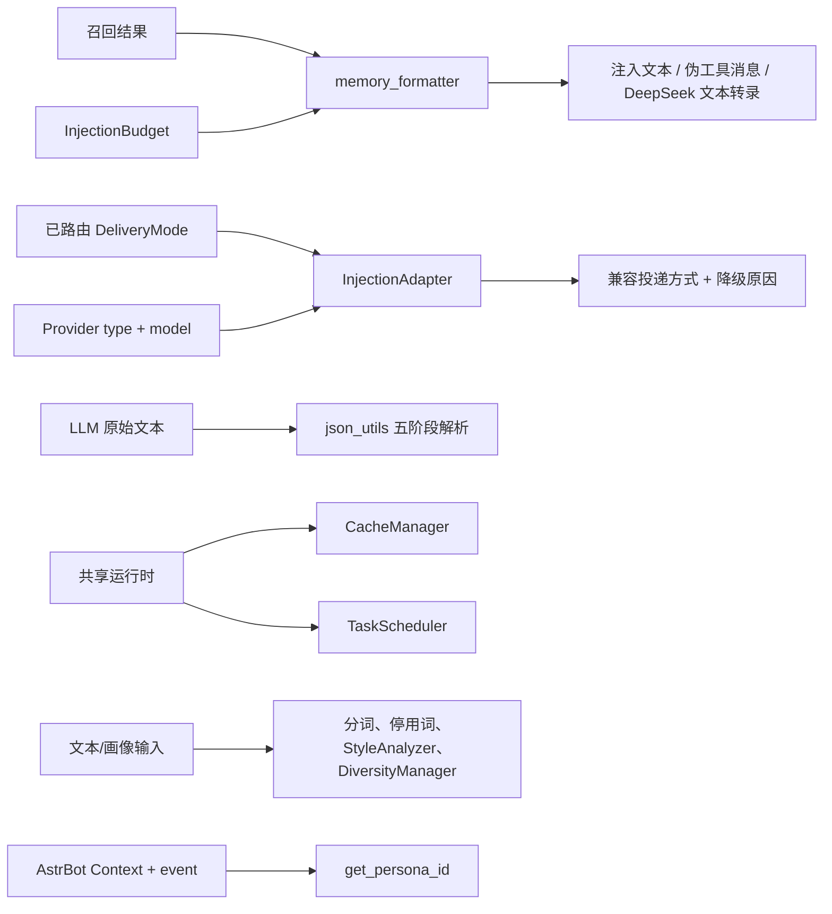

[根级 AGENTS.md](../../AGENTS.md) > [core](../AGENTS.md) > **utils**

# `core/utils` 模块上下文

**最后更新：** 2026-07-19
**模块入口：** `core/utils/__init__.py`；性能/注入等专用工具从各子模块直接导入

## 职责与边界

`core/utils/` 提供跨领域、可复用且不拥有业务状态的适配能力：元数据/JSON/数值解析、注入文本与预算、Provider 投递兼容、缓存、停用词、文本分词、风格/多样性分析、任务调度、时区/人格解析和版本读取。

`memory_formatter.py` 还负责把 Projection 作为普通注入、fake tool call 和 DeepSeek V4 转录中的受控 metadata。三条路径必须复用同一 allowlist：仅 `type`、`summary`、`confidence`；未知类型、空摘要、非有限置信度和内部 source/revision/ID 字段一律丢弃。Projection 字符数计入 metadata budget 和 total injection budget，`ContentLevel.NONE` 不输出，Prompt Protection 的边界与既有动态记忆清理保持一致。

“工具”不等于可以隐藏领域决策：路由决策属于 `core/injection`，配置契约属于 [`../base/AGENTS.md`](../base/AGENTS.md)，领域模型属于 [`../models/AGENTS.md`](../models/AGENTS.md)，Prompt 泄露防护属于 [`../security/AGENTS.md`](../security/AGENTS.md)。这里负责格式化/适配/降级，不负责选择要召回哪些记忆、写数据库或决定严格安全模式。

## 工具地图



## 公共入口与导出边界

`core/utils/__init__.py` 汇总数据辅助、记忆格式化、JSON、缓存、调度、多样性、风格、停用词以及时间/人格辅助函数；它还转导 `TextProcessor`。以下常用接口**未**在包级 `__all__` 中，应从子模块导入：

- `InjectionBudget`、`InjectionStats`、预算筛选/头尾格式函数；
- `InjectionAdapter`；
- `safe_float()`、`clamp_float()`；
- `tokenize_bigrams()`、`tokenize_cjk_words()`、`tokenize_keywords()`；
- `PLUGIN_VERSION`。

不要为了方便再建立第二套别名入口；若改变公开面，必须核对所有调用方。

## 子模块契约

### 注入格式与预算

- `memory_formatter.py`
  - `format_memories_for_injection()`：无预算时返回 `str`；传入 `InjectionBudget` 时返回 `(str, InjectionStats)`，这是刻意的兼容重载。
  - `ContentLevel.NONE` 或非正总预算返回空注入并统计丢弃数；预算模式按字段限制截断，并保留稳定 header/footer。
  - `format_memories_for_fake_tool_call()` 生成 assistant `tool_calls` 与 tool 结果消息对；ID 必须保留 `FAKE_TOOL_CALL_ID_PREFIX`，名称必须与注册工具一致。
  - `format_memories_for_fake_tool_call_deepseek_v4()` 生成文本转录，不是标准 tool message。
- `injection_budget.py`
  - `InjectionBudget.total_chars` 是字符预算；0 表示禁止自动注入。单条内容/元数据的 0 表示“不截断”，不是零成本。
  - `select_memories_with_budget()` 按 `score` 降序且返回新顺序；先扣除 header/footer 固定成本，返回 `(selected, dropped)`。
  - `truncate_preserving_sentence()` 依次尝试段落/句末、逗号、空格、硬截断；它以字符计数而非 tokenizer 计费。
- `injection_adapter.py`
  - `resolve(provider, configured_mode)` 只处理 Provider 兼容性，不重新路由内容策略；`AUTO` 固定适配为临时 `extra_user_content`。
  - `describe_capabilities()` 返回不可变、安全的 Provider capability snapshot；旧 `capabilities()` tuple 保持兼容。未知 Provider 不因动态属性存在而获得文本生成、取消或工具投递能力。
  - Gemini 的伪工具模式降级到 `user_message_before`；未知或异常 Provider 保守降级到 `extra_user_content`。
  - `DeliveryMode` 不包含 System Prompt 投递；动态记忆不得在此重新写入 System Prompt。

### 解析与小型纯工具

- `json_utils.py`：`safe_parse_llm_json()` 依次移除 8 类思考块、Markdown 围栏、控制字符，提取边界并修复常见格式，最多三轮解析；失败返回 `None`。它是宽容解析器，不替代 Pydantic 业务 Schema 护栏。
- `data_helpers.py`：元数据解析失败返回 `{}`，序列化失败返回 `"{}"`；`validate_timestamp()` 接受数字、数字字符串或有 `.timestamp()` 的对象，否则使用默认/当前时间。
- `retry_on_failure()` 总尝试次数是 `max_retries + 1`，使用指数退避；仅重试传入的异常族，最终重抛最后异常。同步函数会在事件循环线程内执行，不适合阻塞 I/O。
- `OperationContext` 只记录开始/耗时/异常，不抑制异常。
- `number_utils.py`：`safe_float()` 拒绝 NaN/无穷；`clamp_float()` 再钳制边界。
- `text_utils.py`：三种分词语义不可互换：重叠 bigram 用于质量重合度，CJK 单字+英文单词用于矛盾检测，标点/停用词过滤关键词集用于知识检索。
- `extract_json_from_response()` 是包入口里的轻量 Markdown 对象提取器；复杂 LLM JSON 应使用 `safe_parse_llm_json()` 或安全护栏。

### 共享状态与可选依赖

- `cache_manager.py`：按任意名称惰性创建 TTL/LRU 缓存；优先 `cachetools`，缺失时用 `OrderedDict` 降级。相同命名空间首次创建后的容量/TTL 不会因后续参数改变。同步/异步装饰器只缓存成功返回值；默认 key 要求参数可哈希。
- `task_scheduler.py`：创建时启动 `AsyncIOScheduler`，时区 `Asia/Shanghai`，`coalesce=False`、`max_instances=1`、`misfire_grace_time=60`。依赖缺失或启动失败时 `_NoOpScheduler` 只记录任务而不执行；业务不能把“注册成功返回 job ID”误当任务一定会运行。
- `stopwords_manager.py`：合并内置 `DEFAULT_STOPWORDS`、文件与自定义词，支持自定义持久化和后备文件写入；模块全局单例不按数据目录分区，测试/多实例使用时要注意共享状态。
- `version.py`：导入时从根级 `metadata.yaml` 读取 `PLUGIN_VERSION`；文件缺失、YAML 无效或缺少 `version` 会让导入失败，这是元数据一致性问题，不应静默硬编码回退。

### 风格与输出多样性

- `StyleAnalyzer` 产生七维 `[0,1]` 画像。提供 LLM callable 时并行发起定性/定量两次调用，双成功各占 0.5，单路成功单独采用，均失败使用确定性启发式回退。
- `StyleProfile.from_dict()` 对每维钳制且非法值回退 0.5；`StyleEvolution` 的 significance 是七维绝对变化均值。
- `ResponseDiversityManager` 保留最近 3 个风格、2 个模式、5 条回复；随机选择温度/表达组合，分析前后 8 字唯一性并生成反重复提示。
- `sanitize_llm_response()` 只清理多样性注入标记。它不是 Prompt 泄露防护，不能替代 `PromptProtectionService`。

### AstrBot 上下文辅助

- `get_persona_id()` 的优先级固定为：`session_service_config.persona_id` → 当前 conversation 的 `persona_id` → 默认人格；特殊值 `[%None]` 表示明确无人格。
- 该函数对所有异常记录 debug 后返回 `None`，调用方必须把 `None` 视为“无可用人格”，不能区分不存在与读取失败。
- `get_now_datetime()` 默认 `Asia/Shanghai`，非法时区回退默认；传入 `Context` 时委托 `get_now_datetime_from_context()`。

## 依赖方向

- **内部向下依赖：** `core.base.constants`、`core.injection.models`、`core.models.default_stopwords`、`core.processors.text_processor`（仅包级转导）。
- **外部依赖：** AstrBot API、`pytz`、`PyYAML`；`cachetools` 与 `APScheduler` 有显式降级路径。
- **被依赖：** handlers/injection 使用格式化、预算和适配器；monitoring/processors/retrieval 使用分词；插件入口使用版本；多类管理器使用缓存、停用词和调度器。
- **避免循环：** 新的低层工具优先放子模块并依赖模型/基础契约；不要再从 `__init__.py` 转导会反向导入 utils 的高层类。

## 安全与性能边界

- 从 LLM、元数据、Provider 或文件得到的值均不可信；宽容解析后的对象仍需领域验证。
- header/footer、伪调用 ID/名称是清理协议的一部分，不是可随意润色的文案。
- 预算选择会排序并估算，不应在循环中重复构建 header 或复制大型列表；格式化器应继续单次遍历。
- 缓存不得保存跨人格/跨会话敏感数据，除非 key 明确包含隔离维度；全局单例不会自动做租户隔离。
- `_NoOpScheduler` 是可用性降级而非成功执行保证；关键清理任务需要调用方监控。
- 多样性管理器输出的 Prompt 标记仍属于内部控制文本，最终用户回复必须经过真正的安全清洗链。

## 测试定位与精确验证

| 变更 | 直接测试 |
|---|---|
| 元数据、时间、数值、停用词、包级时间/JSON 辅助、适配器 | `tests/test_utils.py` |
| 记忆格式与伪工具消息 | `tests/test_memory_formatter.py` |
| 预算、截断与 header/footer | `tests/test_injection_budget.py` |
| JSON 五阶段清理 | `tests/test_json_utils.py` |
| TTL/LRU 与装饰器 | `tests/test_cache_manager.py` |
| 风格双路/回退 | `tests/test_style_analyzer.py` |
| 多样性轮换/泄露标记清理 | `tests/test_diversity_manager.py` |
| APScheduler/NoOp | `tests/test_task_scheduler.py` |
| 版本单一事实来源 | `tests/test_project_metadata.py tests/test_version_check.py` |

最小工具验证：

```bash
python -m pytest -q tests/test_utils.py tests/test_json_utils.py tests/test_cache_manager.py tests/test_style_analyzer.py tests/test_diversity_manager.py tests/test_task_scheduler.py
```

涉及注入投递时：

```bash
python -m pytest -q tests/test_memory_formatter.py tests/test_injection_budget.py tests/test_injection_executor.py tests/test_cleaners.py
python -m pytest -q tests/test_adapter_capabilities.py tests/test_utils.py
```

## 变更检查清单

1. 新工具是否真的跨领域，还是应归属 injection、security、models 或 storage？
2. 是否维持包级导出与直接子模块导出的现有边界？
3. 可选依赖失败时，是明确降级、显式失败还是隐藏丢数据？
4. 缓存 key、单例或调度状态是否会跨会话/人格泄露？
5. 宽容解析之后是否仍由调用方执行了领域/安全验证？
