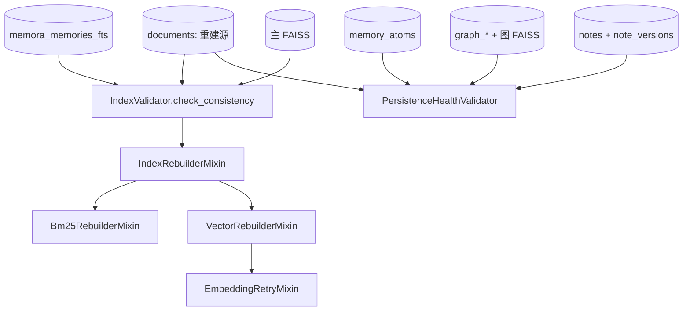
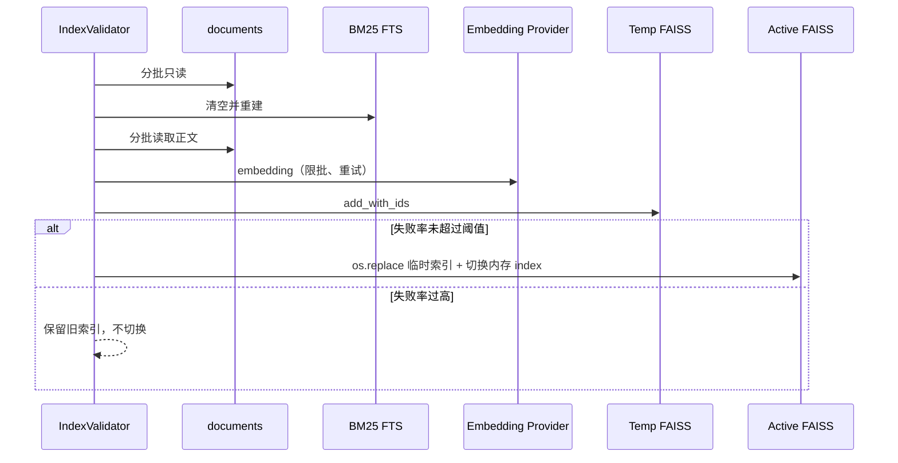

[根级 AGENTS.md](../../AGENTS.md) > **core/validators**

# Validators 模块上下文

**最后更新：** 2026-07-17  
**源码范围：** `core/validators/*.py`（7 个 Python 文件）

## 职责与边界

`core/validators/` 检查 SQLite 主文档、FTS、FAISS、原子、图和笔记之间的一致性，并从 `documents` 重建 BM25/向量派生索引。它不负责业务 CRUD，也不应删除 `documents` 原始数据。

包级只导出 `IndexValidator` 和 `PersistenceHealthValidator`。



## 关键接口

### `IndexValidator`

| 接口 | 语义 |
|---|---|
| `check_consistency() -> IndexStatus` | 比较 documents、BM25 和主向量索引 |
| `rebuild_indexes(memory_engine, progress_callback)` | 编排 BM25 重建与向量补写/全量重建 |
| `_iter_document_batches()` | 按 ID 集合分块或 `id > last_id` 游标扫描 documents |

`IndexStatus` 包含一致性、三方计数、BM25/向量缺失数、是否需重建和原因。

实际判定规则：

1. `documents` 为空视为一致。
2. documents 中存在但 BM25/向量缺失时需要重建。
3. BM25 distinct doc ID 数大于 documents 时需要重建。
4. FAISS `ntotal` 大于 documents 仅视为逻辑删除冗余槽位，不触发重建。
5. 能读取 `IndexIDMap.id_map` 时按 ID 集合比较；不能读取时退回计数差。
6. 检查本身异常返回 `is_consistent=False, needs_rebuild=True`，不是空库成功。

### `PersistenceHealthValidator`

`check()` 是只读检查，optional 表缺失时跳过：

- BM25 中不存在于 documents 的孤儿 doc ID。
- `memory_atoms.parent_memory_id` 孤儿。
- graph entry 的 `source_memory_id`、entry-node 的 entry/node 引用孤儿。
- `note_versions.note_id` 孤儿及 `(note_id,version)` 重复。
- 主 FAISS ID 不在 documents、图 FAISS ID 不在 graph entry `vector_doc_id`。

返回 `{ok, needs_repair, counts, issues}`；它只报告，不自动修复。

## 安全重建流程



### BM25

- 只允许白名单表 `memora_memories_fts`；任何其他表名抛 `ValueError`。
- 清空 FTS 时 SQLite `database is locked` 最多重试 5 次，等待 `0.2 * attempt` 秒。
- 分批预处理后批量写；批写失败降级逐条写。失败率超过 `max_failure_ratio` 时停止。
- `documents` 始终只读。

### 向量

- 能获取向量 ID 且仅有缺失时执行增量补写。
- ID 不可读但 `vector_count >= documents total` 时跳过全量重建。
- 否则创建 `faiss.IndexIDMap(IndexFlatL2)` 临时索引；校验 embedding 数量和维度。
- 失败率过高或总数非零但一条也没处理时不切换。
- 有路径时先写 `<index>.rebuild.tmp`，再 `os.replace`；最后切换内存 `embedding_storage.index`。
- 临时文件替换与内存对象切换不是一个事务；进程恰在中间崩溃时需在启动检查中重新核对。

### Embedding 重试

`EmbeddingRetryMixin` 按 `embedding_batch_size` 切块，兼容 `get_embeddings`、`get_embeddings_batch` 和逐条 `get_embedding`；普通错误指数退避，rate limit 至少等待 `RATE_LIMIT_RETRY_MIN_DELAY=30s`。取消必须向上传播。

## 配置边界

`_get_rebuild_options()` 从 `memory_engine.config` 读取并钳制：

| 配置 | 默认值 | 范围 |
|---|---:|---:|
| `index_rebuild_batch_size` | 50 | 1–500 |
| `index_rebuild_embedding_batch_size` | 8 | 1–256 |
| `index_rebuild_tasks_limit` | 1 | 1–8 |
| `index_rebuild_max_retries` | 5 | 1–8 |
| `index_rebuild_retry_base_delay` | 30.0 | 0–60 s |
| `index_rebuild_batch_delay` | 5.0 | 0–10 s |
| `index_rebuild_request_delay` | 5.0 | 0–60 s |
| `index_rebuild_max_failure_ratio` | 0.02 | 0–1 |

不要在验证器内读取未经钳制的外部参数。`tasks_limit` 当前属于配置契约，即使具体 provider 调用仍固定单任务，也不能无测试删除。

## 安全与不可泄露数据边界

1. documents 正文会发送给 embedding provider；重建是数据出境行为，必须使用已授权 provider，不能在诊断端点无授权触发。
2. 日志只记录 ID、计数、范围和失败率；不得记录正文、embedding、metadata、provider 凭据或完整异常响应。
3. FTS 表名必须保留封闭白名单；动态 `IN` 只拼接内部生成的 `?`，ID 作为参数传入。
4. 重建前不得删除/覆盖唯一的 documents 源数据；旧 FAISS 应在新索引通过失败阈值后才替换。
5. 健康报告中的孤儿 ID、计数与部署路径仍属于运维敏感信息，API 层必须鉴权。
6. 备份恢复仅在 documents 为空等受控路径使用；不能用陈旧备份覆盖非空主表。

## 异常与并发约束

- 验证过程使用独立 aiosqlite 连接并应用共享 WAL PRAGMA；仍可能与正常写入竞争，重建应由上层串行化/维护窗口控制。
- `progress_callback` 是 awaitable；回调失败会影响重建，调用方不可在其中执行不受控慢 I/O。
- 普通重建错误返回带 `success/errors` 的结果；调用方必须检查 `switched`、`partial`、`errors`，不能仅看函数是否返回。
- `CancelledError` 必须传播；取消后旧索引应保持可用，临时文件由 finally 清理。

## 测试定位与精确验证

```bash
python -m pytest -q tests/test_validators.py
python -m pytest -q tests/test_vector_rebuilder.py
python -m pytest -q tests/test_managers_stats.py
```

本次文档迁移不运行测试。修改 schema 不变量时还需运行对应 storage 测试；修改 embedding 重试时使用 `tests/test_validators.py` 中 `TestEmbeddingRetry*`，不得调用真实 provider。

## 依赖方向与改动守则

- 允许：`validators → storage` 共享 PRAGMA、FAISS/NumPy、由调用方注入的 MemoryEngine。
- 禁止 validators 启动 scheduler、持有页面 API 或直接编排业务删除。
- 新增持久化实体或派生索引时同步扩展健康检查、计数、测试和修复策略。
- 新重建算法必须遵循“主数据只读、临时构建、阈值门、原子替换、失败保留旧索引”。