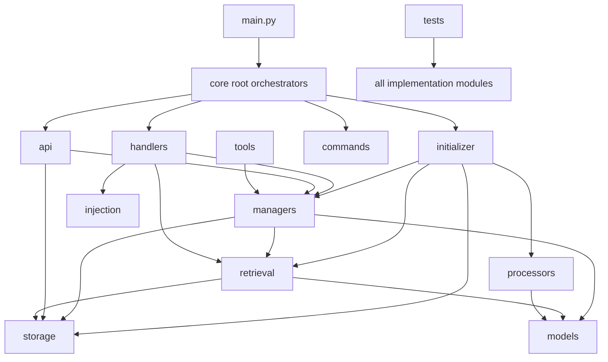
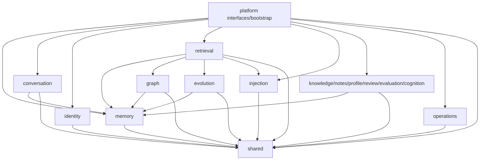
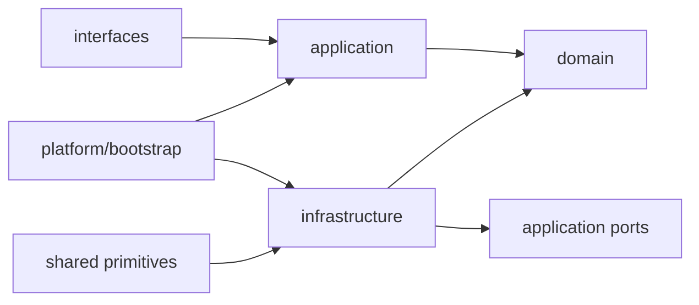

# Dependency Graph Baseline

> 状态：阶段 1 静态基线与目标依赖提案
>
> 事实提交：`f1ad662cd56766f090b6699ea81ee164783b78b6`

## 采集方法

Python 标准库 `ast` 解析 `main.py`、`core/**/*.py`、`tests/**/*.py` 和
`scripts/**/*.py`。相对 import 按当前 package 解析，AstrBot 真实命名空间
`data.plugins.astrbot_plugin_memora.*` 归一化回仓库模块。生产模块均解析成功。

结果：

- 生产模块：329；
- 生产模块间显式 import 边：823；
- 含字面量 patch/dynamic import 引用的目标模块：54；
- Python 语法解析错误：0。

静态 AST 不能证明第三方插件消费情况，也不能自动识别运行时构造出的模块字符串。
因此公共 API 判断必须同时结合门面、文档、测试、真实命名空间导入和用户确认。

## 当前依赖形状



问题不是这些箭头单独存在，而是业务能力被同一条垂直链拆到多个横向目录，调用方
又直接导入具体实现模块。结果是路径迁移会同时触发生产 import、测试 patch、
`__module__` 身份和 AstrBot namespace 风险。

## 高扇入模块

| 模块 | 已知导入方 | 目标所有者 | 处理 |
|---|---:|---|---|
| `core.retrieval.rrf_fusion` | 45 | retrieval | 通过 retrieval facade/contracts 暴露结果 DTO 与 fusion 入口 |
| `core.base.list_sorting` | 32 | shared/kernel | 证明无业务语义后保留单一技术实现 |
| `core.api.response_utils` | 30 | platform/page | 领域 Page API 依赖平台响应协议，不复制 helper |
| `core.injection.models` | 30 | injection/domain | 显式公共 DTO 候选 |
| `core.models.memory_evolution` | 28 | evolution/domain | Memory/Graph/Retrieval 只经 evolution contracts |
| `core.storage.base` | 28 | shared/persistence | 只保留 SQLite primitive，不暴露业务 Store |
| `core.base.entity_editing` | 25 | shared/kernel | 限定为 revision/edit 技术协议 |
| `core.models.memory_atom` | 22 | memory/domain | canonical memory 核心契约 |
| `core.models.conversation_models` | 21 | conversation/domain | 保持 JSON/Message/Session 契约 |
| `core.models.domain_provenance` | 20 | shared/kernel | 多领域 provenance 类型，不复制 |
| `core.adapter_capabilities` | 19 | platform/providers | Provider 能力快照与 fail-closed 规则 |
| `core.managers.memory_engine` | 19 | memory/application | 保持确认后的 MemoryEngine 稳定门面 |

导入方总数包含生产、测试和脚本；矩阵分别以 `P` 和 `T` 计数并展示示例。

## 目标领域图



所有指向另一领域的箭头只能落在目标领域 facade/contracts。图中不允许
`shared -> business domain`，也不允许任一领域直接指向另一领域的
`infrastructure`。

## 包内图



Shared 箭头同样表示 infrastructure 依赖 shared，而非 shared 依赖 infrastructure。

## 动态引用图

```text
tests string patch/import
  -> 54 current implementation modules

tests/test_plugin_package_imports.py
  -> data.plugins.astrbot_plugin_memora.core.api.recall_trace_api
  -> data.plugins.astrbot_plugin_memora.core.injection.recorder
  -> data.plugins.astrbot_plugin_memora.core.monitoring.perf_tracker

core/command_endpoints.py
  -> handler.__module__ = <plugin package>.main
  -> import-time legacy handler registry cleanup

instrumentation/cache/task scheduler
  -> func.__module__ + func.__qualname__ identity keys
```

AST-7 的门禁必须同时分析静态 import 与字面量 patch/import。仅靠 Ruff、pytest
collection 或普通模块图会遗漏第二组边。

## 可复现命令

从仓库根目录执行快速文本证据：

```powershell
rg -n --glob '*.py' `
  '(importlib|import_module|__import__\s*\(|__module__|pickle|cloudpickle|dill)' `
  main.py core tests scripts

rg -n --glob '*.py' `
  '(data\.plugins\.astrbot_plugin_memora|mock\.patch|patch\(|monkeypatch)' `
  main.py core tests scripts
```

精确边应由 AST-7 提交的架构门禁脚本生成并测试；阶段 1 的临时分析器不是仓库
交付物。门禁输出至少包含 source module、target module、reference kind、source path
和规则结论，并对解析失败返回非零退出码。
