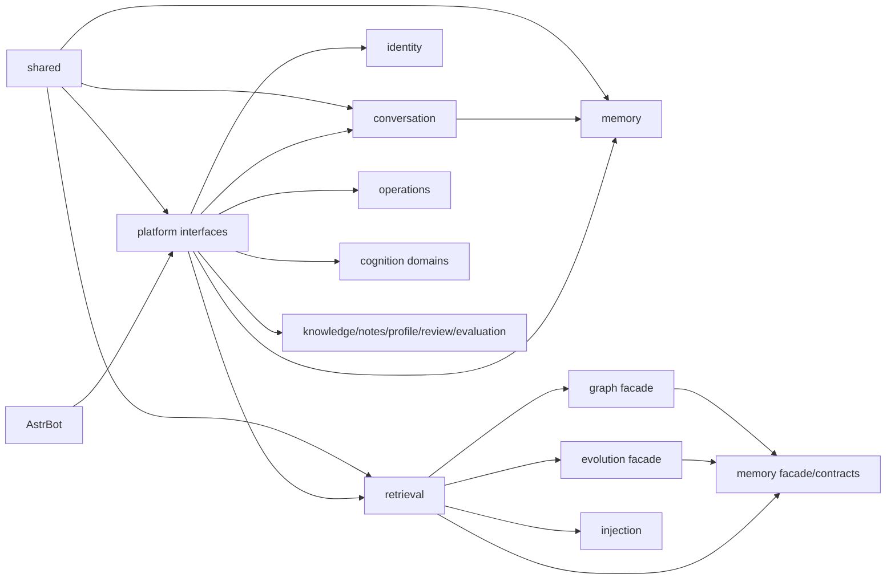

# Target Backend Architecture

> 状态：目标提案，待 AST-6 评审
>
> 非当前实现：本文件中的目标路径尚未落地

## 结构决策

最终结构采用“顶层领域自治包 + 包内按需分层 + 唯一门面”。不采用把现有
`managers/models/storage/processors/api/utils` 原样包进更深目录的机械搬运，也不
把“同名模块原位包化”作为最终状态。只有确有多个职责或实现文件时才增加子目录。

```text
core/
  platform/
    bootstrap/
    providers/
    events/
    page/
    commands/
    delegation/
  shared/
    kernel/
    config/
    persistence/sqlite/
    observability/
    security/
    cache/
    runtime/
    text/
    i18n/
  memory/
  conversation/
  identity/
  retrieval/
  graph/
  injection/
  evolution/
  knowledge/
  notes/
  profile/
  review/
  evaluation/
  cognition/
    affection/
    expression/
    jargon/
    social/
    personality/
  operations/
    backup/
    maintenance/
    diagnostics/
    update/
```

`cognition/personality` 是基于当前仓库补充的实际领域：它承接
`TraitEvolutionTracker` 和 `StyleAnalyzer`，避免把人格演化继续藏在 managers
和 utils。若 AST-6 决定将其并入 profile 或 affection，必须同时修改矩阵和 AST-22
词汇表，不能留下双重所有权。

## 领域内部结构

领域按实际需要选择以下层级：

```text
<domain>/
  __init__.py
  contracts.py              # 仅在跨域协议不能放入门面时存在
  domain/                   # 模型、不变量、策略、领域事件
  application/              # 用例、commands、queries、ports、编排
  infrastructure/           # SQLite、FAISS、文件、Provider 实现
  interfaces/               # Page API、AstrBot 命令、Agent Tool、事件适配
```

禁止为了目录对称创建空 `domain`、`application`、`infrastructure` 或 `interfaces`。
一个领域只有模型和一个用例时，保持浅结构比空分层更可审查。目录深度通常控制在
3 至 5 层；只有同一能力已有两个以上实现文件时再增加 `commands`、`queries`、
`sqlite`、`adapters` 等子目录。

## 领域职责

| 领域 | 拥有 | 不拥有 |
|---|---|---|
| platform | AstrBot lifecycle、provider 适配、事件/命令/Page 聚合、composition root | 领域规则、SQL、排序算法 |
| shared | 无业务语义的 kernel/config/SQLite primitive/观测/安全/缓存/runtime/text | 业务 Store、领域 DTO、跨域编排 |
| memory | canonical atom、MemoryEngine、CRUD/batch/lifecycle、写协调、抽取与反思写入 | graph 算法、Page 聚合、provider 发现 |
| conversation | 消息、会话、topic、metadata、sender、去重和 conversation Store | canonical memory 与稳定协议身份 |
| identity | 协议稳定身份、解析、目录和 conversation 名称同步 | 业务表回填、检索排序 |
| retrieval | query planning、direct/vector/BM25、fusion/ranking、feedback、trace | graph 持久化、canonical 写入 |
| graph | graph model、SQLite graph Store、层级、graph retrieval adapters | canonical memory 权威、全局排序策略 |
| injection | route、selection、budget、format、delivery、decision recorder | System Prompt 所有权、检索算法 |
| evolution | relation/projection、gate/worker、source revision、派生重建 | canonical memory 写权限 |
| knowledge | knowledge model、Store、manager、extractor、retriever、API/tools | 通用 retrieval 排序 |
| notes | note model、Store、manager、generator、API/tools | profile 或 knowledge 持久化 |
| profile | user profile、provenance、Store、extractor、API/tools | bot personality 演化，除非 AST-6 改决策 |
| review | review model、detector、queue Store 和 Page API | 通用 diagnostics |
| evaluation | fixture repository、指标、ablation、report Store 和接口 | 在线召回状态 |
| cognition/* | affection、expression、jargon、social、personality 各自模型/状态/工具 | canonical memory 或 shared 技术原语 |
| operations/* | backup、maintenance、diagnostics、update 运维用例 | 领域业务规则的第二实现 |

## 分层依赖

```text
interfaces -> application -> domain
infrastructure -> application ports + domain
platform/bootstrap -> domain facades + concrete infrastructure
shared -> third-party/stdlib only
```

- `domain` 不得导入 AstrBot、Quart、SQLite、FAISS、HTTP 或其他领域内部实现。
- `application` 通过本领域 ports 使用基础设施，不直接构造 SQLite/FAISS/Provider。
- `infrastructure` 实现本领域 ports；它可以依赖 shared 技术 primitive，但不能
  调用另一个领域的 infrastructure。
- 跨领域调用只经过目标领域门面或显式 `contracts`。跨域事务若确实需要由
  platform composition root 或明确 application coordinator 组合，不能隐藏在 Store。
- `platform/bootstrap` 是唯一可同时导入多个领域 concrete implementation 的位置。

完整允许/禁止矩阵见 [DEPENDENCY_RULES.md](DEPENDENCY_RULES.md)。

## 公共门面

每个领域 `__init__.py` 只显式导出：

- 跨域需要的 domain DTO、Enum、异常和 Protocol；
- 稳定 application facade 或用例入口；
- 必须由 platform/bootstrap 构造的 port 类型。

门面不得：

- 连接数据库、加载 FAISS、探测 Provider、注册 hook 或创建任务；
- 导出 repository helper、mixin、私有策略或 Page API 实现；
- 使用通配符导入；
- 为保持旧内部路径而无限期 re-export 全部实现。

`core/__init__.py` 当前的延迟导出属于候选公共入口。阶段 7 可让它继续轻量地指向
领域门面，但不能恢复横向 `managers/models/storage` 依赖。

## Composition Root

阶段 7 后，`platform/bootstrap` 负责：

1. 读取并验证配置；
2. 冻结 LLM/Embedding provider 能力；
3. 建立 shared SQLite connection/transaction primitive；
4. 构造各领域 repository/adapter；
5. 注入 application ports 并发布领域 facade；
6. 按依赖顺序启动 scheduler/worker；
7. 关闭时先停止生产者，再关闭 Store 和数据库。

请求、命令或领域代码不得创建第二套 Store、Manager、Recorder 或 Provider。初始化
失败必须清理已创建组件，`asyncio.CancelledError` 必须传播。

## 目标数据流



图中的 Shared 箭头表示消费者依赖 shared；shared 本身不得反向依赖任一业务领域。

## 迁移边界

- 目标结构不改变 HTTP/Page API、AstrBot hooks、命令名、配置键、异常或响应 envelope。
- 不改变 SQLite schema、表名、migration、FAISS/FTS/canonical ID 或数据目录。
- 不把 Graph、Evolution、Projection 或索引提升为 canonical memory。
- 不在结构迁移 PR 中调整算法、阈值、SQL、超时、重试或日志字段。
- 旧路径兼容只针对已确认的外部公共消费者，使用纯 re-export，最多支持一个明确
  版本窗口；测试 patch 字符串不构成生产兼容层理由。
- `main.py`、initializer、Page API 聚合与全局 fixture 只在阶段 7 由 AST-15 修改。

## 完成状态

目标架构只有在以下条件全部满足后才算落地：329 行矩阵已全部消费；横向目录不再
承载业务规则；依赖门禁通过；公共兼容层已删除或有批准期限；全量门禁通过；后端
与 Dashboard 使用一致领域词汇；AST-19/AST-20 独立终审无阻塞项。
