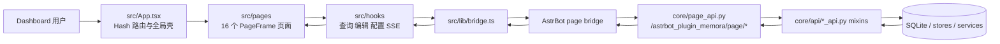
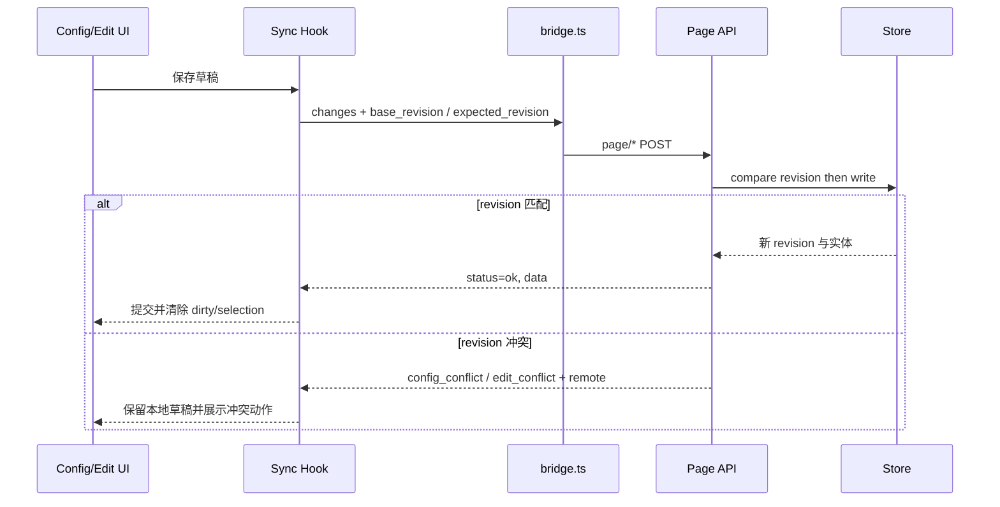

[根级 AGENTS.md](../../AGENTS.md) > `pages` > **dashboard**

# Memora Dashboard 开发上下文

## 职责与边界

`pages/dashboard` 是 Memora 的 React 管理面板。它在 AstrBot 插件页面桥接环境中运行，负责查看、检索、编辑和观测记忆系统；后端契约由 `core/page_api.py` 聚合并由 `core/api/*_api.py` mixin 实现。

- 本文件是 Dashboard 的模块级权威上下文；同时继承根级 `../../AGENTS.md`。
- Dashboard 代码只应写入 `pages/dashboard/src/`、`pages/dashboard/scripts/` 和本目录构建配置。跨模块 API 变更必须同步核对 `core/page_api.py`、对应 `core/api/*_api.py` 与 `tests/test_page_api*.py`，不能只改前端请求形状。
- 不要手改或提交生成物：`node_modules/`、`dist/`、截图输出、缓存、coverage、`index.html` 和 `tsconfig.tsbuildinfo`。生产产物由构建与 artifact gate 生成。
- 保持 AstrBot bridge、Hash URL、API envelope、三语言 key、SSE 事件和 classic-script 单 bundle 为兼容契约；布局重构不得顺带改变这些契约。

## 技术栈与入口

- React 18.3、React DOM 18.3、TypeScript 5.6、Vite 6、Tailwind CSS 3.4、PostCSS。
- shadcn 本地组件以 `@base-ui/react` 1.5 primitives 为基础，不是 Radix；样式组合使用 CVA、`clsx`、`tailwind-merge` 和 `tw-animate-css`。
- 图谱使用 `@antv/g6` / `@antv/layout`；图标使用 Lucide；动画使用 Framer Motion；图表使用 Recharts；长列表可使用 TanStack Virtual；Toast 使用 Sonner。
- Geist variable font；`next-themes` 管理亮暗主题并与 AstrBot 宿主主题同步。
- `src/main.tsx` 是入口，`src/App.tsx` 是全局壳、懒加载路由、移动菜单、SSE 状态与全局搜索的所有者。
- `src/lib/bridge.ts` 把相对请求转换为 AstrBot 的 `page/` endpoint，并统一解析 `status`、`data`、`error`、`code`、`field_errors` 等 envelope。

## 目录地图

| 路径 | 责任 |
|---|---|
| `src/pages/` | 16 个功能页面；页面必须使用共享 `PageFrame` |
| `src/components/brand/` | `MemoraLogo` 品牌图形；Sidebar 等品牌入口统一复用 |
| `src/components/layout/` | `Sidebar`、`PageFrame`、`PageHeader`、`PageToolbar`、`PageContent`、指标和状态布局原语 |
| `src/components/ui/` | Base UI-backed shadcn 本地组件；优先复用，不手写等价控件 |
| `src/components/intelligence/` | 评测、召回追踪、诊断、复核队列 |
| `src/components/system/` | 系统观测、委托与质量管理 |
| `src/hooks/` | 主题、i18n、SSE、编辑、配置同步及各资源数据流 |
| `src/lib/` | bridge、导航、i18n、常量和纯工具 |
| `src/mock/` | browser/runtime smoke 的确定性 bridge 与三语言模拟数据；Recall Trace 响应由 `recallTrace.ts` 构造安全 DTO，超长 `server.ts` 只保留路由委托，禁止重新内联 query、正文、身份、canonical ID 或 provenance |
| `src/types/` | 页面、API、编辑和领域类型 |
| `src/index.css` | shadcn 语义 token、亮暗主题、Geist 和旧 token 兼容别名 |
| `scripts/` | runtime/browser smoke、helper 与截图基线断言 |

## 16 个 Hash 路由与五组导航

`src/App.tsx` 的 `HASH_TO_PAGE` 和 `src/lib/navigation.ts` 必须一起维护。URL 形如 `#/memory`；空、未知或无效 hash 当前回退到 `graph`。不要引入第二套路由器。

| 导航组 | Hash 路由 | 页面职责 |
|---|---|---|
| Overview | `#/preview` | 数据预览、增长与资产概览 |
| Memory | `#/graph` | 知识图谱工作区 |
| Memory | `#/memory` | 记忆搜索、筛选、编辑和批量操作 |
| Memory | `#/timeline` | 时间线 |
| Memory | `#/recall` | 召回测试与解释 |
| Memory | `#/injection` | 注入策略、配置与决策历史 |
| Memory | `#/knowledge` | 知识库管理 |
| Memory | `#/notes` | 笔记管理 |
| Insights | `#/intelligence` | 评测、追踪、诊断与复核 |
| Insights | `#/learning` | 自主学习状态 |
| Insights | `#/jargon` | 黑话候选、释义与管理 |
| Relationships | `#/profiles` | 用户画像 |
| Relationships | `#/affection` | 好感度与情绪 |
| Relationships | `#/social` | 社交关系 |
| System | `#/system` | 运行观测、Provider 和系统操作 |
| System | `#/config` | 插件配置编辑与冲突处理 |

导航组固定为 Overview、Memory、Insights、Relationships、System。新增或移动页面时同时更新 `PageId`、懒加载映射、hash 映射、导航、三语言文案、全局搜索、mock、单测和 browser smoke；保留脏表单前进/后退保护与 history index 行为。

## 前后端真实数据流





## PageFrame、滚动与响应式

所有功能页面从三种模板中选用，不得重新实现页面壳：

| 模板 | 典型页面 | 契约 |
|---|---|---|
| `standard` | Preview、Timeline、Recall、Notes、Intelligence、Learning、Affection、Social、System | 内容自然滚动，常规最大宽度 1440px |
| `dense` | Memory、Injection、Knowledge、Profiles、Jargon、Config 等高密度数据/配置页 | 固定页头或顶层切换；活跃内容/表格区是唯一纵向滚动者 |
| `workspace` | Graph | 占满可用空间，以稳定网格和明确最小宽高约束画布 |

标准组合顺序是 `PageFrame` → `PageHeader` → 可选 `PageToolbar` → `PageContent`。指标用 `MetricGrid`；加载、空数据和错误用 `Skeleton` 或 `StatePanel`。桌面与 390px 移动端都必须可滚动、无遮挡、无页面级横向溢出；宽表和固定格式工作区应在局部使用 `minmax`、最小尺寸或受控横向滚动。

Injection 页面固定为 `dense`：PageHeader 下有 Overview、Strategy Configuration、Decision History 三个顶层 Tab。每个活跃 Tab 的 `PageContent` 是唯一纵向滚动者；Overview/Config 为 constrained 宽度，Decision History 为 full 宽度且只有表格容器承担横向滚动。决策列表/概览/详情读取 SQLite 全量持久化 Page API，Decision History 通过 DataTable 的 allowlist 列做服务端排序，固定操作列打开受控详情 Sheet，Sheet 使用独立滚动正文和固定底栏。成本趋势图必须保留数值型 `bucket_ms` 作为 Recharts 横轴数据，只在 tick 与 tooltip 层格式化日期，避免 hover 命中错误时间点。

## 主题、组件与可访问性

- 新代码使用 `bg-background`、`bg-card`、`text-foreground`、`text-muted-foreground`、`border-border`、`bg-primary` 等语义类。
- 旧 `--color-*`、`--text-*` 仅是复杂旧面板兼容别名，不新增消费者。
- 主题为中性黑白；成功、警告、错误等功能状态色可保留。宿主主题优先，用户手动覆盖持久化到 localStorage。
- 常规最大圆角是 `rounded-lg`（8px）；不要新增 `rounded-xl`、`rounded-2xl`、`rounded-3xl`。
- 卡片只表示独立对象、指标或明确分组；不把普通段落卡片化，不嵌套卡片。
- 标题、面板标题、正文保持稳定排版层级，不按视口宽度缩放字号。
- 优先复用 `src/components/ui/` 的 Button、Checkbox、Input、Textarea、Table、Tabs、ToggleGroup、Dialog、Sheet 等；不得恢复自定义 Modal。
- 品牌入口复用 `src/components/brand/MemoraLogo.tsx`；组件以 `currentColor` 继承语义颜色，通过 `size` 缩放并保留可访问名称，不在 Sidebar 中重新拼 SVG 或退回通用 Lucide 图标。
- 详情使用受控 Sheet；创建、确认和破坏性操作使用 Dialog。Dialog/Sheet 必须有可访问名称；纯图标按钮有 `aria-label`/`title`；选择框、进度条和分页导航有明确名称。
- 2–7 个互斥选项用 Tabs、ToggleGroup 或等价分段控件；数值范围可用 Slider。

## 三语言与实时状态

语言为 `zh`、`en`、`ru`，切换顺序是 zh → en → ru。导航、标题、操作、状态、验证错误、分页及空态都必须通过现有 i18n key；禁止只补一种语言或在 JSX 中散落新的用户可见硬编码。更新 key 时同步 `src/lib/i18n.ts`、相关 hook/mock、页面测试和 browser smoke。

实时连接由 `useRealtimeStream` 使用 SSE，而不是 WebSocket；保持连接状态、未读计数、事件处理及 cleanup 契约。页面不应各自创建重复连接。

## Page API、写回与冲突

- Page API 总入口为 `/astrbot_plugin_memora/page/*`；前端调用 bridge 时沿用当前相对路径，不手工重复拼接宿主前缀。
- 读取、编辑和批量动作必须尊重统一 envelope；不得把 `error`、`code` 或 `field_errors` 吞成成功空数据。
- 配置保存发送 `base_revision` + 最小 `changes`，而不是覆盖整个远端配置。遇到 `config_conflict` 时保留草稿，支持接受远端/丢弃本地、查看差异和基于最新 revision 重放本地修改。
- 实体编辑发送 `expected_revision`；服务端比较 revision 后原子写入。`conflict` / `edit_conflict` 必须展示远端快照及用户可控的解决路径，不能静默 last-write-wins。
- 成功写回后用服务端返回实体/revision 更新缓存并清理 dirty；失败保留用户输入和字段级错误。高影响批量操作必须显式确认。
- Evaluation Workbench 从 `evaluation/datasets` 的 `variants` descriptor 动态生成消融选项；只默认选择 `available=true` 且 `default_selected=true` 的项，不可用项必须禁用并展示稳定 `reason_code` 文案。旧后端未返回 descriptor 时仅回退 `baseline`、`graph_expansion_off`、`topic_expansion_off`，不得默认运行全部实验。
- Evaluation 默认把当前数据库中最近最多 20 条活跃 canonical memory 组装成仅存在于请求内的 `current_memories` 自身召回样本，安装后无需上传即可运行；不得把该样本的 query、正文或 canonical ID 写入报告。人工标注集来自插件 `data_dir`，通过 `evaluation/datasets/import` 导入并重新获取目录；不得从 `tests/fixtures` 或前端 mock 伪造生产选择项。
- Evaluation 报告展示每个变体的 completed/skipped、稳定 reason 和安全 `effective_settings`。逐用例表只消费 case ID 与 Recall/Precision/RR/nDCG/latency 数值；不得重新要求或展示 query、ranked/relevant canonical ID、身份或任意 metadata。

### 备份与热恢复

- System 页只消费 `/backup/list` 返回的脱敏摘要，不读取 `directory` 或服务器绝对路径。列表显示类型、时间、完整性、大小和文件数；`invalid`、`incompatible` 或 `can_restore=false` 必须禁用恢复。
- 恢复确认根据 `capabilities.hot_reload` 与单项 `can_hot_restore` 发送 `apply_mode=reload|restart`。`legacy_unverified` 必须在确认 Dialog 中提示未校验风险。
- 热重载响应包含 operation ID 后，页面通过 `/backup/status` 做最长 60 秒的有界轮询；热重载窗口内的短暂请求失败不立即判定恢复失败，组件卸载时必须清理 timer。终态为 `succeeded`、`failed_before_apply`、`rolled_back` 或 `cancelled`。
- 热重载不可用时保留 `staged` 写保护状态与手动重启提示，并只允许通过 `/backup/restore/cancel` 取消尚未应用的事务。批量删除按 `deleted_names` 清理选择，只保留 `failed_items` 对应项供重试。

## 服务端筛选、分页与选择清理

- Knowledge 普通列表与 Profiles 使用服务端 `limit` / `offset` 真分页，服务端返回 total/边界决定翻页；不要先拉全量再在客户端伪分页。
- Profiles 详情中的标签与偏好来源以服务端 provenance 为准，分别显示 `manual`/`derived`；
  旧数据可回退既有 `source` 字段，但不得把 source mapping、revision、scope、privacy 或
  canonical 正文展示给模型或普通观测链。新增来源文案必须同步 Mock 字典与
  `.astrbot-plugin/i18n/{zh-CN,en-US,ru-RU}.json`，并通过生产 i18n 契约测试。
- Knowledge search 没有 `offset`；Jargon candidates/meanings 也没有 `offset`。不得向这些端点虚构 offset 或展示无法兑现的页码。
- 查询、范围、筛选、排序、数据集、page size 或页码变化时，清除已经不可见的选择；刷新/删除/写回后也要按返回数据收敛 selection。
- 批量动作只能作用于当前可验证的选中 ID，绝不能保留隐藏页选择并对用户不可见的数据执行。
- Social 关系使用 `from_user + to_user + group_id + relation_type` 作为复合身份。编辑、单项删除和批处理都必须携带服务端 revision；组、类别或返回数据变化时收敛选择，批处理部分失败时只保留失败项供用户重试。

## 构建与产物契约

Vite 对宿主生成 IIFE classic script，使用 `inlineDynamicImports` 把 lazy 页面合入单 bundle，并移除 `type="module"` / `crossorigin`。artifact gate 要求最终恰好一个 JS 和一个 CSS 引用，并拒绝陈旧 hash 产物。不要通过改 gate 掩盖错误产物。

本地安装与开发：

```bash
cd pages/dashboard
npm ci
npm run dev
```

与改动匹配的精确验证顺序：

```bash
cd pages/dashboard
npm test
npm run build
npm run check:artifacts
npm run smoke:runtime
npm run smoke:browser
cd ../..
python scripts/check_all.py
```

直接调用 Vitest 时必须指定 jsdom，例如：

```bash
cd pages/dashboard
npx vitest run --environment jsdom src/pages/MemoryPage.test.tsx
npx vitest run --environment jsdom src/pages/SystemPage.test.tsx src/mock/server.test.ts
```

行为变更先写能失败的 Vitest + React Testing Library 测试。构建不能替代 runtime smoke，runtime smoke 不能替代真实 Playwright browser smoke；仓库级 `python scripts/check_all.py` 是最终门禁，不是开发时缩小反馈环的替代品。

## Browser smoke 与 50 张截图

`scripts/browser_smoke.mjs` 在桌面 1366×900、移动 390×844、宽屏 2048×1152 下验证页面，并覆盖暗色、zh/en/ru、Graph、全局搜索、Evaluation 桌面双列/移动单列变体卡片、编辑/配置 revision 冲突、确认流程、横向溢出、加载稳定性和控制台/page error。脚本定义的 50 张基线全部必须生成、尺寸匹配且超过最低字节阈值：

- 配置/注入/搜索（10）：`config.png`、`config-conflict.png`、`mobile-config.png`、`injection-overview.png`、`injection-config-conflict.png`、`injection-decisions.png`、`mobile-injection-detail.png`、`wide-injection-overview.png`、`global-search-scroll.png`、`global-search-memory-target.png`。
- 主要页面/智能控制台（12）：`graph.png`、`memory.png`、`system.png`、`jargon.png`、`intelligence-evaluation.png`、`mobile-intelligence-evaluation.png`、`intelligence-trace.png`、`intelligence-diagnostics.png`、`intelligence-review.png`、`mobile-system.png`、`mobile-jargon.png`、`system-confirmation.png`。
- 主题/预览/宽屏（9）：`dark-learning.png`、`dark-system.png`、`preview.png`、`mobile-preview.png`、`dark-preview.png`、`wide-preview.png`、`wide-learning.png`、`wide-affection.png`、`wide-social.png`。
- i18n/编辑（10）：`i18n-en-preview.png`、`i18n-en-memory.png`、`i18n-ru-preview.png`、`i18n-ru-memory.png`、`editing-social-sheet.png`、`editing-social-conflict.png`、`editing-error-summary.png`、`editing-batch-toolbar.png`、`editing-mobile-affection.png`、`editing-mobile-mood.png`。
- 数据表/编辑器/密度（9）：`knowledge-table-default.png`、`knowledge-table-columns.png`、`knowledge-editor-view.png`、`knowledge-editor-edit.png`、`mobile-knowledge-table.png`、`mobile-knowledge-editor.png`、`wide-profiles-table.png`、`dark-social-table.png`、`injection-decisions-compact.png`。

Browser smoke 通过后仍须人工打开 50 张图片，不能只看 exit code/字节数。重点检查：

- Recall Trace 的 query、会话 ID、用户 ID属于用户主动填写的检索控件；它们不得出现在 trace response、历史 trace、Diagnostics、日志或模型可见 metadata 中。
- Review Queue 是受控人工复核页面，可以按复核权限显示候选正文和来源；这些字段不得复制到 Recall Trace、Diagnostics、注入观测或模型输入。
- 当前 smoke 人工复核记录两个观察项：搜索弹层底部次级文本轻微裁剪，移动端黑话表格需要横向滚动查看得分列。

1. Graph 画布实际可见且尺寸稳定，不是空白、遮罩或截断。
2. 移动侧栏、Dialog/Sheet、固定底栏、关闭按钮和背景滚动锁无重叠。
3. 页面加载遮罩已消失；没有截图到 Skeleton、spinner 或过渡中间态。
4. 暗色对比度、三语言文本溢出、桌面/移动/2048px 网格与局部横向滚动正确。
5. `injection-overview.png`、`injection-config-conflict.png`、`injection-decisions.png`、`mobile-injection-detail.png`、`wide-injection-overview.png` 的唯一滚动所有权、冲突草稿、宽表边界和详情 Sheet 固定底栏正确。
6. 编辑冲突、字段错误汇总、批量工具栏与高影响确认清晰且操作目标一致。

## 修改清单

新增或改页面时至少核对：路由与五组导航、PageFrame 模板、滚动所有权、所有三语言 key、bridge/API 契约、loading/empty/error、服务端分页、选择清理、键盘/可访问名称、移动/宽屏/暗色、单测、runtime smoke、browser smoke 与人工截图。不要留下备用实现、旧组件别名、失效路由或未使用翻译 key。

## 深层模块导航

以下目录有独立职责，进入目录后继续读取对应上下文：

- [`src/pages/AGENTS.md`](./src/pages/AGENTS.md)：路由页面、PageFrame 分层与页面级测试。
- [`src/components/AGENTS.md`](./src/components/AGENTS.md)：共享布局、功能组件、UI 原语和编辑组件边界。
- [`src/components/editing/AGENTS.md`](./src/components/editing/AGENTS.md)：实体编辑器、冲突草稿、字段错误与批量工具栏。
- [`src/lib/AGENTS.md`](./src/lib/AGENTS.md)：bridge、配置/i18n、导航、搜索和 API 响应契约。
- [`src/hooks/AGENTS.md`](./src/hooks/AGENTS.md)：SSE、配置同步、实体编辑、主题和数据查询 hooks。
- [`scripts/AGENTS.md`](./scripts/AGENTS.md)：runtime/browser smoke、截图基线与构建后门禁。
