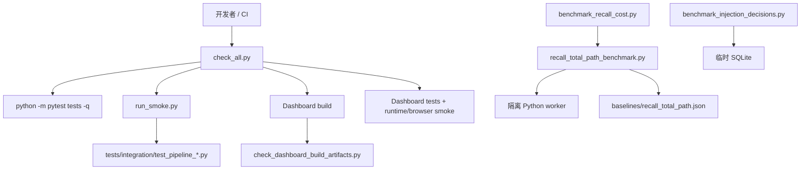

[`根级 AGENTS.md`](../AGENTS.md) > **scripts**

# Scripts 模块上下文

**最后更新：** 2026-07-17
**入口：** `scripts/check_all.py`、`scripts/run_smoke.py`、`scripts/benchmark_recall_cost.py`

## 职责与边界

`scripts/` 保存可从仓库根目录直接执行的质量门禁、集成 smoke、构建产物检查和专用性能基准。脚本是开发/CI 基础设施，不是生产库接口；生产模块不得依赖脚本内部函数，除非该函数本身就是明确受测的基准支持边界。

当前有效内容：

| 路径 | 职责 | 主要副作用 |
|---|---|---|
| `check_all.py` | 顺序执行统一仓库质量门禁，首个失败立即退出 | 运行 pytest、Dashboard 构建/测试/smoke |
| `run_smoke.py` | 分别执行五条 Python 集成管线并汇总 | 创建各测试自己的临时数据 |
| `check_dashboard_build_artifacts.py` | 检查生产 Dashboard 的 HTML 与 bundle 兼容约束 | 只读目标构建目录 |
| `benchmark_recall_cost.py` | 运行注入预设与 RecallHandler 全路径确定性基准 | 可选写 JSON 报告；启动隔离 worker |
| `recall_total_path_benchmark.py` | 全路径测量、基线校验、回归判定和基线记录支持 | 记录基线时读取 Git 状态并写 JSON |
| `benchmark_injection_decisions.py` | 对 100,000 条脱敏决策测量摘要、分页、入队和清理 | 仅使用临时目录中的 SQLite |
| `baselines/recall_total_path.json` | 固化全路径 p95 与注入契约基线 | 只应由受控基线记录流程更新 |

不在本目录承担：运行时业务逻辑、生产配置默认值、测试 fixture、Dashboard 源码或普通文档。脚本发现问题时应让命令非零退出，不要在脚本中修补或吞掉被检对象的错误。

## 调用与依赖方向



- `check_all.py` 只编排已有命令，不复制 pytest、npm 或构建工具逻辑。
- `run_smoke.py` 依赖 `tests/integration` 的固定文件清单；重命名/增删主路径必须同步 `SMOKE_TARGETS` 和集成测试指南。
- `check_dashboard_build_artifacts.py` 依赖 Dashboard 的单 JS、单 CSS legacy bundle 契约；构建配置变化要同时验证检查器。
- `benchmark_recall_cost.py` 导入 `core/injection` 和 AstrBot Provider 类型，并通过 `recall_total_path_benchmark.py` 启动子进程测量公开 `RecallHandler.handle_memory_recall()` 路径。
- `benchmark_injection_decisions.py` 直接使用注入决策模型、Recorder 与 Store；不读取生产数据库。

## 入口语义

### `check_all.py`

从仓库根目录执行：

```bash
python scripts/check_all.py
```

执行顺序以代码为准：

1. 若 `scripts/validate_conf_schema.py` 存在，先执行配置 schema 校验；当前仓库没有该文件，因此该步被条件跳过。
2. `python -m pytest tests -q`。
3. `python scripts/run_smoke.py -q`。
4. 在 `pages/dashboard/` 执行 `npm run build`。
5. 从根目录执行 `python scripts/check_dashboard_build_artifacts.py`。
6. 在 Dashboard 目录执行 `npm run test`。
7. 执行 `npm run smoke:runtime`。
8. 执行 `npm run smoke:browser`。

`_resolve_command()` 使用 `shutil.which()`，并在 Windows 兼容 `.cmd`/`.exe`。任一步骤非零时立即返回该退出码，不继续后续步骤。

### `run_smoke.py`

```bash
python scripts/run_smoke.py -q
```

固定目标是 ingest、event、retrieval、graph、lifecycle 五个文件。存在 `uv` 时使用 `uv run pytest`，否则使用当前 Python 的 `-m pytest`。目标缺失返回 2；测试失败不会阻止后续目标执行，最终返回第一个测试失败码。

新增给 pytest 的参数会原样附加到每个目标。不要传只适用于单一文件的 node id 或会改变五条目标语义的参数。

### `check_dashboard_build_artifacts.py`

```bash
python scripts/check_dashboard_build_artifacts.py
python scripts/check_dashboard_build_artifacts.py pages/dashboard
```

默认检查 `pages/dashboard`。它要求：

- `index.html` 与 `assets/` 存在；
- `.vite-build/` 已清除；
- HTML 不引用 `/src/main`，不含 `type="module"` 或 `crossorigin`；
- HTML 恰好引用一个本地 JS 和一个本地 CSS；
- `assets/` 中也恰好各有一个 JS/CSS，且引用文件存在。

该命令验证已有构建产物，不会替你执行构建。

### `benchmark_recall_cost.py`

```bash
python scripts/benchmark_recall_cost.py --profile balanced
python scripts/benchmark_recall_cost.py --all
python scripts/benchmark_recall_cost.py --all --output reports/recall-cost.json
```

- 单 profile 与 `--all` 都会运行全路径 RecallHandler 基准。
- profile 指标覆盖路由准确率、预算内命中、冗余、预算溢出、额外 LLM 调用和策略决策延迟。
- 全路径 worker 使用版本化基线的 20 次 warmup、160 次测量和 10ms 固定检索延迟，并要求 p95 回归不超过 5%。
- `--output` 只写文件，不创建父目录；调用前必须确保父目录存在。
- `--record-total-path-baseline` 是维护入口：必须同时提供独立 `--baseline-source-root` 与完整 40 位 `--source-commit`，且源 checkout 必须干净并与 commit 完全一致。不要在普通性能调优或噪声环境中重录基线。

### `benchmark_injection_decisions.py`

```bash
python scripts/benchmark_injection_decisions.py
```

该命令会在临时 SQLite 中写入 100,000 条记录并执行预热/多轮测量，适合专用基准，不应塞进普通单元测试。阈值包括 summary 中位数、分页中位数、enqueue p95 与 cleanup 总时长；任一达到或超过限制即返回 1。

## 精确验证命令

脚本变更先验证最窄边界；不要为了检查一个解析函数直接启动完整仓库门禁。

```bash
# Recall 全路径基线读写、回归公式与 worker 契约
python -m pytest tests/test_recall_cost_benchmark.py -q

# 脚本/元数据入口与统一门禁声明
python -m pytest tests/test_project_metadata.py -q

# 集成 smoke 调度的真实执行
python scripts/run_smoke.py -q

# 修改产物检查器或 Dashboard bundle 契约后；先确保已有生产构建
python scripts/check_dashboard_build_artifacts.py pages/dashboard

# 修改注入策略、预算、执行器或全路径基准后
python scripts/benchmark_recall_cost.py --all

# 修改决策 Store/Recorder 性能路径后
python scripts/benchmark_injection_decisions.py

# 仅在准备验证整个仓库时
python scripts/check_all.py
```

文档或上下文迁移本身不需要运行 benchmark、构建或完整门禁；这些命令是对应脚本/契约变更的最小运行入口。

## 约束与安全边界

- 所有用户可见命令默认从仓库根目录执行；改变 `cwd` 时必须同时检查相对路径和 CI 调用方。
- 脚本必须用退出码表达失败：0 成功，1 一般校验/阈值失败，`run_smoke.py` 的 2 专用于目标缺失。
- 禁止吞掉 `subprocess` 失败、把失败打印成成功、或在统一门禁中继续执行首错之后的步骤。
- 禁止把真实用户数据目录、生产数据库、网络 Provider 或凭据用于 benchmark。
- 禁止把机器、绝对路径或秘密写入基线和报告；基线只保留复现实验所需的平台与版本元数据。
- 禁止为了“让基准通过”放宽阈值或重录基线；先定位可复现的行为/性能变化。
- 禁止手工编辑 `source_commit`、p95 或注入计数来伪造基线。基线更新必须来自干净、锁定 commit 的记录流程。
- 禁止在 `check_all.py` 重复实现各工具自己的校验；它只维护顺序、工作目录、命令解析和失败传播。
- 禁止把 `scripts/` 当稳定第三方 API。若测试需要算法边界，优先测试生产模块；只有版本化基准支持函数可直接导入。
- 禁止提交 benchmark 生成的临时报表，除非任务明确将其定义为受版本控制的基线或交付物。

## 维护联动

- 变更 `SMOKE_TARGETS`：同步 [测试模块上下文](../tests/AGENTS.md) 与 `tests/integration/README.md`。
- 变更 `check_all.py` 步骤：同步 `docs/DEV_SETUP.md`、CI workflow 和 [普通文档维护边界](../docs/AGENTS.md)。
- 变更 Dashboard bundle 形状：同步 Dashboard 构建配置、package script 与产物检查器。
- 变更全路径场景或测量契约：同步基准测试；只有场景仍可比较时才更新版本化 baseline。
