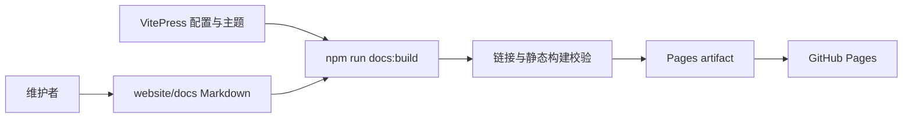

# Memora 文档站设计

## 目标

- 为安装者、管理员、运维人员和贡献者提供可搜索的中文文档入口。
- 将详细内容拆分为稳定的小页面，避免根级 README 继续膨胀。
- 以纯静态构建部署到 GitHub Pages，不增加运行时服务。
- 保持桌面和移动端可访问、可滚动且无页面级横向溢出。

## 非目标

- 首期不提供多语言站点、历史版本、博客、评论或 CMS。
- 不从 Python docstring 自动生成公开 API Reference。
- 不把内部协作材料、运行时数据或敏感诊断信息发布到站点。
- 不与 Dashboard 共用依赖、构建目录或前端组件。

## 架构



`website/package.json` 和锁文件定义独立工具链。`website/docs/.vitepress/` 只包含站点配置和轻量主题覆盖；页面内容按读者任务拆分。GitHub Actions 对拉取请求执行构建，对 `main` 和手动任务额外部署静态产物。

## 组件职责

| 组件 | 职责 | 不承担 |
|---|---|---|
| `docs/.vitepress/config.mts` | 元数据、导航、侧栏、搜索、基础路径 | 业务内容和运行时读取 |
| `docs/.vitepress/theme/` | 品牌 token、排版与响应式细节 | 重写 VitePress 交互组件 |
| `docs/**/*.md` | 公开用户与开发文档 | 内部计划和第二套运行时契约 |
| `.github/workflows/docs.yml` | 构建、上传和 Pages 部署 | 插件 Release |
| VitePress 构建与浏览器检查 | 验证结构、链接、基础路径和页面呈现 | 插件运行时行为测试 |

## 设计决策

### 文档优先首页

首页使用紧凑的品牌说明和直接文档入口，不采用营销式首屏。该方向最接近 VitePress 默认模型，升级成本较低，也符合 Memora 冷静、精确、可信的品牌性格。

### 独立 npm 工程

文档站不复用 Dashboard 的 `package.json`。两者虽然都使用 Vite 工具链，但部署目标、构建产物和升级节奏不同；隔离依赖可以避免文档发布改变插件 Dashboard。

站点使用 VitePress 2。Mermaid 集成必须选择兼容 VitePress 2 的实现；不得为了图表支持降低 VitePress 版本。

### 单一内容权威

详细中文文档以 `website/docs/` 为准。README、设计契约和更新日志只保留各自稳定职责，其他入口通过链接引用，避免复制整章内容。

### 本地搜索

使用 VitePress 内置本地索引，不引入远程搜索服务。这样可以避免外部请求、隐私边界和额外运维成本。

## 视觉约束

- 使用 VitePress 默认主题，并将颜色 token 映射到 Dashboard 的中性黑白 OKLCH 语义主题。
- 浅色与暗色的背景、表面、文字、边框和主色与 Dashboard 保持一致；绿、黄、红只表达成功、警告和危险状态。
- 卡片圆角不超过 8px，正文保持可读行宽和稳定行高。
- 不使用渐变、玻璃效果、装饰光斑、嵌套卡片或无意义动画。
- 移动端保留搜索、导航和主题切换，不隐藏关键功能。

## 失败边界

- Markdown、Mermaid、内部链接或资源路径失败时终止构建。
- PR 构建失败不得产生 Pages 部署。
- Pages 部署失败保留上一版站点，不影响插件 Release。
- 文档与实现冲突时，以代码、Schema 和测试为事实来源并修正文档。

## 安全边界

- 示例使用匿名占位符，不包含真实身份、会话、记忆正文或 Provider 信息。
- 不发布请求头、密钥、数据库内容、内部 ID、source mapping 或原始堆栈。
- 构建不读取运行时数据，页面只依赖受版本控制的静态输入。

## 验证

```powershell
Set-Location website
npm ci
npm run docs:build
npm run docs:preview
```

构建后检查首页、快速开始、配置参考、Mermaid 图、搜索和移动导航。视觉验收覆盖 `1440x900` 与 `390x844`，并确认无重叠、空白内容和页面级横向溢出。

## 已接受限制

- 首期仅中文；英文和俄文 README 暂时保留现状。
- 首期不提供历史版本导航，等确有并行维护需求时再评估。
- Logo 在站点 `public/` 中保留发布副本，修改根级源素材时必须同步。
