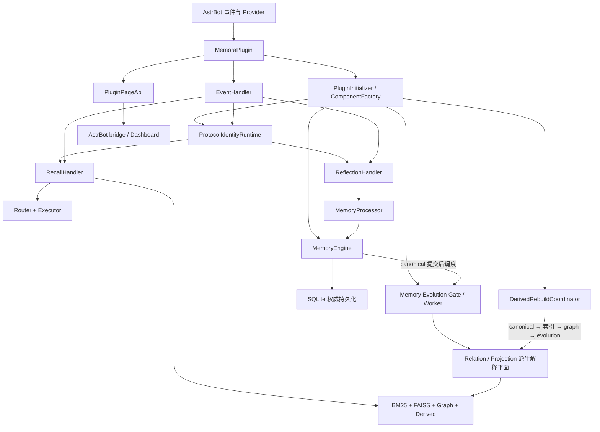

# 架构导览

本页帮助高级用户和贡献者理解 Memora 的主要链路。完整的内部不变量以仓库根级 [`DESIGN.md`](https://github.com/INSide-734/astrbot_plugin_memora/blob/main/DESIGN.md) 为准。

## 组件关系



## 代码组织

后端按 package-by-feature 组织为三层，依赖方向固定为 feature 依赖 shared，由 platform 集中装配：

```text
core/
├── platform/     宿主适配与装配：composition、config、security、resources、transport
├── shared/       无状态 DTO、错误、SQL 与序列化原语、窄端口契约
└── features/     按领域划分的业务实现：identity、memory、recall、injection、retrieval 等
```

- `core/platform/composition/` 是唯一组合根：`PluginInitializer` 非阻塞等待 Provider，`ComponentFactory` 按依赖顺序构造数据库、`MemoryEngine`、身份运行时、Prompt 防护与演化组件，并在部分失败时回滚已登记组件。
- `core/platform/transport/` 聚合 Page API、`/memora` 命令与 Agent 工具的宿主适配；`core/platform/security/` 提供共享 Prompt 防护与输出护栏。
- `core/shared/` 只放无状态、被多个生产消费者复用的 DTO、契约与纯工具，不依赖 platform 或 feature。
- `core/features/<feature>/` 各自持有领域模型、存储与处理器；`memory` 拥有 canonical 门面与存储，`recall`/`injection` 执行安全热路径，`evolution` 在 canonical 提交后产出可重建的派生解释平面。
- `main.py` 只使用初始化器发布的实例创建 `EventHandler`、`CommandHandler` 与 `PluginPageApi`，消息、命令和页面请求共享同一存储与引擎。

## 写入链

1. `EventHandler` 接收 AstrBot 消息事件。
2. 会话管理和内容提取建立可处理上下文。
3. `MemoryProcessor` 抽取并分类值得长期保留的信息。
4. `MemoryEngine` 在统一提交边界写入 SQLite。
5. 全文、向量、图和演化任务从 canonical 数据派生。

普通可恢复失败会降级对应能力，不应破坏聊天主链路；异步取消必须继续传播。

## 召回链

新的请求经过查询处理、作用域过滤、多路检索、关系扩展、Projection 附着、重排序和隐私过滤，然后交给注入策略路由与执行器。请求变更必须先完整构建，再原子应用。

## 三个不变量

1. SQLite canonical memory 及其整数 ID 始终是唯一权威身份。
2. FTS5、FAISS、图、Relation 和 Projection 是可校验、可失效、可重建的派生层。
3. 动态记忆只在当前请求内临时提供，不进入 System Prompt。

## 管理边界

`PluginPageApi` 与 Dashboard bridge 是前后端边界。写回请求保留 revision、字段校验和显式错误 envelope；Dashboard 不伪造客户端分页，也不把内部异常原样暴露给浏览器。
