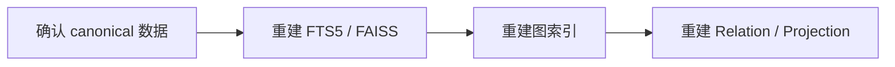

# 记忆生命周期

Memora 把长期记忆视为有来源、有作用域、可更新并可重建派生视图的持久数据，而不是一段无约束文本。

## 形成

- 捕获 AstrBot 消息并提取规范化文本。
- 对消息去重，按话题组织上下文。
- 通过结构化抽取和 MemoryAtom 分类识别事实、偏好、关系和经历。
- 使用重要度、有效期和参与者来源证据决定长期保留内容。

## 持久化

SQLite 中的 canonical memory 是唯一权威记录。成功提交后，系统可以更新全文、向量和图索引，并调度可选的记忆演化任务。

索引失败不得回滚或删除已经成功提交的 canonical 记录；系统应报告降级，并允许后续重建。

## 使用与更新

召回会根据访问上下文校验 scope、privacy、validity、role 和 revision。语义 metadata 更新仍通过 canonical 提交边界，并在提交后重新加载 source 再调度派生处理。

## 衰减、归档与遗忘

- 普通记忆可以根据重要度、访问状态和配置参与衰减。
- 高重要度闪光灯记忆具有额外保护。
- 归档和清理通过显式生命周期服务执行。
- `/memora forget <doc_id>` 删除指定 canonical 记忆，并使相关派生数据失效。

## 派生重建

阶段失败只报告对应层降级，不删除 canonical 数据。管理员可以使用 `/memora rebuild-index` 和 `/memora rebuild-graph` 执行维护。

## 相关页面

- [检索与注入](/concepts/retrieval-injection)
- [备份与恢复](/operations/backup-recovery)
- [管理命令](/reference/commands)
