# 数据流与关键链路

本页按链路说明 Memora 后端的数据流向。组件关系总览见[架构导览](/concepts/architecture)，本页专注每条链路的顺序、权威边界与失败语义。

## 总览

```mermaid
flowchart LR
    Message["AstrBot 消息"] --> Handler["EventHandler"]
    Handler --> Processor["ConversationManager / MemoryProcessor"]
    Processor --> Engine["MemoryEngine"]
    Engine --> SQLite[("SQLite canonical")]
    SQLite --> Gate["MemoryEvolutionGate"]
    Gate --> Worker["演化 job queue / worker"]
    Worker --> Derived["Relation / Projection"]
    Derived --> Retrieval["检索与注入"]
    Retrieval --> Request["当前模型请求"]
```

## 写入链

`AstrBot 消息 → EventHandler → ConversationManager / MemoryProcessor → MemoryEngine → SQLite`

1. `EventHandler` 捕获有效消息，提取规范化内容，在写保护允许时交给会话管理。
2. `MemoryProcessor` 完成结构化抽取与分类；候选必须通过质量门才允许写入。
3. `MemoryEngine` 在统一提交边界写入 SQLite；FTS、FAISS 与图索引是可重建的派生数据。
4. canonical 提交成功后才发布派生工作；派生失败不得删除或覆盖 canonical 数据。

## 身份链

`协议事件 → ProtocolIdentityResolver → ResolvedIdentity → 身份目录/会话名称同步 → 召回与反思`

- OneBot 11 只把规范化 QQ 号作为 canonical user ID。
- QQ 官方按平台实例隔离场景 OpenID，不伪装成 QQ 号；`union_openid` 不参与主键。
- 名称是可更新的辅助数据；匿名、冲突和非法事件不得写用户目录。
- 身份目录失败时安全降级，不阻断聊天主链路。

## 演化链

`canonical 写入成功 → MemoryEvolutionGate → job queue / worker → relation / projection`

- canonical SQLite 记录及其整数 ID 始终是唯一权威身份。
- Projection 只能作为有 source/revision 证据的读时注解，不形成第二套 canonical memory 或独立 `doc_id`。
- `memory_evolution.enabled=false` 强制禁用；`disabled` 不启动 worker。`shadow`、`readonly`、`active` 都会启动 worker 并可持久化派生对象，但只有 `readonly`/`active` 装配 relation/projection 读取器。
- 任何模式都不得绕过 source revision、scope、privacy、validity 与 role 校验。

## 派生重建链

`DerivedRebuildCoordinator` 只读确认 canonical 后，按 `canonical → FTS5/FAISS → graph → relation/projection` 顺序执行：

- 阶段失败只报告降级，不删除 canonical 数据。
- Evolution worker 在启动期重建完成或安全降级后再启动。
- 管理员可通过 `/memora rebuild-index` 与 `/memora rebuild-graph` 触发维护重建。

## 召回与注入链

`请求 → 改写/隔离过滤 → direct/graph 合并 → relation expansion → projection attachment → reranker → privacy filter → InjectionStrategyRouter → InjectionExecutor`

- 召回候选逐条校验 identity、scope、privacy、role、revision 与 validity。
- 动态记忆不得进入 System Prompt；请求变更必须先完整构建再原子应用。
- 注入观测只持久化 allowlist 标量；不记录 query、prompt、记忆正文或 ID 列表。

## 失败语义

- `asyncio.CancelledError` 必须传播，不吞掉取消信号。
- 普通可恢复失败降级对应能力，不破坏聊天主链路；不可恢复的初始化失败由组合根按已登记顺序回滚。
- 派生、认知投喂等旁路是尽力而为，失败不得阻断主消息链。

继续阅读[测试指南](/development/testing)了解各链路对应的测试位置与验证命令。
