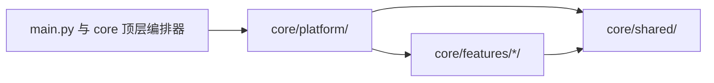

# 开发指南

本页面向希望为 Memora 贡献代码的开发者，说明代码组织、常见扩展入口、必须遵守的不变量和验证流程。首次搭建本地环境见[环境准备](/development/setup)，提交前检查清单见[质量门禁](/development/quality-gates)。

## 代码组织与依赖方向



- `core/platform/`：宿主适配与装配，包含唯一组合根 `composition/`、`config/`、`security/`、`resources/` 与 `transport/`。
- `core/shared/`：无状态 DTO、错误、SQL 与序列化原语、窄端口契约，不依赖 platform 或 feature。
- `core/features/<feature>/`：按领域划分的业务实现，各自持有模型、存储与处理器。

硬性方向：

- feature 只依赖 shared 契约，不得反向 import 组合根，也不得依赖其他 feature 的内部实现；
- 跨 feature 对象由 `ComponentFactory`/`PluginInitializer` 集中创建并注入，请求内不得新建数据库、索引或模型；
- store、retriever、processor 与领域 manager 不得依赖页面/命令适配层。

新增子模块时同步 [`core/AGENTS.md`](https://github.com/INSide-734/astrbot_plugin_memora/blob/main/core/AGENTS.md) 的导航，并为模块维护自己的 AGENTS.md。

## 常见扩展入口

### 新增配置字段

1. 同步 `_conf_schema.json`、Pydantic 模型、运行时读取与 Dashboard 类型/默认值。
2. 更新 `tests/test_config_contract.py` 等契约测试。
3. 在[配置参考](/reference/configuration)对应分组页补充字段说明。
4. 涉及 Provider、后台 worker 或启动期组件的字段，说明重新加载或重启要求。

### 新增 Page API 端点

1. 在 `core/platform/transport/page_api/` 添加聚焦 mixin，由 `PluginPageApi` 聚合。
2. 保留稳定响应 envelope、revision 写回与字段校验；不向浏览器返回凭据、原始数据库对象或内部异常。
3. 同步 `tests/test_api_<domain>.py` 与 `tests/test_page_api_contract.py`，并核对 `pages/dashboard/src/lib/bridge.ts` 调用方。

### 新增或修改管理命令

在 `core/platform/transport/commands/` 实现。命令名或行为变化必须同步仓库 README、CHANGELOG、测试与本网站[管理命令](/reference/commands)页。

### 新增 Agent 工具

在 `core/platform/transport/tools/` 实现。工具结果会进入模型上下文，只返回完成任务所需的稳定字段并遵守隐私观测 allowlist；主动写入工具默认关闭，不根据模型猜测自行开启。

## 必须遵守的不变量

- SQLite canonical memory 及其整数 ID 是唯一权威；FTS5、FAISS、图、Relation、Projection 是可重建的派生层。
- canonical 提交成功后才发布派生工作；派生失败不得删除或覆盖 canonical 数据。
- 稳定身份只来自可信协议解析；名称是辅助数据，匿名、冲突和非法事件不得写入身份目录。
- 动态记忆不进入 System Prompt；日志、指标、trace 与决策记录只保留 allowlist 标量。
- `asyncio.CancelledError` 必须传播；普通可恢复失败不得破坏聊天主链路。
- SQL 值使用参数绑定；动态标识符只允许固定 allowlist。
- 生产代码中的注释、docstring、日志与 reason 文本统一使用中文。

## 测试约定

- 领域权威用例使用独立文件，不把新职责继续堆进超长综合测试；变更定位见 [`tests/AGENTS.md`](https://github.com/INSide-734/astrbot_plugin_memora/blob/main/tests/AGENTS.md)。
- 跨模块主路径使用 `tests/integration/test_pipeline_*.py`，由 `scripts/run_smoke.py` 汇总执行。
- 检索质量使用 `tests/evaluation/` 与 `tests/fixtures/retrieval/` 样本。
- 测试不访问真实模型、生产 SQLite 或开发机绝对路径；不用 sleep 证明并发正确性。
- 新行为遵循 RED → GREEN → REFACTOR；不修改测试迎合错误实现。

## 验证流程

按改动范围选择最窄命令；Python 命令统一通过锁定 uv 环境执行：

```powershell
# 单文件行为回归
uv run --locked python -m pytest tests/test_<domain>.py -q

# 本轮文件 lint / 格式化 / 复查
uv run --locked ruff check --fix path/to/file.py
uv run --locked ruff format path/to/file.py
uv run --locked ruff check path/to/file.py

# 五条集成 smoke
uv run --locked python scripts/run_smoke.py -q

# 准备合并前的完整门禁
uv run --locked python scripts/check_all.py
```

提交前对本轮全部改动文件运行 pre-commit；hook 改写文件后审阅差异并重复运行，不得用 `--no-verify`、`SKIP` 或删除规则绕过。

## 约束速查

- 新增或修改的源码、测试文件不超过 800 物理行；Markdown 设计/计划文件不超过 400 行。
- 拆分按单一职责或生命周期边界进行，保持原导入路径和公开契约兼容。
- 配置叶变更必须五处同步：schema、Pydantic 模型、运行时读取、Dashboard 类型/默认值与契约测试。
- 索引、Relation 与 Projection 不是第二套 canonical；模型可见的 Projection metadata 只有 `type`、`summary`、`confidence`。

更细的运行时边界见 [`core/AGENTS.md`](https://github.com/INSide-734/astrbot_plugin_memora/blob/main/core/AGENTS.md) 与各子模块 AGENTS.md。

## 相关页面

- [数据流与关键链路](/development/data-flow)：写入、身份、演化、派生重建与召回链的顺序和失败语义。
- [测试指南](/development/testing)：测试目录职责、fixture 契约与变更定位表。
- [Dashboard 前端开发](/development/frontend)：前端技术栈、页面模板、三语言与 bridge 契约。
- [打包与发布](/development/packaging)：ZIP 生成、产物校验、SHA-256 与发布门禁。
