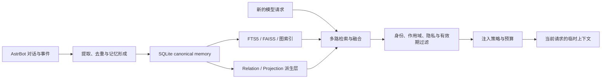

# 项目介绍

Memora 是面向 [AstrBot](https://github.com/Soulter/AstrBot) 的长期记忆插件。它帮助机器人从持续对话中识别值得保留的信息，将记忆可靠地保存下来，并在后续交流真正需要时，把相关内容安全地提供给模型。

项目覆盖的不只是“存储一段文本”或“搜索相似内容”，而是一套完整的长期记忆生命周期：记忆形成、权威持久化、混合检索、身份与隐私过滤、请求级注入、反思演化、衰减遗忘、诊断评测以及备份恢复。

## 为什么需要长期记忆

普通大模型只能直接看到当前请求携带的上下文。随着对话变长，完整历史既难以全部放入上下文窗口，也会带来更高的令牌成本和更多无关噪声。仅保存聊天记录可以回看过去，却不能自动判断哪些信息值得长期保留、属于谁、何时应当再次使用。

长期运行的 AstrBot 通常还会面对更复杂的问题：

- 同一个用户可能跨会话出现，昵称也可能发生变化；
- 私聊、群聊和不同协议场景中的记忆不能随意混用；
- 用户偏好、共同经历、知识、关系等信息的保留周期并不相同；
- 召回结果即使语义相似，也不一定适合注入当前请求；
- 索引损坏、模型暂时不可用或某个增强模块失败时，聊天主链路仍应继续工作。

Memora 将这些问题作为一条受约束的系统链路处理，让机器人获得可持续、可管理、可解释的长期记忆，而不是无限堆积聊天内容。

## Memora 如何工作

下面的流程概括了从对话到再次使用记忆的主要路径：

### 1. 从对话中形成记忆

Memora 接收 AstrBot 的消息与生命周期事件，从对话中提取可能具有长期价值的事实、偏好、关系、经历或知识。形成过程会结合去重、分类和反思，避免简单地把每条消息都当成永久记忆。

原始聊天历史与长期记忆承担不同职责：聊天历史记录发生过什么，长期记忆则保存经过处理、适合在未来继续使用的信息。

### 2. 保存唯一的权威记录

形成后的 canonical memory（权威记忆）保存在 SQLite 中。这里的“权威”表示它是记忆身份和内容的唯一事实来源；全文索引、向量索引、图关系和 Projection 都是可以根据权威记录重新生成的派生数据。

这一边界可以避免索引或增强结果反过来成为第二套相互冲突的记忆。当派生数据损坏或版本变化时，系统能够保留权威记录并执行重建。

### 3. 组合多路检索

新请求到来后，Memora 不依赖单一相似度搜索，而是组合全文、向量、图关系、关系扩展和重排序等检索路径。不同路径分别擅长精确词语、语义近似和关系关联，融合后再选出更适合当前问题的候选记忆。

检索质量与资源消耗可以通过配置调整。首次使用时不需要理解所有字段，可先从[质量与成本档位](/guide/tuning-profiles)选择偏向质量、均衡或性能的起点。

### 4. 安全地提供给模型

“找到相关内容”不等于“可以直接交给模型”。候选记忆还要经过稳定身份、场景作用域、隐私、角色、有效期等约束，再由注入策略根据当前请求和预算决定是否使用以及使用多少。

动态召回的记忆只进入当前请求的临时上下文，不会被写入 System Prompt。这样可以缩小动态内容的影响范围，并让每次注入都接受当前请求的规则与预算控制。详细机制见[检索与注入](/concepts/retrieval-injection)。

### 5. 维护完整生命周期

记忆写入并不是流程终点。Memora 还提供反思、关系演化、衰减、遗忘、索引重建和一致性校验等能力，使长期数据能够随时间维护，而不是只增不减。

权威记忆与派生数据的生命周期边界、失败降级方式和重建顺序可在[记忆生命周期](/concepts/memory-lifecycle)中继续了解。

## 核心能力

### 稳定身份与场景隔离

Memora 通过协议身份解析建立稳定身份，在允许的范围内处理名称变化和跨会话识别。身份信息不仅用于展示，也参与记忆归属和召回过滤，防止仅凭相同昵称合并不同用户。

不同协议、平台实例、私聊与群聊场景各有自己的身份和作用域边界。发生匿名、冲突或无法可靠确认身份的情况时，系统优先保守处理。更多细节见[稳定身份](/concepts/identity)。

### 可调节的质量与成本

记忆抽取、语义检索、重排序、图关系和智能增强会消耗不同程度的模型、CPU、内存与存储资源。Memora 将这些能力拆分为可配置模块，既可以偏向更充分的检索质量，也可以在资源有限的设备上减少增强步骤。

项目提供质量、均衡和性能三个配置思路，帮助用户先建立整体取向，再按实际数据量和 Provider 能力微调。完整字段含义可查阅[插件配置参考](/reference/configuration)。

### 可视化管理

Dashboard 为日常管理提供统一入口，可查看运行摘要、记忆、召回、配置、备份、更新和诊断状态。大多数常用操作都可以在页面中完成；例如使用非 runtime 安装包时，首次安装依赖和构建页面也由引导页按钮触发，无需手工输入 npm 命令。

页面入口、运行时构建开关和安全注意事项见 [Dashboard 指南](/features/dashboard)。

### 管理命令与 Agent 工具

管理员可以使用 `/memora` 命令查询状态、健康度、诊断信息和记忆，也可以执行遗忘、索引重建、备份相关维护与在线更新。部分能力还以 AstrBot Agent 工具提供，让模型在明确的权限与参数约束下使用记忆功能。

可用命令与权限要求见[管理命令](/reference/commands)，工具契约见 [Agent 工具](/features/agent-tools)。

### 诊断、评测与恢复

长期记忆系统需要能够回答“当前是否正常”“召回为什么变差”和“派生数据能否恢复”。Memora 提供健康状态、诊断事件、检索评测、备份恢复以及索引和图数据重建能力。

这些运维能力以保护 canonical memory 为前提：派生阶段失败时优先报告降级并保留权威记录，不用删除长期数据来掩盖索引问题。遇到异常时可从[故障排除](/operations/troubleshooting)开始，并在重要变更前阅读[备份与恢复](/operations/backup-recovery)。

## 与简单聊天记录或向量检索的区别

Memora 并不是聊天记录查看器，也不是向量数据库的薄封装。三者解决的问题不同：

- 聊天记录负责保存原始对话，适合回看和审计，但不会自动形成可复用的长期认识；
- 单一向量检索擅长寻找语义相近文本，但通常不负责稳定身份、作用域、隐私、有效期和注入决策；
- Memora 把记忆形成、权威存储、多路检索、安全过滤、请求级注入与后续维护连接为一条完整链路。

这也意味着 Memora 不承诺让模型“记住所有事情”。更合理的目标是保留值得长期使用的信息，并在正确的身份、场景和请求中，以可控成本找回其中真正相关的部分。

## 数据与安全边界

使用 Memora 前，建议先理解以下边界：

- SQLite 中的 canonical memory 是唯一权威数据；FTS5、FAISS、图、Relation 和 Projection 属于可重建的派生层。
- 召回会受到身份、会话或群组作用域、隐私、角色、有效期和预算约束；相似度不是唯一判断依据。
- 动态记忆仅注入当前请求，不写入 System Prompt。
- Provider 未就绪或可恢复的增强阶段失败时，插件会等待或降级，避免阻塞 AstrBot 的聊天主链路。
- Dashboard、Page API、管理命令和 Agent 工具都有各自的调用边界；应只向可信管理员开放运维能力。
- 备份策略应以 SQLite 权威数据和实际部署配置为中心，不应把可重建索引当成唯一副本。

## 适合哪些场景

Memora 适合希望机器人在长期运行中逐步建立连续性的场景，例如：

- 个人助手需要记住稳定偏好、计划背景和过去的重要经历；
- 社群机器人需要在严格的群组与身份边界内维护关系和共享语境；
- 知识型机器人需要组合精确关键词、语义和关系信息进行召回；
- 管理员希望通过 Dashboard、命令、诊断和备份掌握记忆系统状态；
- 部署者需要在检索质量、模型成本与本机资源之间做明确取舍。

如果需求只是临时保留少量固定文本、完全重放最近几轮消息，或不准备配置 Embedding 与 LLM Provider，那么直接使用 AstrBot 的上下文能力或更简单的存储方案可能更合适。

## 使用前需要准备什么

运行 Memora 需要：

- Python `>=3.12,<3.13`；
- AstrBot `>=4.24.2`；
- 可用的 Embedding Provider，用于向量化与语义检索；
- 可用的 LLM Provider，用于记忆抽取、反思和启用后的智能增强。

普通用户安装推荐使用 Release 中的 `-runtime.zip`，不需要 Node.js。只有使用非 runtime 包并需要首次构建 Dashboard，或参与 Dashboard、文档站开发时，才需要准备 Node.js 环境。

## 推荐阅读顺序

1. 按照[快速开始](/guide/getting-started)完成安装、Provider 配置与首次状态检查。
2. 阅读[配置入门](/guide/configuration)，了解最常用的配置域和安全起点。
3. 从[质量与成本档位](/guide/tuning-profiles)选择适合部署环境的整体取向。
4. 继续阅读[记忆生命周期](/concepts/memory-lifecycle)、[稳定身份](/concepts/identity)与[检索和注入](/concepts/retrieval-injection)。
5. 正式积累重要数据前，确认[备份与恢复](/operations/backup-recovery)流程，并保存[故障排除](/operations/troubleshooting)入口。
