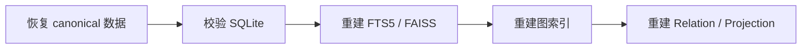

# 备份与恢复

本页面向负责长期运行 Memora 的管理员说明数据权威、备份和恢复顺序。

## 先识别权威数据

SQLite canonical memory 是唯一权威持久化。FTS5、FAISS、图索引、Relation 和 Projection 都是派生数据，可以从 canonical 数据重新生成。

因此备份的首要目标是保护经过校验的 SQLite 权威状态，而不是只复制向量或图索引。

## 备份

Memora 支持校验后的备份快照、定时备份和保留策略。备份操作应：

1. 使用 Dashboard System 页面查看当前维护和写入状态。
2. 选择受控目标目录，不使用运行时数据库目录作为临时交换位置。
3. 完成后确认快照校验结果和保留策略。

## 恢复

恢复流程包含预检、维护锁、事务式切换、运行时重载和失败回滚。路径和归档内容会拒绝路径穿越、绝对路径及非法目标。

::: danger 不要手工覆盖运行中数据库
直接替换正在使用的 SQLite 文件可能破坏事务边界或留下不一致派生索引。使用 Dashboard 或受支持的维护入口执行恢复。
:::

## 恢复后的重建顺序

阶段失败只降级对应派生能力，不删除已经恢复的 canonical 数据。

## 导出

当前记忆可以导出为 JSONL 或 Markdown，用于人工审阅和外部归档。导出文件可能包含敏感记忆内容，应按用户数据处理，不要提交到仓库或附在公开问题报告中。

维护命令见[管理命令](/reference/commands)。
